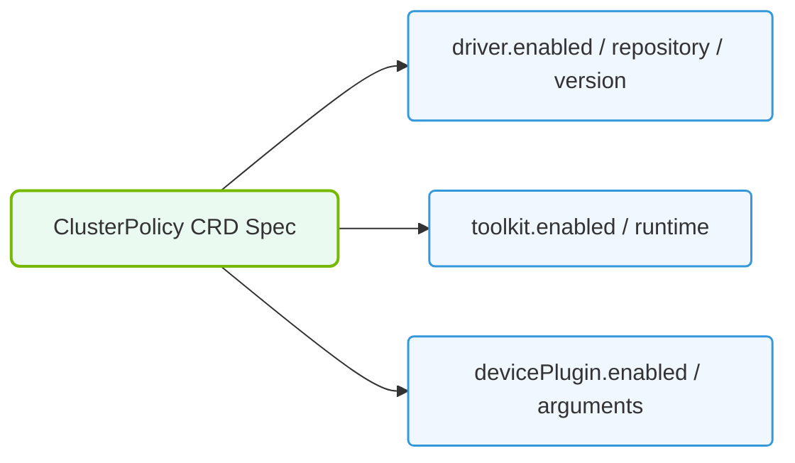

# 27.1d ClusterPolicy CRD: the single object that controls the entire GPU software stack

  📦 Cluster Orchestration
  📖 Kubernetes for AI

## 🧠 Context Introduction

When you are setting up a Kubernetes cluster for AI workloads, you need to install and configure many GPU-related software components: drivers, container runtime, device plugins, monitoring tools, and more. Without automation, this is a tedious and error-prone process. The **ClusterPolicy CRD (Custom Resource Definition)** is the single configuration object that the NVIDIA GPU Operator uses to control the entire GPU software stack across your cluster. Think of it as the "master switch" or "control panel" that defines how every GPU-related component should behave.

---

## ⚙️ What is a ClusterPolicy CRD?

A **ClusterPolicy** is a Kubernetes Custom Resource that tells the GPU Operator exactly what to install, configure, and manage on every GPU-enabled node in your cluster. When you create or update a ClusterPolicy object, the GPU Operator reconciles the actual state of your cluster to match what you defined.

- It is a **cluster-scoped resource** (not namespaced) — it applies to all nodes.
- It is the **only configuration file** you need to manage the entire GPU software stack.
- It is typically named **"cluster-policy"** or **"default"** in your cluster.

---

## 🛠️ What Does the ClusterPolicy Control?

The ClusterPolicy defines settings for every major component in the GPU software stack:

| Component | What It Controls |
|-----------|------------------|
| 🖥️ **GPU Drivers** | Which driver version to install, how to install (via container or host), and whether to enable persistence mode |
| 🐳 **Container Runtime** | Whether to use Docker, containerd, or CRI-O, and how to configure the NVIDIA Container Toolkit |
| 🔌 **Device Plugin** | How the GPU device plugin registers GPUs with Kubernetes (e.g., sharing, MIG configuration) |
| 📊 **Monitoring** | Whether to deploy DCGM (Data Center GPU Manager) for GPU health and metrics |
| 🧪 **Validation** | Whether to run GPU validation jobs after deployment to verify functionality |
| 🔐 **Security** | Whether to enable GPU feature discovery, time-slicing, or MIG (Multi-Instance GPU) partitioning |

---

## 📋 How Engineers Use the ClusterPolicy

As a new engineer, you will typically interact with the ClusterPolicy in these ways:

- **View the current policy** — to understand what is already configured in your cluster
- **Modify the policy** — to change driver versions, enable monitoring, or configure GPU sharing
- **Apply a new policy** — when setting up a fresh cluster or upgrading the GPU stack

The ClusterPolicy is defined as a YAML file that you apply using **kubectl apply -f** (but remember, no code blocks here — just know it's a standard Kubernetes apply operation).

---

### 📊 Visual Representation: ClusterPolicy Custom Resource Definition (CRD) structure
This diagram displays the ClusterPolicy spec fields, controlling driver versions and validation options.

## 🕵️ Key Fields in a ClusterPolicy

Here are the most important fields you will encounter when reading or writing a ClusterPolicy:

- **`driver`** — Controls GPU driver installation (version, repository, licensing)
- **`toolkit`** — Configures the NVIDIA Container Toolkit (runtime class, install path)
- **`devicePlugin`** — Manages GPU device plugin settings (sharing strategy, MIG profiles)
- **`dcgmExporter`** — Enables or disables GPU metrics export to Prometheus
- **`validator`** — Runs post-installation GPU validation tests
- **`sandboxWorkloads`** — Configures GPU time-slicing or MIG partitioning for multi-tenant environments

---

## 🔄 How the ClusterPolicy Works in Practice

1. **You define** a ClusterPolicy YAML with your desired settings.
2. **You apply** it to your Kubernetes cluster.
3. **The GPU Operator** detects the new or updated ClusterPolicy.
4. **The Operator** deploys or updates DaemonSets, Deployments, and ConfigMaps for each component.
5. **Each node** receives the correct drivers, runtime, and plugins automatically.
6. **Validation jobs** run to confirm everything works.

If you later change the ClusterPolicy, the Operator automatically reconciles the cluster to match the new configuration — no manual node-by-node updates needed.

---

## ✅ Why This Matters for AI Infrastructure

- **Single source of truth** — One YAML file defines your entire GPU software stack
- **Consistency** — Every GPU node gets the exact same configuration
- **Upgrade simplicity** — Change one field and the Operator handles the rest
- **Rollback safety** — Revert to a previous ClusterPolicy to undo changes

---

## 📌 Summary

The **ClusterPolicy CRD** is the heart of the NVIDIA GPU Operator. As an engineer managing AI infrastructure, you will spend most of your GPU Operator time reading, modifying, and applying this single object. Master the ClusterPolicy, and you master the GPU software stack in Kubernetes.

> 💡 **Key Takeaway:** The ClusterPolicy is not just a configuration file — it is the contract between you and the GPU Operator that defines how your entire GPU fleet operates.