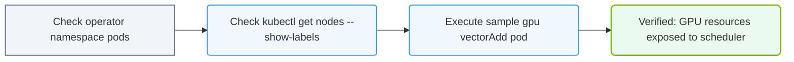

# 27.1f Verifying GPU Operator: pod status across kube-system and gpu-operator namespaces

  📦 Cluster Orchestration
  📖 Kubernetes for AI

---

## 🌐 Context Introduction

When you deploy the NVIDIA GPU Operator in a Kubernetes cluster, it creates several pods across two key namespaces: **kube-system** and **gpu-operator**. As a new engineer learning AI infrastructure, verifying that these pods are running correctly is one of the first health checks you should perform. This ensures the GPU Operator is fully operational and ready to manage GPU resources for your AI workloads.

---

## ⚙️ Why Two Namespaces?

The GPU Operator splits its components across two namespaces for organizational and security reasons:

| Namespace | Purpose | Key Components |
|-----------|---------|----------------|
| **kube-system** | Core Kubernetes system components | Node Feature Discovery (NFD) operator, NFD worker pods |
| **gpu-operator** | NVIDIA-specific GPU management | GPU Operator controller, driver daemons, device plugin, monitoring tools |

---

## 🕵️ Checking Pod Status in kube-system

The **kube-system** namespace hosts the **Node Feature Discovery (NFD)** components. These pods detect GPU hardware on each node.

**What to look for:**
- **NFD operator pod** — This is the controller that manages NFD workers.
- **NFD worker pods** — One pod should run on each node in your cluster (including GPU nodes and CPU-only nodes).

**Expected healthy state:**
- All NFD worker pods should show **Running** status.
- The NFD operator pod should also be **Running**.
- The **Ready** column should show **1/1** for each pod (meaning the container inside is fully ready).

---

## 🛠️ Checking Pod Status in gpu-operator

The **gpu-operator** namespace contains the core GPU management components.

**What to look for:**
- **GPU Operator controller pod** — The main operator that manages the GPU lifecycle.
- **NVIDIA driver daemon pods** — One pod per GPU node that installs and manages the GPU driver.
- **NVIDIA device plugin pod** — Registers GPU resources with Kubernetes.
- **NVIDIA container toolkit pod** — Ensures GPU-enabled containers can access the hardware.
- **NVIDIA MIG manager pod** (if using MIG) — Manages Multi-Instance GPU partitioning.
- **NVIDIA DCGM exporter pod** — Exports GPU metrics for monitoring.

**Expected healthy state:**
- All pods should show **Running** status.
- The **Ready** column should show **1/1** for most pods.
- Driver daemon pods may show **2/2** if they run both the driver and the toolkit together.

---

### 📊 Visual Representation: GPU Operator Node Verification loop
This flowchart maps out validation steps check-list to verify successful Operator boot on a node.

## 📊 Comparison Table: Pods by Namespace

| Namespace | Pod Type | Count per Node | Purpose |
|-----------|----------|----------------|---------|
| **kube-system** | nfd-operator | 1 (cluster-wide) | Manages NFD workers |
| **kube-system** | nfd-worker | 1 per node | Detects hardware features |
| **gpu-operator** | gpu-operator-controller | 1 (cluster-wide) | Orchestrates GPU components |
| **gpu-operator** | nvidia-driver-daemon | 1 per GPU node | Installs GPU drivers |
| **gpu-operator** | nvidia-device-plugin | 1 per GPU node | Registers GPUs with K8s |
| **gpu-operator** | nvidia-container-toolkit | 1 per GPU node | Enables GPU access in containers |
| **gpu-operator** | nvidia-dcgm-exporter | 1 per GPU node | Exports GPU metrics |

---

## 🚦 Common Pod Statuses and What They Mean

When you check pod status, you may see different states:

- **Running** — ✅ Pod is healthy and operational.
- **Pending** — ⏳ Pod is waiting for resources (e.g., GPU node not ready, insufficient memory).
- **CrashLoopBackOff** — ❌ Pod keeps starting and crashing. Check logs for driver or configuration errors.
- **Init:0/1** — 🔄 Pod is initializing (common for driver pods during first deployment).
- **ImagePullBackOff** — ❌ Pod cannot download the container image (check network or registry access).

---

## ✅ Verification Checklist

Use this checklist to confirm the GPU Operator is healthy:

- [ ] All pods in **kube-system** with "nfd" in their name show **Running** status.
- [ ] All pods in **gpu-operator** show **Running** status.
- [ ] The number of **nvidia-driver-daemon** pods matches the number of GPU nodes.
- [ ] The number of **nfd-worker** pods matches the total number of nodes (GPU + CPU).
- [ ] No pods are stuck in **CrashLoopBackOff** or **Pending** for more than 2 minutes.

---

## 🔍 Troubleshooting Quick Tips

If you see unhealthy pods, here are common fixes:

- **Pending pods** — Check if nodes have the correct labels (e.g., **nvidia.com/gpu.present=true**).
- **CrashLoopBackOff** — Inspect pod logs to find driver version mismatches or missing dependencies.
- **Missing pods** — Verify the GPU Operator was installed with the correct configuration for your GPU type.
- **ImagePullBackOff** — Ensure your cluster has internet access to pull NVIDIA container images, or configure a private registry.

---

## 📌 Key Takeaway

Verifying pod status across **kube-system** and **gpu-operator** namespaces is your first line of defense when troubleshooting GPU availability in Kubernetes. Healthy pods in both namespaces mean the GPU Operator is ready to manage GPU resources for your AI workloads. Always check both namespaces — a problem in either one will prevent GPUs from being available to your applications.