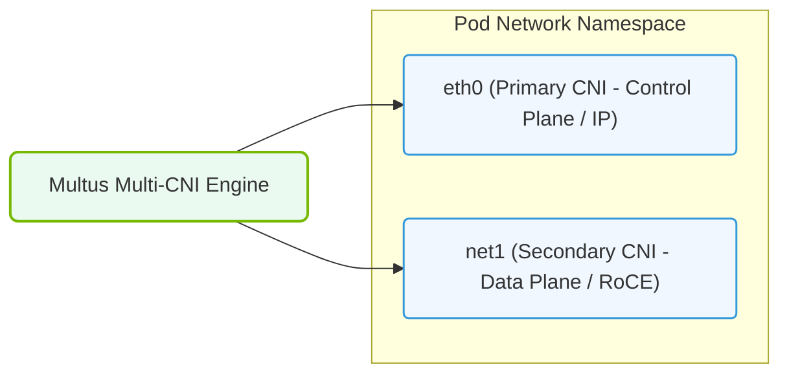

# 27.2d Multus CNI: attaching multiple network interfaces to AI training Pods

  📦 Cluster Orchestration
  📖 Kubernetes for AI

---

## 🧠 Context Introduction

In AI training, a single Pod often needs more than just one network interface. While Kubernetes assigns a single default network interface to every Pod, AI workloads—especially those using distributed training across multiple GPUs—require high-speed, low-latency connections like **RDMA** or **InfiniBand** in addition to standard management traffic.

**Multus CNI** is a Container Network Interface (CNI) plugin that acts as a "meta-plugin." It allows you to attach **multiple network interfaces** to a single Pod. Think of it as a network switch inside Kubernetes that lets your Pod speak on different networks simultaneously.

For new engineers, this means your AI training Pod can have:
- One interface for general cluster communication (e.g., Flannel, Calico)
- A second interface for high-speed GPU-to-GPU data transfer (e.g., RDMA over Converged Ethernet or InfiniBand)

---

## ⚙️ How Multus CNI Works

Multus does not replace your primary CNI plugin. Instead, it sits on top of it and delegates the creation of additional interfaces to other CNI plugins.

- **Default Interface**: Managed by your cluster's primary CNI (e.g., Calico, Weave).
- **Additional Interfaces**: Defined through **Network Attachment Definitions (NADs)** — custom Kubernetes resources that specify which secondary CNI plugin to use and its configuration.
- **Pod Annotation**: When you create a Pod, you annotate it with the names of the NADs you want attached. Multus reads these annotations and creates the interfaces before the Pod starts.

---

## 🛠️ Key Components

| Component | Role |
|-----------|------|
| **Multus DaemonSet** | Runs on every node; listens for Pod creation events and attaches additional interfaces |
| **Network Attachment Definition (NAD)** | A custom resource that defines a secondary network (e.g., "this interface uses the RDMA CNI plugin") |
| **Secondary CNI Plugin** | The actual plugin that creates the interface (e.g., **macvlan**, **ipvlan**, **SR-IOV**, or **RDMA CNI**) |
| **Pod Annotation** | A label on the Pod spec that tells Multus which NADs to use |

---

## 🧩 Why Multus Matters for AI Training

AI training Pods often need to communicate across multiple networks for different purposes:

- **Management network**: For logging, monitoring, and control plane communication.
- **Data network**: For high-speed GPU-to-GPU transfers using RDMA or InfiniBand.
- **Storage network**: For accessing shared filesystems or object stores.

Without Multus, you would need to run separate Pods or use complex workarounds. With Multus, a single Pod can have all three interfaces, each optimized for its specific traffic type.

---

### 📊 Visual Representation: Multus CNI Multi-Interface Pod Bindings
This diagram displays Multus CNI: attaching a primary management interface (flannel) and secondary RDMA network interfaces (SR-IOV) to a Pod.

## 📋 Example Workflow (No Code Blocks)

Here is a simplified workflow for attaching a second network interface to an AI training Pod:

1. **Create a Network Attachment Definition (NAD)** that defines the secondary network. This NAD specifies the CNI plugin to use (e.g., **macvlan** for a VLAN-backed network) and its parameters like subnet and gateway.

2. **Annotate your Pod YAML** with the NAD name. You add an annotation like **k8s.v1.cni.cncf.io/networks: my-secondary-network** to the Pod metadata.

3. **Deploy the Pod**. Multus detects the annotation, reads the NAD, and calls the secondary CNI plugin to create the additional interface inside the Pod.

4. **Verify inside the Pod**. Once running, the Pod will have two interfaces:
   - **eth0**: The default Kubernetes network interface.
   - **net1**: The secondary interface from the NAD (e.g., for RDMA traffic).

---

## 🕵️ Common Use Cases in AI Infrastructure

- **Distributed Training with NCCL**: NVIDIA Collective Communications Library (NCCL) can use a dedicated RDMA-capable interface for GPU-to-GPU communication, while the default interface handles Kubernetes API calls.
- **Storage Separation**: A dedicated network interface for accessing a high-performance parallel filesystem (e.g., Lustre, GPUDirect Storage) without competing with management traffic.
- **Multi-Tenancy**: Different teams or jobs can have their own isolated network interfaces, preventing cross-traffic interference.

---

## ⚠️ Important Considerations for New Engineers

- **Resource Planning**: Each additional interface consumes a host network resource (e.g., a MAC address, a VLAN ID, or a physical function). Plan your node capacity accordingly.
- **IP Address Management**: Secondary networks may use different IPAM (IP Address Management) schemes. Ensure your network team allocates enough IPs for your Pods.
- **Performance Overhead**: Multus itself adds minimal latency, but the secondary CNI plugin (e.g., SR-IOV) may have its own performance characteristics.
- **Troubleshooting**: If a Pod fails to start with a Multus-related error, check the **Multus DaemonSet logs** on the node and verify that the NAD is correctly defined and the secondary CNI plugin is installed.

---

## ✅ Summary

| Concept | Takeaway |
|---------|----------|
| **What Multus does** | Attaches multiple network interfaces to a single Pod |
| **Why AI needs it** | Separate high-speed GPU traffic from management traffic |
| **How it works** | Uses NADs and Pod annotations to delegate interface creation to secondary CNI plugins |
| **Key benefit** | Enables distributed training with RDMA/InfiniBand without complex networking workarounds |

Multus CNI is a foundational tool for AI infrastructure because it gives you the flexibility to design network topologies that match the performance requirements of modern GPU workloads. As you build and operate AI training clusters, understanding Multus will help you ensure that your Pods have the right network paths for every type of traffic.