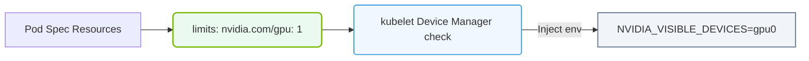

# 27.3a Requesting GPUs in Pod spec: resources.limits.nvidia.com/gpu: 8

<div class="lesson-completion" data-lesson-id="27_3a_gpu_requests_in_pods"></div>
<div class="lesson-tags">
  <span class="lesson-tag">📦 Cluster Orchestration</span>
  <span class="lesson-tag">📖 Kubernetes for AI</span>
</div>


---

## 🧠 Context: Why Request GPUs in a Pod?

When you run an AI training job in Kubernetes, your container needs access to NVIDIA GPUs. Without explicitly requesting GPUs, Kubernetes will not assign any GPU hardware to your pod. The key field **resources.limits.nvidia.com/gpu: 8** tells Kubernetes: *"This pod needs 8 NVIDIA GPUs to run."*

This is critical because:
- GPUs are expensive, shared resources in a cluster.
- Multiple teams may compete for the same GPU nodes.
- Kubernetes uses this request to schedule your pod onto a node with enough free GPUs.

---

## ⚙️ How It Works Under the Hood

The NVIDIA GPU Operator installs a device plugin on each GPU node. This plugin registers available GPUs with Kubernetes. When you set **resources.limits.nvidia.com/gpu**, the following happens:

- **Kubernetes scheduler** checks which nodes have at least 8 free GPUs.
- The scheduler binds your pod to a suitable node.
- The **kubelet** on that node calls the NVIDIA device plugin to assign 8 specific GPU devices (e.g., GPU 0 through GPU 7) to your container.
- Inside the container, the GPUs appear as **/dev/nvidia0** through **/dev/nvidia7**.

---

## 🛠️ Key Concepts to Understand

| Concept | Explanation |
|---------|-------------|
| **resources.limits** | The maximum amount of a resource the container can use. For GPUs, limits and requests must be equal. |
| **nvidia.com/gpu** | The custom resource name registered by the NVIDIA device plugin. |
| **Value: 8** | The number of GPUs requested. Can be any integer from 1 up to the total GPUs on a node. |
| **No fractional GPUs** | You cannot request 0.5 GPUs. GPUs are allocated as whole units. |

---


### 📊 Visual Representation: Pod spec GPU resource Request
This diagram displays how setting resources.limits.nvidia.com/gpu triggers the device plugin to expose specific GPU cards.




## 📊 Real-World Example: Training a Large Model

Imagine you are running a distributed training job for a large language model (LLM). Your training script expects 8 GPUs. Your pod specification would include:

**For reference:**
```yaml
apiVersion: v1
kind: Pod
metadata:
  name: llm-training-pod
spec:
  containers:
  - name: trainer
    image: nvidia/cuda:12.2-base
    resources:
      limits:
        nvidia.com/gpu: 8
      requests:
        nvidia.com/gpu: 8
```

📤 **Output:** The pod will only be scheduled on a node with at least 8 free GPUs. If no such node exists, the pod stays in **Pending** state.

---

## 🕵️ Common Pitfalls for New Engineers

- **Forgetting to set both limits and requests** — For GPUs, Kubernetes requires both fields to be identical. Setting only limits may cause scheduling failures.
- **Requesting more GPUs than any node has** — If your cluster nodes have only 4 GPUs each, requesting 8 GPUs will leave your pod pending forever.
- **Not installing the NVIDIA GPU Operator** — Without the device plugin, the resource **nvidia.com/gpu** does not exist, and your pod will fail with an error like *"0/3 nodes are available: 3 Insufficient nvidia.com/gpu"*.
- **Assuming GPUs are shared** — Each GPU is exclusively assigned to one container. Two containers cannot share the same physical GPU unless you use NVIDIA MIG (Multi-Instance GPU) technology.

---

## ✅ Best Practices

- **Always match limits and requests** for GPUs to avoid ambiguity.
- **Use node affinity or taints** to ensure GPU pods land on GPU-enabled nodes.
- **Monitor GPU utilization** with tools like **nvidia-smi** inside the pod to verify all 8 GPUs are visible and being used.
- **Start small** — Test with **nvidia.com/gpu: 1** first to confirm your setup works, then scale up to 8.

---

## 📌 Summary

Setting **resources.limits.nvidia.com/gpu: 8** is your way of telling Kubernetes: *"This AI job needs 8 dedicated NVIDIA GPUs."* Kubernetes handles the rest — finding a node with enough GPUs, reserving them exclusively for your container, and making them available inside the pod. Understanding this one line is the foundation for running any GPU-accelerated workload in Kubernetes.