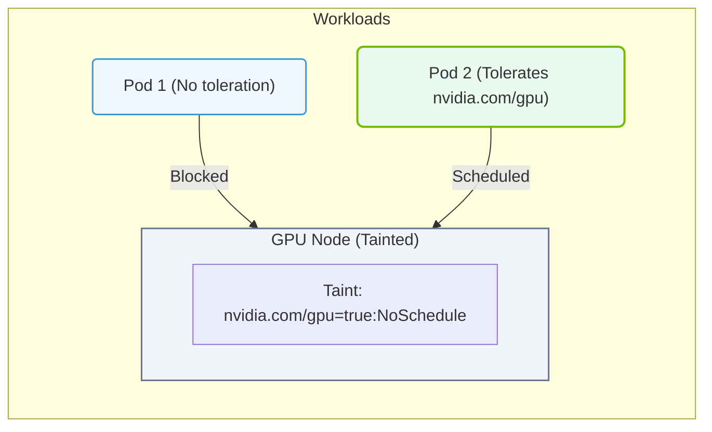

# 27.3b Node affinity and taints/tolerations: directing GPU workloads to GPU nodes

  📦 Cluster Orchestration
  📖 Kubernetes for AI

In a Kubernetes cluster, not all nodes are created equal. Some nodes have powerful GPUs, while others are CPU-only. Without proper controls, a GPU-hungry AI training job could accidentally land on a CPU-only node and fail. Node affinity and taints/tolerations are two Kubernetes mechanisms that work together to ensure your GPU workloads are placed exactly where they belong — on GPU-equipped nodes.

---

## 🧭 Context: Why We Need to Direct GPU Workloads

Imagine you have a cluster with 10 nodes. Only 3 of those nodes have NVIDIA A100 GPUs. When you submit an AI training job, Kubernetes will try to schedule it on any available node. If the job lands on a CPU-only node, it will either crash or run incredibly slowly. You need a way to tell Kubernetes: *"This job must run on a GPU node, and only on a GPU node."*

Node affinity and taints/tolerations solve this problem from two different angles:
- **Node affinity** is like a *preference* or *requirement* — it tells Kubernetes which nodes the pod *wants* to run on.
- **Taints and tolerations** are like *gatekeepers* — they prevent pods from running on certain nodes unless the pod explicitly *tolerates* the taint.

---

## ⚙️ Node Affinity: Attracting Pods to the Right Nodes

Node affinity is a set of rules that tell Kubernetes which nodes a pod should be scheduled on. It is defined in the pod specification under `spec.affinity.nodeAffinity`.

### 🧩 Two Types of Node Affinity

- **requiredDuringSchedulingIgnoredDuringExecution** — Hard requirement. The pod will not be scheduled unless a matching node is found. Use this for GPU workloads that absolutely need a GPU.
- **preferredDuringSchedulingIgnoredDuringExecution** — Soft preference. Kubernetes will try to match, but if no matching node is available, the pod will still be scheduled elsewhere. Use this for workloads that benefit from GPUs but can fall back to CPU.

### 🏷️ How It Works with GPU Nodes

GPU nodes are typically labeled with a key like `gpu-type` or `accelerator`. For example, a node with an NVIDIA A100 might have the label:
- **gpu-type: a100**

To direct a GPU workload to that node, you define a node affinity rule that requires the node to have that label.

### 📊 Node Affinity Example (Conceptual)

| Component | Value |
|-----------|-------|
| Label key | `gpu-type` |
| Label value | `a100` |
| Affinity type | `requiredDuringSchedulingIgnoredDuringExecution` |
| Operator | `In` (matches if the node has the label with that value) |

The pod will only be scheduled on nodes that have the label `gpu-type: a100`. If no such node exists, the pod will remain in a Pending state.

---

## 🛡️ Taints and Tolerations: Keeping Unwanted Pods Off GPU Nodes

While node affinity attracts pods to specific nodes, taints and tolerations repel pods from nodes they shouldn't be on. A taint is placed on a node, and only pods with a matching toleration can be scheduled on that node.

### 🧩 How Taints Work

A taint has three components:
- **Key** — A string identifier (e.g., `gpu`)
- **Value** — An optional string (e.g., `true`)
- **Effect** — What happens to pods that don't tolerate the taint:
  - **NoSchedule** — Pods that don't tolerate the taint will not be scheduled on the node.
  - **PreferNoSchedule** — Kubernetes will try to avoid scheduling non-tolerating pods, but it's not guaranteed.
  - **NoExecute** — Existing pods that don't tolerate the taint will be evicted from the node.

### 🏷️ How Tolerations Work

A toleration is added to a pod specification. It must match the taint's key, value, and effect (or use a wildcard operator).

### 🛠️ Typical GPU Node Setup

A GPU node is often tainted with something like:
- **Key:** `nvidia.com/gpu`
- **Value:** `present`
- **Effect:** `NoSchedule`

This means only pods that have a toleration for `nvidia.com/gpu: present` with effect `NoSchedule` can run on that node. All other pods are blocked.

---

### 📊 Visual Representation: Node Taints and Pod Tolerations matching
This diagram displays how taints restrict GPU nodes to dedicated workload pods, preventing CPU workloads from running on expensive GPU systems.

## 🎯 Combining Node Affinity and Taints/Tolerations

For production GPU workloads, you typically use both mechanisms together:

1. **Taint the GPU nodes** to prevent non-GPU pods from accidentally landing on them.
2. **Add a toleration to your GPU pod** so it can bypass the taint.
3. **Add node affinity to your GPU pod** to ensure it is scheduled on a GPU node (and not on a CPU-only node that happens to have no taint).

### 📊 Comparison Table

| Mechanism | Purpose | Direction | Example |
|-----------|---------|-----------|---------|
| Node Affinity | Attract pods to specific nodes | Pod → Node | Pod requires node with label `gpu-type: a100` |
| Taints | Repel pods from specific nodes | Node → Pod | Node has taint `nvidia.com/gpu: present` with effect `NoSchedule` |
| Tolerations | Allow pods to bypass taints | Pod → Node | Pod tolerates `nvidia.com/gpu: present` with effect `NoSchedule` |

---

## 🕵️ Common Pitfalls and Best Practices

### ❌ Pitfall: Forgetting the Toleration
If you add a taint to a GPU node but forget to add a toleration to your GPU pod, the pod will never be scheduled on that node. It will remain in a Pending state.

### ❌ Pitfall: Using Only Node Affinity Without Taints
Without taints, a CPU-only pod could still be scheduled on a GPU node, wasting valuable GPU resources. Always taint GPU nodes to reserve them for GPU workloads.

### ✅ Best Practice: Use Both Mechanisms
- Taint GPU nodes with **NoSchedule** effect.
- Add a matching toleration to every GPU pod.
- Add a **required** node affinity rule to ensure the pod lands on a GPU node.

### ✅ Best Practice: Use Descriptive Labels
Label your GPU nodes clearly. For example:
- **gpu-vendor: nvidia**
- **gpu-model: a100**
- **gpu-memory: 80gb**

This makes it easy to write precise node affinity rules.

### ✅ Best Practice: Test with a Simple Pod
Before running a full AI training job, test your scheduling rules with a simple pod that just sleeps. Check where it lands using:
- **kubectl get pods -o wide** (shows the node name)
- **kubectl describe node <node-name>** (shows taints and labels)

---

## 🧠 Summary

- **Node affinity** attracts GPU pods to GPU nodes by matching node labels.
- **Taints** repel non-GPU pods from GPU nodes by marking them as restricted.
- **Tolerations** allow GPU pods to bypass the taint and land on GPU nodes.
- Use **both** mechanisms together for a robust GPU scheduling strategy.
- Always taint GPU nodes to prevent resource waste, and always add tolerations and node affinity to your GPU pods.

By mastering node affinity and taints/tolerations, you ensure that your expensive GPU resources are used only by the workloads that truly need them — keeping your AI training jobs running smoothly and efficiently.