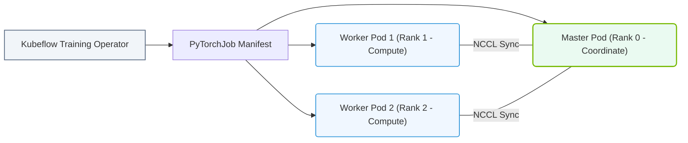

# 27.3d MPI Operator and PyTorch Operator: running distributed training jobs in K8s

  📦 Cluster Orchestration
  📖 Kubernetes for AI

## 🧠 Context Introduction

When you move from training a single model on one GPU to training across multiple GPUs (or multiple nodes), you enter the world of **distributed training**. In Kubernetes, running these distributed jobs manually is complex — you need to coordinate pod startup, network setup, and fault tolerance. This is where **MPI Operator** and **PyTorch Operator** come in. They are Kubernetes custom resource definitions (CRDs) that simplify launching and managing distributed training jobs, handling the orchestration for you.

Think of them as specialized job schedulers: you tell them *what* to run (your training script) and *how many* workers you need, and they handle the rest.

---

## ⚙️ What is the MPI Operator?

The **MPI Operator** (Message Passing Interface Operator) is designed for distributed training frameworks that use MPI-style communication, such as **Horovod** or **TensorFlow with MPI**. It creates a set of pods (a "launcher" pod and multiple "worker" pods) and sets up the SSH or MPI communication between them.

**Key characteristics:**
- Best suited for **synchronous all-reduce** training patterns (e.g., Horovod).
- Creates a **Launcher** pod that coordinates and a set of **Worker** pods that do the actual computation.
- Automatically generates the hostfile (list of worker addresses) needed for MPI.
- Supports **Gang scheduling** (all workers must be scheduled before the job starts).

---

## 🔥 What is the PyTorch Operator?

The **PyTorch Operator** (often called **PyTorchJob**) is purpose-built for **PyTorch's native distributed training** (`torch.distributed`). It manages the lifecycle of master, worker, and (optionally) parameter server pods.

**Key characteristics:**
- Natively understands PyTorch's `DistributedDataParallel` (DDP) and `torchrun` launcher.
- Supports **Elastic Training** — workers can be added or removed during training without restarting.
- Defines roles: **Master** (coordinator), **Worker** (compute), and optionally **Parameter Server** (for older PS mode).
- Handles **fault tolerance** — if a worker dies, it can be restarted automatically.

---

## 📊 Comparison: MPI Operator vs. PyTorch Operator

| Feature | MPI Operator | PyTorch Operator |
|---------|--------------|------------------|
| **Primary framework** | Horovod, TensorFlow (with MPI), any MPI-based code | PyTorch native (`torch.distributed`) |
| **Communication pattern** | MPI all-reduce (synchronous) | NCCL / Gloo (PyTorch's backend) |
| **Elastic training** | ❌ Not natively supported | ✅ Supported (add/remove workers) |
| **Fault tolerance** | ❌ Pod failure = job failure (usually) | ✅ Can restart failed workers |
| **Pod roles** | Launcher + Workers | Master + Workers (+ Parameter Servers) |
| **Ease of use for PyTorch** | Requires wrapping code with Horovod | Native `torchrun` support |
| **Gang scheduling** | ✅ Yes (all workers start together) | ✅ Yes (configurable) |

---

### 📊 Visual Representation: Training Operator Master-Worker layout
This diagram displays PyTorchJob/MPIJob abstractions: establishing master rank networks and orchestrating worker pod synchronization.

## 🛠️ How They Work in Kubernetes

Both operators extend Kubernetes by introducing new **Custom Resource Definitions (CRDs)**. You define your training job as a YAML resource, and the operator's controller watches for these resources and creates the necessary pods, services, and configmaps.

**For the MPI Operator:**
- You define an `MPIJob` resource.
- The operator creates a **Launcher pod** (runs the MPI launcher command) and **Worker pods** (run the training script).
- The Launcher pod generates a hostfile and distributes it to workers.
- Workers communicate via MPI over the cluster network (often using **NVIDIA GPUDirect RDMA** for fast GPU-to-GPU communication).

**For the PyTorch Operator:**
- You define a `PyTorchJob` resource.
- The operator creates **Master** and **Worker** pods (and optionally **Parameter Server** pods).
- The Master pod runs `torchrun` or similar to initialize the distributed process group.
- Workers connect to the master using the `MASTER_ADDR` and `MASTER_PORT` environment variables automatically injected by the operator.

---

## 🕵️ When to Use Which Operator?

**Use MPI Operator when:**
- Your training code uses **Horovod** (`hvd.allreduce`, `hvd.DistributedOptimizer`).
- You are running **TensorFlow** distributed training with MPI backend.
- You need **synchronous all-reduce** with strict consistency.
- You are comfortable with MPI concepts (world size, rank, hostfile).

**Use PyTorch Operator when:**
- Your training code uses **PyTorch's native distributed** (`torch.distributed.launch` or `torchrun`).
- You want **elastic training** (add/remove GPUs mid-job).
- You need **fault tolerance** (worker restarts).
- You are starting fresh with PyTorch and want the simplest path.

---

## 🧩 Example Workflow (Conceptual)

Here is a high-level workflow for running a distributed training job with either operator:

1. **Prepare your training script** — ensure it accepts `WORLD_SIZE`, `RANK`, `MASTER_ADDR`, `MASTER_PORT` (for PyTorch) or uses Horovod init (for MPI).

2. **Build a container image** — include your training script, dependencies (PyTorch, Horovod, NCCL), and NVIDIA CUDA toolkit.

3. **Create a YAML manifest** — define the `MPIJob` or `PyTorchJob` resource specifying:
   - Number of workers (and replicas per worker)
   - Container image and command
   - GPU resource requests (e.g., `nvidia.com/gpu: 8`)
   - (Optional) Elastic policy for PyTorch Operator

4. **Apply the manifest** — submit to Kubernetes with `kubectl apply -f job.yaml`.

5. **Monitor the job** — use `kubectl get pods` to see the launcher/master and worker pods. Check logs with `kubectl logs <pod-name>`.

6. **Scale or stop** — for PyTorch Operator, you can update the replica count to add/remove workers. For MPI Operator, you typically stop and resubmit.

---

## ✅ Key Takeaways for New Engineers

- **MPI Operator** is for **Horovod/MPI-based** training; **PyTorch Operator** is for **native PyTorch** distributed training.
- Both operators **automate pod creation, networking, and coordination** — you don't need to manually set up SSH or hostfiles.
- **PyTorch Operator** offers **elasticity** and **fault tolerance**; MPI Operator is more rigid but optimized for synchronous all-reduce.
- Always ensure your container image has the correct **NVIDIA drivers, CUDA toolkit, and NCCL** libraries for GPU communication.
- Start with **PyTorch Operator** if you are new to distributed training — it has better defaults and documentation for modern workflows.

---

## 📚 Further Learning

- Explore the **NVIDIA GPU Operator** documentation to understand how GPUs are exposed to pods.
- Experiment with small distributed jobs (2–4 GPUs) before scaling to hundreds.
- Learn about **NCCL** (NVIDIA Collective Communications Library) — it's the backbone of GPU-to-GPU communication in both operators.
- Understand **Gang scheduling** and why it matters for distributed training performance.

> 💡 **Remember:** Distributed training is about **parallelism** — splitting data across GPUs and synchronizing gradients. These operators are your tools to manage that complexity in Kubernetes.