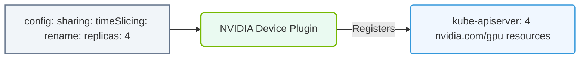

# 28.2b Configuring time-slicing in Kubernetes via GPU Operator configmap

<div class="lesson-completion" data-lesson-id="28_2b_kubernetes_timeslicing_configuration"></div>
<div class="lesson-tags">
  <span class="lesson-tag">📦 Cluster Orchestration</span>
  <span class="lesson-tag">📖 Advanced GPU Resource Management</span>
</div>


---

## 🧠 Context Introduction

Time-slicing is a GPU sharing technique that allows multiple workloads to share a single GPU by dividing its compute time into small intervals. Unlike MIG (which provides hardware-level partitioning) or MPS (which enables concurrent kernel execution), time-slicing is a software-based approach that works with any NVIDIA GPU, including those that do not support MIG.

In Kubernetes, the GPU Operator simplifies time-slicing configuration through a ConfigMap. This approach allows engineers to define how GPU resources are shared across pods without modifying the underlying GPU hardware configuration.

---

## ⚙️ What is Time-Slicing?

Time-slicing works by:

- **Temporal sharing**: The GPU processes work from one pod for a short time slice, then switches to another pod's work.
- **Round-robin scheduling**: Pods take turns using the GPU, with each getting a fair share of compute time.
- **No memory isolation**: Unlike MIG, all pods sharing the GPU have access to the same GPU memory — this means one pod could potentially consume all available memory.
- **Best for inference workloads**: Time-slicing is ideal for batch inference, model serving, and other workloads where latency is not critical.

---

## 🛠️ How the GPU Operator ConfigMap Works

The GPU Operator uses a ConfigMap named **nvidia-device-plugin-config** in the **gpu-operator** namespace to define time-slicing configurations. This ConfigMap tells the NVIDIA device plugin how to expose GPU resources to Kubernetes.

### Key Components:

- **ConfigMap name**: nvidia-device-plugin-config
- **Namespace**: gpu-operator (default)
- **Data key**: config (contains the YAML configuration)
- **Configuration format**: YAML with a list of sharing configurations

---

## 📊 Time-Slicing vs. Other GPU Sharing Methods

| Feature | Time-Slicing | MIG | MPS |
|---------|-------------|-----|-----|
| **Hardware requirement** | Any NVIDIA GPU | A100, H100, H200 | Any NVIDIA GPU |
| **Memory isolation** | ❌ No | ✅ Yes | ❌ No |
| **Compute isolation** | ❌ No (temporal) | ✅ Yes (hardware) | ⚠️ Partial |
| **Best for** | Inference, batch jobs | Multi-tenant, security-critical | Mixed workloads |
| **Configuration complexity** | Low | Medium | Medium |

---

## 🕵️ Configuring Time-Slicing Step-by-Step

### Step 1: Understand the Default Configuration

By default, the GPU Operator does not enable time-slicing. Each GPU is exposed as a single resource (nvidia.com/gpu: 1). To enable time-slicing, you must modify the ConfigMap.

### Step 2: Define the Time-Slicing Configuration

The configuration defines how many "virtual GPUs" each physical GPU should be split into. For example, to split each GPU into 4 time-sliced replicas:

- **Configuration structure**: A list of sharing configurations, each with a name, a list of resources, and a replicas count.
- **Resource name**: The Kubernetes resource name (e.g., nvidia.com/gpu).
- **Replicas**: The number of time-sliced instances per physical GPU.

### Step 3: Apply the Configuration

To apply the configuration, you update the ConfigMap in the gpu-operator namespace. The GPU Operator's device plugin watches for changes and reloads automatically.

### Step 4: Verify the Configuration

After applying, you can verify by checking the device plugin logs or by deploying a test pod that requests a fractional GPU.

---


### 📊 Visual Representation: K8s Device Plugin Timeslicing config
This diagram displays how configuring replicas in the device plugin spec tells Kubernetes to report a single GPU card multiple times.




## 🧪 Example Configuration Breakdown

For reference, here is a sample time-slicing configuration:

```
apiVersion: v1
kind: ConfigMap
metadata:
  name: nvidia-device-plugin-config
  namespace: gpu-operator
data:
  config: |
    version: v1
    sharing:
      timeSlicing:
        resources:
        - name: nvidia.com/gpu
          replicas: 4
```

📤 **Output**: After applying this ConfigMap, each physical GPU will appear as 4 separate nvidia.com/gpu resources in Kubernetes. A pod requesting nvidia.com/gpu: 1 will get 1/4 of the GPU's compute time.

---

## ✅ Best Practices for Time-Slicing

- **Start with small replicas**: Begin with 2-4 replicas per GPU and monitor performance.
- **Monitor GPU memory**: Since memory is not isolated, ensure workloads do not exceed available GPU memory.
- **Use for stateless workloads**: Time-slicing works best for inference and batch processing, not for training.
- **Combine with resource limits**: Set Kubernetes resource limits (memory, CPU) to prevent one pod from starving others.
- **Test with representative workloads**: Run your actual application to see if time-slicing introduces unacceptable latency.

---

## 🚨 Common Pitfalls

- **Memory exhaustion**: One pod can consume all GPU memory, causing other pods to fail.
- **Latency spikes**: Time-slicing adds context-switching overhead, which can increase inference latency.
- **Not suitable for training**: Training workloads require consistent GPU access and benefit from MIG or dedicated GPUs.
- **Configuration not applied**: Ensure the ConfigMap is in the correct namespace and the device plugin is running.

---

## 🔍 Troubleshooting Tips

- **Check device plugin logs**: Look for messages indicating the ConfigMap was loaded.
- **Verify GPU resources**: Use kubectl describe node to see if time-sliced resources appear.
- **Test with a simple pod**: Deploy a pod requesting nvidia.com/gpu: 1 and check if it runs.
- **Revert changes**: If issues occur, restore the default ConfigMap (no sharing configuration).

---

## 📚 Summary

Time-slicing via the GPU Operator ConfigMap is a simple, flexible way to share GPUs across multiple pods in Kubernetes. It requires no hardware changes and works with any NVIDIA GPU. However, engineers must be aware of its limitations — no memory isolation and potential latency impacts — and choose it for appropriate workloads like inference and batch processing.

By modifying the **nvidia-device-plugin-config** ConfigMap, you can define how many virtual GPU instances each physical GPU should provide, enabling efficient GPU utilization in multi-tenant environments.