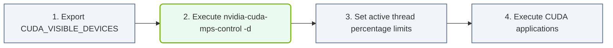

# 28.3d Enabling MPS: nvidia-cuda-mps-control daemon and K8s configuration

  📦 Cluster Orchestration
  📖 Advanced GPU Resource Management

---

## 🧠 Context Introduction

When multiple processes share a single GPU, they typically compete for resources, leading to inefficiencies and performance degradation. NVIDIA Multi-Process Service (MPS) solves this by creating a unified CUDA context that allows multiple processes to submit work to the GPU simultaneously, improving both utilization and throughput. This section covers how to enable MPS using the **nvidia-cuda-mps-control daemon** and configure it within a Kubernetes (K8s) environment.

---

## ⚙️ What is the nvidia-cuda-mps-control Daemon?

The **nvidia-cuda-mps-control daemon** is a background service that manages MPS on a GPU. It acts as a proxy between CUDA applications and the GPU driver, enabling:

- **Unified memory management** across multiple processes
- **Reduced context switching overhead**
- **Better GPU utilization** for small, frequent workloads

**Key characteristics:**
- Runs as a persistent process on the host or container
- Controls MPS server startup and shutdown
- Monitors active client connections
- Provides runtime configuration options (e.g., default active thread percentage)

---

## 🛠️ Enabling MPS on a Host System

To enable MPS manually on a Linux host:

1. **Stop any existing MPS daemon** — Use the control daemon to shut down previous instances
2. **Set the CUDA MPS pipe directory** — Define a shared directory for MPS communication
3. **Start the MPS daemon** — Launch the control daemon with root privileges
4. **Verify MPS is active** — Check that the daemon is running and accepting connections

**Expected behavior after enabling MPS:**
- All CUDA applications launched under the same user will automatically use MPS
- GPU memory and compute resources are shared efficiently
- Performance improves for workloads with many small kernel launches

---

## 📊 MPS vs. Default GPU Sharing

| Feature | Default GPU Sharing | With MPS Enabled |
|---------|-------------------|------------------|
| **Context overhead** | High per-process | Low (shared context) |
| **Kernel launch latency** | High | Reduced |
| **Memory utilization** | Fragmented | Unified |
| **Concurrent execution** | Limited | Enhanced |
| **Ideal workload** | Large, independent tasks | Many small, concurrent tasks |

---

### 📊 Visual Representation: MPS Server Daemon Boot Flow
This flowchart maps out starting MPS: exporting the GPU ID, starting the control daemon, and setting thread caps.

## 🐳 Configuring MPS in Kubernetes

In Kubernetes, MPS must be configured at the **node level** or **pod level** using specific environment variables and volume mounts.

### Node-Level Setup (Recommended for Production)

1. **Install the NVIDIA device plugin** with MPS support enabled
2. **Configure the MPS daemon** as a systemd service on each GPU node
3. **Set the default MPS pipe directory** to a shared path accessible by all pods

### Pod-Level Configuration

For pods that need MPS, include the following in your pod spec:

- **Environment variables:**
  - `CUDA_MPS_PIPE_DIRECTORY` — Points to the MPS pipe directory
  - `CUDA_MPS_ACTIVE_THREAD_PERCENTAGE` — Limits GPU compute usage (optional)

- **Volume mounts:**
  - Mount the MPS pipe directory from the host into the container
  - Mount the MPS control socket for daemon communication

**Example pod configuration (conceptual):**
- Set `CUDA_MPS_PIPE_DIRECTORY` to `/tmp/nvidia-mps`
- Mount host path `/tmp/nvidia-mps` to container path `/tmp/nvidia-mps`
- Mount host path `/tmp/nvidia-mps-control` to container path `/tmp/nvidia-mps-control`

---

## 🕵️ Verifying MPS is Working in a Pod

To confirm MPS is active inside a running pod:

1. **Check the MPS daemon status** — Look for the `nvidia-cuda-mps-control` process
2. **Inspect environment variables** — Verify `CUDA_MPS_PIPE_DIRECTORY` is set correctly
3. **Run a CUDA sample** — Execute a multi-process CUDA application and observe performance

**Signs of successful MPS activation:**
- Multiple CUDA processes appear under the same MPS server
- GPU utilization shows concurrent kernel execution
- Reduced latency for small kernel launches

---

## ⚠️ Important Considerations

- **MPS is per-GPU** — Each GPU requires its own MPS daemon instance
- **User isolation** — All processes sharing MPS must run under the same user ID
- **Memory limits** — MPS does not enforce per-process memory limits; use CUDA MPS control to set active thread percentage
- **Kubernetes compatibility** — Ensure your NVIDIA device plugin version supports MPS (v0.9.0+)
- **Performance tuning** — Adjust `CUDA_MPS_ACTIVE_THREAD_PERCENTAGE` to balance fairness vs. throughput

---

## 🧪 Troubleshooting Common Issues

| Issue | Likely Cause | Solution |
|-------|-------------|----------|
| MPS daemon not starting | Missing permissions or pipe directory | Run as root; create directory with proper permissions |
| Pods cannot connect to MPS | Volume mounts missing or incorrect | Verify mount paths match between host and container |
| Performance degradation | Active thread percentage too low | Increase `CUDA_MPS_ACTIVE_THREAD_PERCENTAGE` |
| MPS not used by applications | Environment variables not set | Ensure `CUDA_MPS_PIPE_DIRECTORY` is defined in pod spec |

---

## ✅ Summary

Enabling MPS through the **nvidia-cuda-mps-control daemon** transforms GPU sharing from a sequential, high-overhead process into an efficient, concurrent execution model. In Kubernetes, this requires careful configuration of environment variables and volume mounts at both the node and pod levels. When properly set up, MPS dramatically improves GPU utilization for workloads with many small, parallel tasks — making it an essential tool for engineers managing AI infrastructure at scale.