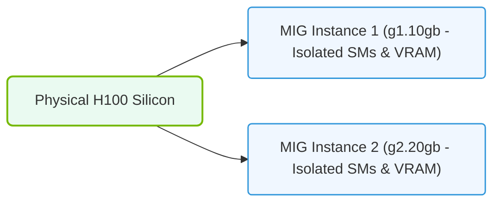

# 28.4a MIG architecture: physically partitioning the GPC, HBM, L2 cache, and engines

  📦 Cluster Orchestration
  📖 Advanced GPU Resource Management

## 🌱 Context Introduction

Imagine you have a powerful NVIDIA GPU, like an A100 or H100, that can handle massive AI workloads. But what if you only need a fraction of that power for a smaller job? Without Multi-Instance GPU (MIG), you would either waste GPU resources or have to run multiple jobs that interfere with each other.

MIG solves this by **physically partitioning** the GPU into smaller, isolated instances. Each instance behaves like its own independent GPU with dedicated memory, cache, and compute engines. This is different from software-based sharing, where jobs can still compete for resources.

For new engineers, think of MIG like dividing a large apartment building into separate, self-contained apartments. Each apartment has its own kitchen (compute), bathroom (memory), and living room (cache). No tenant can access another tenant's space.

---

## ⚙️ What Does MIG Physically Partition?

MIG works at the hardware level to split four key GPU components:

- **GPC (Graphics Processing Cluster)** — The main compute units where AI calculations happen
- **HBM (High Bandwidth Memory)** — The fast, on-board GPU memory where data and models are stored
- **L2 Cache** — A shared memory pool that speeds up data access for compute units
- **Engines** — Specialized hardware units for tasks like video decoding, DMA transfers, and copy operations

Each MIG instance gets its own dedicated slice of these components. The partitioning is **static** — meaning it is set at GPU configuration time and cannot change dynamically while jobs are running.

---

## 🛠️ How Partitioning Works (Simple Breakdown)

### 🔹 GPC Partitioning
- The GPU's compute units (SMs or Streaming Multiprocessors) are grouped into GPCs.
- MIG assigns a specific number of GPCs to each instance.
- Example: An A100 GPU has 7 GPCs. You could create 7 single-GPC instances or 3 dual-GPC instances plus 1 single-GPC instance.

### 🔹 HBM Partitioning
- The GPU's high-bandwidth memory (e.g., 80 GB on an H100) is sliced into smaller chunks.
- Each MIG instance gets a fixed amount of memory (e.g., 10 GB, 20 GB, or 40 GB).
- This memory is **physically isolated** — one instance cannot read or write to another instance's memory.

### 🔹 L2 Cache Partitioning
- The L2 cache is a shared resource that speeds up memory access.
- MIG divides the L2 cache into separate slices, one per instance.
- This prevents one workload from "flooding" the cache and slowing down other instances.

### 🔹 Engine Partitioning
- Specialized engines (like NVENC for video encoding, NVDEC for decoding, and copy engines for data movement) are also partitioned.
- Each instance gets dedicated access to a subset of these engines.
- This ensures that one job's video processing doesn't block another job's data transfers.

---

## 📊 Comparison: MIG vs. Software Sharing

| Feature | MIG (Hardware Partitioning) | Software Sharing (e.g., MPS, Time-Slicing) |
|---------|-----------------------------|---------------------------------------------|
| **Isolation Level** | Full hardware isolation | Partial (software-level) |
| **Memory Protection** | Yes — physical memory separation | No — memory can be shared |
| **Cache Interference** | None — dedicated L2 cache slices | Possible — cache can be contested |
| **Performance Guarantee** | Predictable, fixed resources | Variable, depends on other jobs |
| **Flexibility** | Static — requires reconfiguration to change | Dynamic — can adjust on the fly |
| **Use Case** | Multi-tenant environments, security-critical workloads | Development, testing, low-priority jobs |

---

### 📊 Visual Representation: Multi-Instance GPU (MIG) Hardware Silicon partitioning
This diagram displays MIG partitioning, isolating GPU memory controllers, SMs, and cache blocks at the silicon level.

## 🕵️ Real-World Analogy

Think of a GPU without MIG as a single large conference room. If two teams need to use it, they either:
- Take turns (time-slicing) — inefficient and causes delays
- Share the room (MPS) — but one team's loud conversation disturbs the other

With MIG, you build a wall down the middle, creating two separate rooms. Each team has its own door, own whiteboard, and own projector. They can work simultaneously without any interference.

---

## 🧩 Key Takeaways for New Engineers

- **MIG is hardware-level**, not software-level. This means the GPU physically enforces the separation.
- **Partitioning is static**. You configure MIG once (usually at boot time or via the NVIDIA management tool), and the partitions stay until you reconfigure.
- **Each instance is fully isolated**. A crash or memory error in one instance does not affect others.
- **Not all GPUs support MIG**. Currently, only certain NVIDIA data center GPUs like the A100, H100, and newer models have this feature.
- **MIG is ideal for multi-tenant environments** where you need to guarantee performance and security for each user or workload.

---

## 📌 Quick Reference: Supported MIG Configurations (Example for A100 80GB)

- **1g.10gb** — 1 GPC, 10 GB memory, 1/7th of the GPU
- **2g.20gb** — 2 GPCs, 20 GB memory, 2/7th of the GPU
- **3g.40gb** — 3 GPCs, 40 GB memory, 3/7th of the GPU
- **4g.40gb** — 4 GPCs, 40 GB memory, 4/7th of the GPU
- **7g.80gb** — Full GPU (no partitioning)

These are the standard "profiles" you will encounter when configuring MIG. Each profile defines exactly how many GPCs, how much HBM, and how much L2 cache a MIG instance receives.

---

## 🔍 Next Steps for Learning

- Experiment with MIG on a supported GPU using the **nvidia-smi** tool to list available profiles.
- Try creating a MIG instance and running a simple AI model inside it.
- Compare performance of the same model running on a full GPU vs. a MIG instance to understand resource isolation.

Remember: MIG is about **guaranteeing resources** for each workload. It trades flexibility for predictability and security.