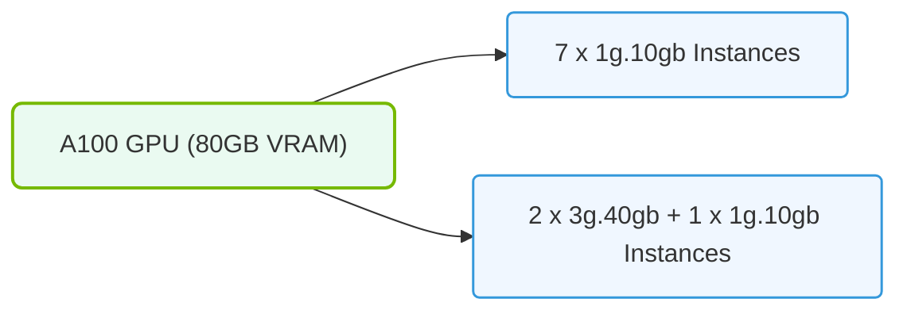

# 28.4b MIG instance profiles on A100: 1g.5gb, 2g.10gb, 3g.20gb, 4g.20gb, 7g.40gb

  📦 Cluster Orchestration
  📖 Advanced GPU Resource Management

## 🧠 Context Introduction

When you work with NVIDIA A100 GPUs in an AI infrastructure, you often face a common challenge: a single GPU is too powerful for small workloads, but you still need to run multiple jobs simultaneously. Multi-Instance GPU (MIG) solves this by physically partitioning one A100 GPU into smaller, isolated instances. Each instance has its own dedicated memory, cache, and compute units — just like having multiple smaller GPUs inside one physical card.

This section covers the five standard MIG instance profiles available on the A100 GPU. These profiles define how much compute and memory each partition gets, allowing you to match GPU resources precisely to workload needs.

---

## ⚙️ What Are MIG Instance Profiles?

MIG instance profiles are predefined configurations that slice an A100 GPU into smaller, hardware-isolated units. Each profile is named using a format like **1g.5gb**, where:

- **The number before "g"** (e.g., 1g, 2g) represents how many GPU compute slices (GPCs) the instance gets.
- **The number after "gb"** (e.g., 5gb, 10gb) represents the dedicated memory allocated to that instance in gigabytes.

These profiles ensure that workloads running on different instances never interfere with each other — no memory conflicts, no compute contention, and no cache sharing.

---

## 📊 The Five Standard MIG Profiles on A100

The A100 GPU supports five standard MIG instance profiles. Here is a quick comparison:

| Profile Name | Compute Slices (GPCs) | Memory (GB) | Best For |
|---|---|---|---|
| **1g.5gb** | 1 | 5 | Small inference jobs, lightweight model serving |
| **2g.10gb** | 2 | 10 | Medium inference, small training experiments |
| **3g.20gb** | 3 | 20 | Larger inference batches, moderate training |
| **4g.20gb** | 4 | 20 | Balanced compute/memory workloads |
| **7g.40gb** | 7 | 40 | Heavy training, large model inference |

---

### 📊 Visual Representation: A100 GPU MIG profile allocations
This diagram displays A100 partition limits: splitting the card into up to seven separate 1g.10gb slices.

## 🛠️ How These Profiles Work in Practice

When you enable MIG on an A100 GPU, you can create one or more instances using these profiles. The key rules are:

- **You cannot mix profiles arbitrarily** — the total compute slices and memory used across all instances must fit within the GPU's full capacity (7 compute slices and 40GB memory).
- **Each instance is fully isolated** — a job on a **1g.5gb** instance cannot access memory or compute resources of a **2g.10gb** instance on the same GPU.
- **Profiles are hardware-enforced** — unlike software-based partitioning, MIG guarantees performance isolation at the hardware level.

---

## 🕵️ Choosing the Right Profile for Your Workload

As a new engineer, here is how you can think about selecting a MIG profile:

- **Start with 1g.5gb** for testing or running many small model inference tasks in parallel. You can fit up to 7 of these on one A100 GPU.
- **Use 2g.10gb** when your model needs more memory but still fits in a smaller compute footprint.
- **Choose 3g.20gb or 4g.20gb** when you need more compute but your model does not require the full 40GB memory. Note that **4g.20gb** gives you more compute than **3g.20gb** but the same memory — useful for compute-heavy models with moderate memory needs.
- **Reserve 7g.40gb** for your largest workloads that need both maximum compute and full memory access. Only one such instance fits on a single A100 GPU.

---

## 🔍 Important Notes for New Engineers

- **MIG is not always enabled by default** — you must enable it on the GPU before creating instances.
- **Profiles are specific to the A100** — other GPU models (like H100) have different profile options.
- **Not all software supports MIG** — check that your container runtime, Kubernetes plugin, or job scheduler is MIG-aware before deploying.
- **You can reconfigure MIG instances** without rebooting the GPU, but any running jobs on the affected instances will be terminated.

---

## ✅ Summary

MIG instance profiles on the A100 GPU give you the flexibility to partition one physical GPU into multiple, isolated virtual GPUs. The five standard profiles — **1g.5gb**, **2g.10gb**, **3g.20gb**, **4g.20gb**, and **7g.40gb** — let you match resources precisely to your workload needs, improving utilization and reducing costs in AI infrastructure. As you gain experience, you will learn to combine these profiles to run diverse workloads efficiently on the same GPU hardware.