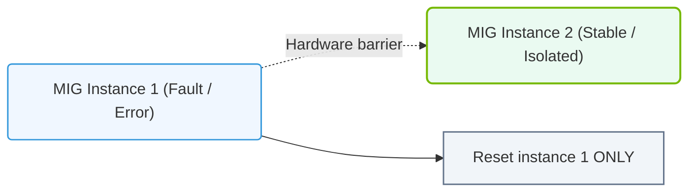

# 28.4g Security guarantees: complete memory isolation and fault isolation between MIG slices

  📦 Cluster Orchestration
  📖 Advanced GPU Resource Management

---

## 🔍 Context Introduction

When you share a single physical GPU among multiple users or workloads, security becomes a critical concern. Without proper isolation, one workload could accidentally (or maliciously) access another workload's data, or a failing workload could crash the entire GPU. Multi-Instance GPU (MIG) solves this by providing **hardware-level guarantees** that each partition (called a "MIG slice") is completely isolated from every other slice. This means you can run sensitive workloads side-by-side with the same security as if they were on separate physical GPUs.

---

## ⚙️ What Are Memory Isolation and Fault Isolation?

- **Memory Isolation**: Each MIG slice has its own dedicated portion of GPU memory (VRAM). No slice can read, write, or even see the memory belonging to another slice. This is enforced at the hardware level, not by software.
- **Fault Isolation**: If one MIG slice crashes, hangs, or experiences an error, it does not affect any other slice. The GPU hardware contains the failure to only that specific partition.

---

## 🛡️ How MIG Achieves Complete Isolation

MIG uses hardware-level partitioning of the GPU's internal resources. Here is how it works:

- **Memory controllers are dedicated**: Each MIG slice gets its own set of memory channels and memory controllers. There is no shared memory bus between slices.
- **L2 cache is partitioned**: The GPU's L2 cache is split into separate, non-overlapping regions for each slice.
- **Compute units are exclusive**: Each slice receives its own set of Streaming Multiprocessors (SMs) that no other slice can use.
- **Register files and caches are private**: Every slice has its own dedicated register file and L1 cache, preventing data leakage through shared resources.
- **Hardware firewall**: The GPU's internal crossbar and interconnect fabric are configured to prevent any data flow between slices.

---

### 📊 Visual Representation: MIG Hardware Fault and Memory Isolation
This diagram displays how physical hardware isolation in MIG prevents memory faults from propagating to adjacent GPU instances.

## 📊 Comparison: MIG vs. Software-Based Isolation

| Feature | MIG (Hardware Isolation) | Software-Based Isolation (e.g., Time-Slicing) |
|---------|--------------------------|-----------------------------------------------|
| Memory isolation | ✅ Complete — hardware-enforced | ❌ Partial — relies on OS/driver |
| Fault isolation | ✅ One slice crash does not affect others | ❌ A crash can impact the entire GPU |
| Performance interference | ✅ None — dedicated resources | ❌ Possible "noisy neighbor" effects |
| Security guarantee | ✅ Tamper-proof at hardware level | ⚠️ Vulnerable to software exploits |
| Certification readiness | ✅ Suitable for multi-tenant environments | ❌ Not recommended for strict isolation |

---

## 🕵️ Real-World Implications for Engineers

- **Multi-tenant AI platforms**: You can safely run workloads from different customers on the same GPU without risk of data leakage.
- **Mixed-criticality workloads**: Run a critical inference job alongside a less important training job. If the training job crashes, the inference job continues unaffected.
- **Compliance and auditing**: Hardware-level isolation helps meet security standards (e.g., PCI DSS, HIPAA) because there is no shared memory state between slices.
- **Debugging simplicity**: When a workload fails, you know the failure is contained to that specific MIG slice. You do not need to restart the entire GPU.

---

## ✅ Key Takeaways for New Engineers

- MIG provides **hardware-enforced** memory and fault isolation — this is stronger than any software-based approach.
- Each MIG slice behaves like a **miniature, independent GPU** with its own dedicated resources.
- You can safely run **untrusted or sensitive workloads** alongside other workloads on the same physical GPU.
- If a MIG slice crashes, **no other slice is affected** — the GPU hardware contains the failure.
- This isolation is **automatic** once MIG is configured; no special application code is needed.

---

## 🧠 Quick Memory Check

To verify memory isolation on a MIG-enabled GPU, you can use the **nvidia-smi** command with the **mig** flag. The output will show each MIG instance with its own memory usage, and you will see that memory totals for each slice add up to the full GPU memory without overlap. For example, on an A100 GPU with 80 GB, if you create 7 MIG slices of 10 GB each, the remaining 10 GB is reserved for the GPU's internal management — no slice can access another slice's 10 GB allocation.