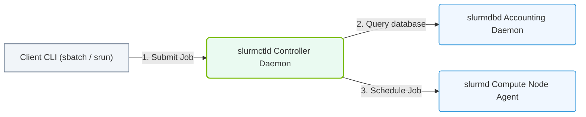

# 29.1a Slurm architecture: slurmctld (controller), slurmd (node daemon), slurmdb (accounting)

  📦 Cluster Orchestration
  📖 Traditional HPC Schedulers

---

## 🧭 Context Introduction

Slurm (Simple Linux Utility for Resource Management) is the most widely used workload manager for high-performance computing (HPC) clusters. Think of it as the **air traffic controller** for your GPU and CPU resources. When you submit a job (like training a large AI model), Slurm decides *which* compute nodes will run it, *when* they will run it, and *how* the resources are shared among all users.

For new engineers entering AI infrastructure, understanding Slurm's architecture is critical because it's the backbone of most GPU clusters in research labs, cloud environments, and enterprise data centers. The architecture has three main components that work together like a well-organized team.

---

## ⚙️ The Three Pillars of Slurm Architecture

Slurm operates with a **centralized manager** design. Here are the three core daemons (background services) that make everything work:

### 1. 🧠 slurmctld — The Controller (The Brain)

This is the **master daemon** that runs on a single management node (often called the "head node" or "login node").

- **What it does:** Manages the entire cluster state, including job queues, resource allocations, and scheduling decisions.
- **Key responsibilities:**
  - Accepts job submissions from users.
  - Decides which nodes and GPUs to assign to each job.
  - Monitors node availability and health.
  - Handles job priorities and fair-share scheduling.
- **High availability:** In production clusters, you can run a backup `slurmctld` on a secondary node for failover.

### 2. 🖥️ slurmd — The Node Daemon (The Worker)

This daemon runs on **every compute node** in the cluster (each server that has GPUs or CPUs).

- **What it does:** Acts as the local agent that follows orders from `slurmctld`.
- **Key responsibilities:**
  - Reports node status (idle, busy, down, drained) back to the controller.
  - Launches and manages jobs on its local node.
  - Enforces resource limits (e.g., only using the assigned GPUs).
  - Cleans up after jobs complete.

### 3. 📊 slurmdbd — The Accounting Daemon (The Bookkeeper)

This daemon handles **database logging** and is optional but highly recommended for production clusters.

- **What it does:** Stores job accounting data, user associations, and resource usage history into a database (usually MySQL or MariaDB).
- **Key responsibilities:**
  - Tracks who used what resources and for how long.
  - Enforces usage limits and fair-share policies.
  - Provides historical data for reporting and chargeback.
  - Works with `sacct` and `sreport` commands for querying usage.

---

## 🛠️ How They Work Together — A Simple Flow

When a user submits a job, here's the step-by-step journey:

1. **User submits a job** (e.g., a request for 4 GPUs for 2 hours) to the login node.
2. **slurmctld** receives the request, checks the job queue, and looks for available nodes.
3. **slurmctld** communicates with **slurmd** on each compute node to check current status.
4. Once resources are found, **slurmctld** sends the job assignment to the appropriate **slurmd** daemon(s).
5. **slurmd** launches the job on the node, allocates the requested GPUs, and monitors execution.
6. When the job finishes, **slurmd** reports completion back to **slurmctld**.
7. **slurmctld** sends accounting data to **slurmdbd**, which stores it in the database.

---

### 📊 Visual Representation: Slurm Workload Manager Architecture
This diagram displays Slurm components: the controller daemon (slurmctld) scheduling tasks down to compute host daemons (slurmd).

## 📋 Comparison Table: The Three Daemons

| Feature | slurmctld (Controller) | slurmd (Node Daemon) | slurmdbd (Accounting) |
|---------|------------------------|----------------------|-----------------------|
| **Location** | Management node only | Every compute node | Management node (or dedicated DB server) |
| **Primary role** | Scheduling & orchestration | Local job execution | Usage tracking & reporting |
| **Runs as** | One instance (plus backup) | One per node | One instance per cluster |
| **Failure impact** | Cluster stops scheduling | Only that node is affected | No scheduling impact, but no accounting |
| **Configuration file** | `slurm.conf` | `slurm.conf` (same file) | `slurmdbd.conf` (separate) |

---

## 🕵️ Key Concepts for New Engineers

### 🔄 Communication Flow
- **slurmctld** talks to **slurmd** using a **control network** (usually a dedicated management VLAN).
- **slurmd** never talks to other **slurmd** daemons — they only communicate with the controller.
- **slurmdbd** receives data from **slurmctld** via a separate TCP connection (port 6819 by default).

### 🏗️ Typical Deployment Layout

A standard Slurm cluster looks like this:

- **1 Login Node:** Where users log in and submit jobs (runs `slurmctld` and `slurmdbd`).
- **N Compute Nodes:** Where jobs actually run (each runs `slurmd`).
- **1 Storage System:** Shared filesystem (like NFS or Lustre) accessible by all nodes.

### ⚠️ What Happens When a Component Fails?

- **slurmctld fails:** No new jobs can be submitted or scheduled. Running jobs continue until they finish.
- **slurmd fails on a node:** That node becomes unavailable. Jobs running on it may fail or be requeued.
- **slurmdbd fails:** Jobs still run and schedule normally, but accounting data is lost until the daemon restarts.

---

## 🎯 Summary for New Engineers

| Component | Think of it as... |
|-----------|-------------------|
| **slurmctld** | The **CEO** — makes all strategic decisions about who gets what resources. |
| **slurmd** | The **factory floor manager** — executes orders on the shop floor (each compute node). |
| **slurmdbd** | The **accountant** — keeps records of everything for billing and reporting. |

As you start working with GPU clusters, remember this simple rule: **slurmctld decides, slurmd executes, slurmdbd remembers.** Understanding this three-part architecture will help you troubleshoot job failures, optimize resource usage, and scale your AI workloads effectively.