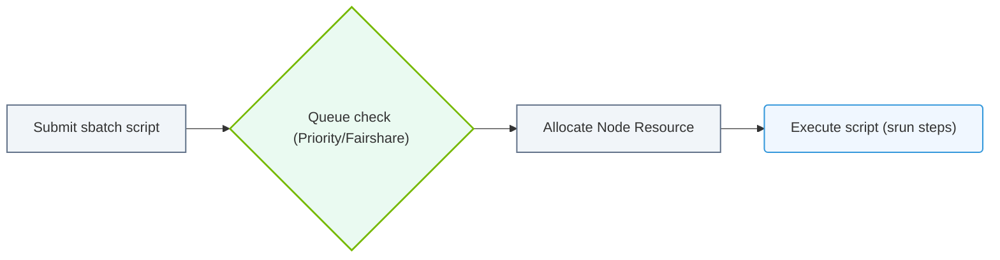

# 29.1b Job submission: sbatch scripts, #SBATCH directives, and job arrays

<div class="lesson-completion" data-lesson-id="29_1b_slurm_job_submission"></div>
<div class="lesson-tags">
  <span class="lesson-tag">📦 Cluster Orchestration</span>
  <span class="lesson-tag">📖 Traditional HPC Schedulers</span>
</div>


---

## 🌱 Context Introduction

When you work with an AI cluster, you don't just run commands directly on a machine. Instead, you submit **jobs** to a scheduler called **Slurm**. Slurm decides *when* and *where* your job runs based on available resources (GPUs, CPUs, memory). This topic covers the three core concepts you need to submit work: **sbatch scripts**, **#SBATCH directives**, and **job arrays**.

---

## ⚙️ What is an sbatch script?

An **sbatch script** is a plain text file (usually with a `.sh` extension) that tells Slurm what program to run and what resources it needs. You submit it using the command **sbatch my_job.sh**.

- The script contains both **Slurm instructions** (resource requests) and **your actual commands** (e.g., training a model).
- Slurm reads the script, allocates resources, and executes it on a compute node.
- The script runs non-interactively — you can log out and come back later to check results.

---

## 🛠️ #SBATCH Directives — Telling Slurm What You Need

**#SBATCH** lines are special comments at the top of your script that define resource requirements. They start with `#SBATCH` followed by a flag and value.

Key directives you will use most often:

- **#SBATCH --job-name=my_training** — gives your job a recognizable name
- **#SBATCH --output=output_%j.txt** — saves standard output to a file (the `%j` is replaced with the job ID)
- **#SBATCH --error=error_%j.txt** — saves error messages to a separate file
- **#SBATCH --time=02:00:00** — maximum wall time (2 hours in this example)
- **#SBATCH --nodes=1** — number of compute nodes (usually 1 for single-GPU jobs)
- **#SBATCH --ntasks=1** — number of tasks (typically 1 per node)
- **#SBATCH --cpus-per-task=8** — CPU cores per task
- **#SBATCH --gres=gpu:1** — requests 1 GPU (generic resource scheduling)
- **#SBATCH --partition=gpu** — which queue/partition to use (e.g., a GPU partition)
- **#SBATCH --mem=32G** — memory per node

---

## 📊 Comparison: Interactive vs. Batch Submission

| Feature | Interactive (srun) | Batch (sbatch) |
|---------|-------------------|----------------|
| How it runs | You get a shell on a compute node | Script runs automatically |
| When it runs | Immediately (if resources available) | Queued until resources are free |
| Persistence | Stops if you disconnect | Runs even if you log out |
| Best for | Debugging, testing | Long training jobs, production |

---

## 🕵️ Job Arrays — Running Many Similar Jobs

A **job array** lets you submit many similar jobs (called "tasks") with a single sbatch script. Each task gets a unique index number.

- Use **#SBATCH --array=0-9** to create 10 tasks (indices 0 through 9)
- Use **#SBATCH --array=1,3,5** for specific indices
- Use **#SBATCH --array=0-100%10** to run 10 tasks at a time (limits concurrency)

Inside the script, you access the current task index using the environment variable **SLURM_ARRAY_TASK_ID**. This lets you:
- Process different input files (e.g., `data_${SLURM_ARRAY_TASK_ID}.csv`)
- Use different hyperparameters
- Run the same model on different data splits

---


### 📊 Visual Representation: Slurm sbatch Job execution flow
This flowchart maps out Slurm batch submission: reading resources headers, entering queues, and executing scripts on worker nodes.




## 🧩 Putting It All Together — Anatomy of an sbatch Script

A typical sbatch script follows this structure:

1. **Shebang line** — tells the system to use Bash
2. **#SBATCH directives** — all resource requests
3. **Module loads** — loading software (e.g., CUDA, Python)
4. **Environment setup** — activating conda environments, setting variables
5. **Actual commands** — your training script, data processing, etc.

For reference:
```
#!/bin/bash
#SBATCH --job-name=cnn_training
#SBATCH --output=logs/train_%j.out
#SBATCH --error=logs/train_%j.err
#SBATCH --time=04:00:00
#SBATCH --nodes=1
#SBATCH --ntasks=1
#SBATCH --cpus-per-task=4
#SBATCH --gres=gpu:1
#SBATCH --partition=gpu
#SBATCH --mem=16G

module load cuda/11.8
source activate my_env

python train.py --epochs 50 --batch_size 32
```

📤 **Output:** Slurm will create two log files (`train_12345.out` and `train_12345.err`) and run your training script on a node with 1 GPU.

---

## 🧪 Example: Job Array for Hyperparameter Tuning

For reference:
```
#!/bin/bash
#SBATCH --job-name=hyperparam_search
#SBATCH --array=0-4
#SBATCH --output=logs/hp_%A_%a.out
#SBATCH --error=logs/hp_%A_%a.err
#SBATCH --time=01:00:00
#SBATCH --gres=gpu:1

learning_rates=(0.001 0.0005 0.0001 0.00005 0.00001)
lr=${learning_rates[$SLURM_ARRAY_TASK_ID]}

python train.py --lr $lr
```

📤 **Output:** Five separate jobs will run, each with a different learning rate. The `%A` is replaced with the job array ID, `%a` with the task index.

---

## ✅ Quick Tips for New Engineers

- Always include **--output** and **--error** directives — you will need these for debugging
- Use **--time** realistically — if your job takes 10 minutes, don't request 24 hours (it delays other users)
- Test with **--gres=gpu:1** first before requesting multiple GPUs
- For job arrays, limit concurrency with **%N** (e.g., `--array=0-99%5`) to avoid overwhelming the cluster
- Check your job status with the command **squeue -u $USER** (bolded inline)
- Cancel a job with **scancel <job_id>** (bolded inline)

---

## 🔍 Common Pitfalls to Avoid

- Forgetting the **shebang line** (`#!/bin/bash`) at the very top
- Putting **#SBATCH directives after** your actual commands (they must come first)
- Using **relative paths** for output files without creating the directory first
- Requesting **more resources than needed** — this wastes cluster capacity and may get your job delayed
- Not using **SLURM_ARRAY_TASK_ID** correctly in job arrays (it is a string, not a number)

---

## 📚 Summary

| Concept | Purpose |
|---------|---------|
| **sbatch script** | A file that contains both resource requests and commands |
| **#SBATCH directives** | Lines that tell Slurm what resources your job needs |
| **Job array** | A way to submit many similar jobs with one script |

You now have the foundation to submit batch jobs on any Slurm-managed AI cluster. Start with simple single-GPU jobs, then move to job arrays for hyperparameter sweeps or data parallel training.