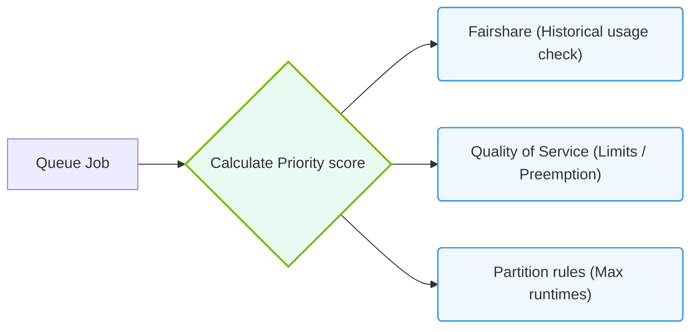

# 29.1d Slurm partitions, QoS, and fair-share scheduling for multi-team GPU access

  📦 Cluster Orchestration
  📖 Traditional HPC Schedulers

## 🧭 Context Introduction

When multiple teams share a GPU cluster, you need a way to prevent one team from hogging all the GPUs while others wait. Slurm provides three powerful mechanisms to manage this: **partitions**, **Quality of Service (QoS)**, and **fair-share scheduling**. Think of partitions as separate waiting rooms, QoS as priority passes, and fair-share as a fairness algorithm that ensures everyone gets their turn over time.

---

## ⚙️ What Are Slurm Partitions?

A **partition** is like a logical queue that groups nodes with similar characteristics. Each partition can have its own set of rules, limits, and access permissions.

- **Purpose:** Organize GPU nodes by team, project, or hardware type (e.g., A100 vs. H100 GPUs).
- **Default partition:** Slurm assigns jobs to a default partition if none is specified.
- **Multiple partitions:** A node can belong to more than one partition.
- **Access control:** You can restrict which users or groups can submit jobs to a partition.

**Example scenario:** You could have a `gpu-team-a` partition with 8 GPUs and a `gpu-team-b` partition with 4 GPUs, each accessible only by the respective team.

---

## 📊 What Is Quality of Service (QoS)?

**QoS** defines priority and resource limits for jobs. It acts like a service tier — higher QoS means faster scheduling and more resources.

- **Priority level:** Higher priority QoS values get scheduled before lower ones.
- **Limits:** QoS can cap the number of GPUs, wall time, or jobs per user or group.
- **Preemption:** Higher QoS jobs can preempt (pause or cancel) lower QoS jobs to free resources.
- **Association:** QoS is assigned to users, groups, or accounts.

**Example QoS tiers:**
- `high-priority` — for urgent production jobs (preempts others)
- `normal` — for standard development work
- `low-priority` — for testing or batch processing

---

## 🕵️ How Fair-Share Scheduling Works

**Fair-share scheduling** ensures that users or groups who have used fewer resources recently get higher priority. It's not about equal GPUs at every moment, but about fairness over time.

- **Decay factor:** Recent usage counts more than old usage.
- **Normalized usage:** Slurm tracks CPU, GPU, and memory usage per user/group.
- **Priority calculation:** Priority = (fair-share factor) × (QoS factor) × (job size factor).
- **Target:** Prevents a single team from dominating the cluster for weeks.

**Simple analogy:** If Team A used 100 GPU-hours yesterday and Team B used 10, Team B gets higher priority today until usage balances out.

---

### 📊 Visual Representation: Slurm Priority, Partition, and Fairshare Scoring
This diagram displays how job queue prioritization incorporates partition bounds, QoS settings, and fairshare scoring.

## 🛠️ Putting It All Together: Multi-Team GPU Access

Here's how partitions, QoS, and fair-share work together in practice:

| Feature | Purpose | Example |
|---------|---------|---------|
| **Partition** | Separates hardware or teams | `gpu-ai-team` for ML engineers, `gpu-viz-team` for rendering |
| **QoS** | Sets priority and limits | `urgent` QoS for critical deadlines, `batch` QoS for overnight jobs |
| **Fair-share** | Balances usage over time | Team with low recent usage gets higher priority |

**Workflow example:**
1. A user from Team A submits a job to the `gpu-ai-team` partition.
2. The job uses the `normal` QoS with a 4-GPU limit.
3. If Team A has used many GPU-hours recently, fair-share lowers their priority.
4. A job from Team B (with less recent usage) might get scheduled first.

---

## 📋 Key Configuration Points for Engineers

When setting up multi-team GPU access, focus on these configuration areas:

- **Partition definitions:** Define partitions in `slurm.conf` with node lists and access controls.
- **QoS definitions:** Create QoS entries in `sacctmgr` with priority values and limits.
- **User/group associations:** Link users to partitions and QoS via accounts.
- **Fair-share settings:** Configure decay and normalization factors in `slurm.conf`.

**Important note:** Fair-share is calculated per account, not per user, unless you configure it otherwise. This makes it ideal for team-level fairness.

---

## 🧪 Practical Tips for New Engineers

- **Start simple:** Use one partition with two QoS levels (normal and high) before adding complexity.
- **Monitor usage:** Run `sshare` to view fair-share usage and `sacct` to see job history.
- **Test limits:** Submit test jobs with different QoS values to verify preemption works as expected.
- **Document partitions:** Clearly label what each partition is for (e.g., "training", "inference", "development").

---

## ✅ Summary

- **Partitions** organize GPU nodes into logical groups for different teams or workloads.
- **QoS** provides priority tiers and resource limits for jobs.
- **Fair-share scheduling** ensures long-term fairness across teams by tracking historical usage.
- Together, these three features let you run a multi-team GPU cluster without constant manual intervention.

Remember: The goal is not to give everyone equal GPUs at every second, but to ensure that over days or weeks, each team gets a fair opportunity to use the shared GPU resources.