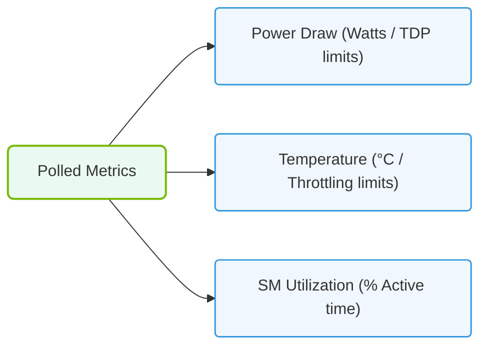

# 30.1b Power draw, temperature, fan speed, and utilization columns

  📦 Virtualization and Cloud
  📖 GPU Diagnostics and nvidia-smi Mastery

---

## 🧠 Context Introduction

When you're managing AI infrastructure, a GPU isn't just a "black box" that processes data. It's a physical device that consumes electricity, generates heat, spins fans to cool itself, and works at different levels of effort. Understanding these four key metrics — **power draw, temperature, fan speed, and utilization** — is essential for keeping your GPUs healthy, efficient, and safe.

Think of these columns as the **vital signs** of your GPU. Just like a doctor checks your heart rate and temperature, engineers check these GPU metrics to spot problems before they cause downtime.

---

## ⚙️ The Four Vital Signs Explained

Each column in the GPU monitoring output tells you something specific about the hardware's current state:

| Metric | What It Measures | Why It Matters |
|--------|------------------|----------------|
| **Power Draw** | How much electrical power (in Watts) the GPU is consuming right now | High power = heavy workload; low power = idle or throttled |
| **Temperature** | The current temperature of the GPU chip (in Celsius) | Too hot = risk of damage or automatic slowdown |
| **Fan Speed** | How fast the cooling fans are spinning (as a percentage) | Higher speed = more cooling, but also more noise and wear |
| **Utilization** | What percentage of the GPU's compute capacity is being used | 0% = idle; 100% = fully busy processing work |

---

## 📊 How to Read These Columns

When you look at a GPU monitoring output, you'll see these four values listed for each GPU in your system. Here's how to interpret them:

- **Power Draw** — A GPU running at **250W** is working hard. A GPU showing **30W** is probably idle or sleeping.
- **Temperature** — Most NVIDIA GPUs run safely between **30°C (idle)** and **85°C (under load)**. If you see **90°C or above**, that's a red flag.
- **Fan Speed** — At **0%**, the fans are off (common for idle GPUs). At **80% or higher**, the GPU is hot and actively cooling itself.
- **Utilization** — **0-10%** means the GPU is mostly idle. **90-100%** means it's fully utilized — good for training, but watch the temperature.

---

### 📊 Visual Representation: GPU Power, Temperature, and Core metrics
This diagram details the primary hardware metrics (TDP draw, core temps, SM usage) polled by monitoring engines.

## 🛠️ Common Scenarios You'll Encounter

As a new engineer, here are the most common patterns you'll see and what they mean:

- **High utilization + high power + high temperature + high fan speed** — The GPU is working hard. This is normal during AI training. Just make sure temperature stays below 85°C.

- **Low utilization + low power + low temperature + fan at 0%** — The GPU is idle. This is fine, but if you're running a job, something might be wrong.

- **Low utilization + high temperature + high fan speed** — Something is wrong. The GPU is hot but not doing work. This could mean a stuck process, poor airflow, or a failing cooling system.

- **High utilization + low power + low temperature** — This is unusual. The GPU might be throttling (slowing down) because of a power limit or driver issue.

---

## 🕵️ Why These Metrics Matter for AI Workloads

AI training and inference are **power-hungry and heat-generating** tasks. Here's why you need to watch these columns:

- **Power draw** — Tells you if your power supply is adequate. Multiple GPUs running at 300W each can overload a circuit.
- **Temperature** — If a GPU gets too hot, it will automatically **throttle down** (slow itself) to prevent damage. This kills your training performance.
- **Fan speed** — High fan speeds mean the GPU is working hard. If fans are stuck at low speed while temperature is high, you have a cooling failure.
- **Utilization** — Low utilization during a job means your code isn't using the GPU efficiently. High utilization with low performance means something else is bottlenecking (like CPU or memory).

---

## 📋 Quick Reference Card

Keep this mental checklist when checking GPU health:

- **Power draw** — Is it matching the workload? (idle = low, training = high)
- **Temperature** — Is it below 85°C? (if not, investigate cooling)
- **Fan speed** — Is it responding to temperature? (hot GPU = fast fans)
- **Utilization** — Is it near 100% when running a job? (if not, check your code)

---

## ✅ Summary

The **power draw, temperature, fan speed, and utilization** columns are your window into the physical health of your GPUs. By learning to read these four numbers together, you can:

- Spot overheating before it causes damage
- Identify underutilized GPUs that are wasting resources
- Detect failing cooling systems early
- Ensure your AI workloads are running at full speed

As you gain experience, you'll develop an intuition for what "normal" looks like for your specific hardware and workloads. Start by checking these four columns every time you monitor your GPUs — they'll tell you everything you need to know.