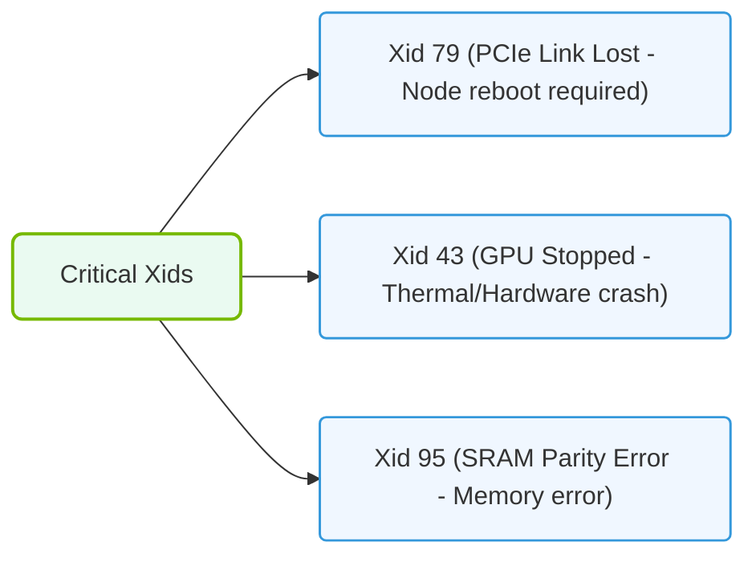

# 30.2b Critical Xids: 63 (Row Remapping), 74 (NVLink Error), 79 (GPU Fallen Off Bus), 94 (DBE)

  📦 Virtualization and Cloud
  📖 GPU Diagnostics and nvidia-smi Mastery

## 📖 Context Introduction

When working with NVIDIA GPUs in AI infrastructure, the system generates error identifiers called **Xids** (eXtended IDs) to report hardware issues. These Xids are critical signals that help engineers detect, diagnose, and resolve problems before they cause downtime or data corruption. This guide covers four essential Xids you will encounter: **63**, **74**, **79**, and **94**. Understanding these will help you maintain stable GPU operations.

---

## ⚙️ Xid 63 — Row Remapping

**What it means:**  
A memory row on the GPU's VRAM has become faulty. The GPU automatically remaps that row to a spare row to continue functioning.

**Key points:**
- This is a **correctable** error — the GPU can recover without immediate failure.
- It indicates early signs of memory degradation.
- Multiple occurrences suggest the GPU may need replacement soon.

**What engineers should do:**
- Monitor the frequency of Xid 63 events over time.
- If the count increases rapidly, plan for GPU replacement.
- Use **nvidia-smi** to check row remapping status.

**How to check row remapping status:**  
Run the command **nvidia-smi -q -d ROW_REMAPPER** and look for the "Row Remapper" section. A "Pending" or "Failed" status indicates the spare rows are exhausted.

---

## 🔗 Xid 74 — NVLink Error

**What it means:**  
An error occurred on the **NVLink** interconnect between GPUs. NVLink is a high-speed bridge that allows GPUs to share data directly.

**Key points:**
- This can be caused by physical connection issues, power fluctuations, or driver problems.
- It may lead to reduced performance or GPU-to-GPU communication failures.
- Often appears alongside other NVLink-related Xids.

**What engineers should do:**
- Check physical NVLink bridge connections and reseat them if needed.
- Verify GPU power cables are secure.
- Update NVIDIA drivers to the latest stable version.
- Monitor for recurring patterns — a single event may be transient.

**How to check NVLink status:**  
Use **nvidia-smi nvlink --status** to see the link state and error counts for each NVLink connection.

---

## 🚌 Xid 79 — GPU Fallen Off Bus

**What it means:**  
The GPU has become **unreachable** by the system. The operating system can no longer communicate with the GPU over the PCIe bus.

**Key points:**
- This is a **critical** error — the GPU is effectively dead until reset.
- Common causes include power supply issues, overheating, or PCIe slot problems.
- The GPU may need a full system reboot or power cycle to recover.

**What engineers should do:**
- Immediately check GPU temperature and power consumption logs.
- Inspect physical PCIe slot and power connectors.
- Try reseating the GPU in its slot.
- If persistent, test the GPU in a different system to isolate the fault.

**How to confirm recovery:**  
After a reboot, run **nvidia-smi** and verify the GPU appears in the list with a valid temperature and power reading.

---

### 📊 Visual Representation: Critical GPU Xid Error classifications
This diagram maps critical Xid codes: sorting PCIe bus drops (Xid 79), thermal trips (Xid 43), and memory parity errors (Xid 95).

## 🧠 Xid 94 — DBE (Double Bit Error)

**What it means:**  
A **Double Bit Error** (DBE) occurred in the GPU's memory. This means two bits in a memory location were corrupted, and the error could not be corrected.

**Key points:**
- This is a **fatal** error — data integrity is compromised.
- The GPU may crash or produce incorrect computation results.
- Unlike Xid 63 (single bit error), DBE cannot be corrected by the hardware.

**What engineers should do:**
- Treat this as a **hardware failure** requiring immediate attention.
- Stop all workloads on the affected GPU.
- Schedule GPU replacement as soon as possible.
- Check if the error is reproducible with different workloads.

**How to check for DBE history:**  
Use **nvidia-smi -q -d ECC** and look for "Double Bit Errors" under the "Volatile" and "Aggregate" counters.

---

## 📊 Comparison Table: Xid 63 vs 74 vs 79 vs 94

| Xid | Name | Severity | Recoverable? | Common Cause |
|-----|------|----------|--------------|--------------|
| 63 | Row Remapping | Low | Yes | Memory wear |
| 74 | NVLink Error | Medium | Usually | Connection or driver issue |
| 79 | GPU Fallen Off Bus | High | With reboot | Power or PCIe failure |
| 94 | DBE (Double Bit Error) | Critical | No | Hardware memory failure |

---

## 🛠️ General Troubleshooting Workflow

When you encounter any of these Xids, follow this simple process:

1. **Identify** — Note the Xid number, timestamp, and GPU index from system logs.
2. **Isolate** — Determine if the error is persistent or transient.
3. **Check** — Verify physical connections, power, and cooling.
4. **Update** — Ensure drivers and firmware are current.
5. **Replace** — If errors recur, plan for GPU replacement.

---

## 🕵️ Where to Find Xid Logs

Xid errors are recorded in several places:

- **System log** — Check **/var/log/syslog** (Linux) or **/var/log/messages** for entries containing "NVRM" or "Xid".
- **nvidia-smi** — Use **nvidia-smi -q -d ECC** for memory-related errors.
- **NVIDIA Persistence Daemon** — If running, logs are in **/var/log/nvidia-persistenced.log**.

---

## ✅ Summary

| Xid | What to Remember |
|-----|------------------|
| 63 | Early warning — monitor and plan replacement |
| 74 | Check cables and drivers — often fixable |
| 79 | Critical — needs reboot or reseat |
| 94 | Fatal — replace GPU immediately |

Understanding these four Xids gives you a strong foundation for keeping GPU infrastructure healthy and reliable. Always document errors and track patterns over time to predict failures before they impact operations.