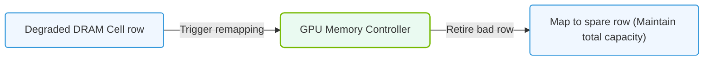

# 30.2e Row Remapping: VRAM Repair Mechanism and Pending Remapping Reboots

  📦 Virtualization and Cloud
  📖 GPU Diagnostics and nvidia-smi Mastery

Modern GPUs contain billions of memory cells in their VRAM (Video Random Access Memory). Over time, some of these cells may develop faults due to manufacturing defects, wear, or environmental stress. NVIDIA GPUs include a sophisticated hardware repair mechanism called **Row Remapping** to handle these issues gracefully.

---

## 🔍 Context: Why Row Remapping Matters

When a memory cell in VRAM fails, it can cause data corruption, application crashes, or silent computation errors — especially dangerous in AI training where incorrect weights can propagate through millions of operations. Row Remapping allows the GPU to detect faulty memory rows and redirect data to spare rows, keeping the GPU operational without immediate replacement.

---

## ⚙️ How Row Remapping Works

- **Detection**: The GPU's memory controller continuously monitors for errors during read/write operations.
- **Identification**: When a specific memory row exceeds a threshold of correctable errors, it is marked as "pending remap."
- **Remapping**: The GPU firmware logically replaces the faulty row with a spare row from a reserved pool.
- **Persistence**: The remapping is stored in non-volatile memory, so it survives power cycles.

---

## 🛠️ The Pending Remapping Reboot

A critical concept to understand: **Row remapping does not take effect immediately**. The GPU must undergo a specific sequence to apply the repair.

| Step | Action | Description |
|------|--------|-------------|
| 1 | Error Detection | GPU identifies a faulty row during normal operation |
| 2 | Pending Status | The row is flagged as "pending remap" in GPU memory |
| 3 | Reboot Required | A full GPU reset or system reboot is needed to activate the remap |
| 4 | Remap Applied | During initialization, firmware applies the row replacement |
| 5 | Verification | GPU confirms the remap was successful and clears the pending flag |

---

## 🕵️ Identifying Row Remapping Status

Engineers can check the row remapping status using the NVIDIA management tools. The key indicators to look for are:

- **Pending remap count**: The number of rows waiting to be remapped
- **Remap availability**: Whether spare rows are still available
- **Remap failure count**: If a remap attempt failed

When you see a pending remap status, it means the GPU has detected faulty memory but needs a reboot to apply the fix. This is a proactive warning — not yet a failure.

---

### 📊 Visual Representation: NVIDIA Row Remapping Memory Retirement
This diagram displays how H100/A100 GPUs retire hardware rows containing degraded DRAM cells, mapping data to spare rows during initialization.

## 📊 Interpreting Row Remapping Information

The row remapping data is typically presented in a structured format. Here is what each field means:

- **Pending rows**: Rows identified as faulty but not yet remapped. Requires a reboot.
- **Remapped rows**: Rows that have been successfully replaced with spares.
- **Remaining spares**: How many spare rows are left for future repairs.
- **Bank**: Which memory bank contains the affected row.
- **Row address**: The specific location of the faulty memory cell.

---

## 🚦 When to Act on Pending Remapping

| Scenario | Recommended Action |
|----------|-------------------|
| Zero pending remaps | No action needed — GPU is healthy |
| 1-2 pending remaps | Plan a maintenance window for a GPU reset or system reboot |
| 3+ pending remaps | Schedule immediate maintenance — risk of data corruption increases |
| Remap failure reported | Contact NVIDIA support — GPU may need replacement |
| No spare rows remaining | GPU is at end-of-life for memory repair — plan for replacement |

---

## 💡 Best Practices for Engineers

- **Monitor proactively**: Check row remapping status during regular maintenance cycles, not just when errors occur.
- **Document pending remaps**: Keep a log of when pending remaps appear and when they were resolved.
- **Plan reboots strategically**: A pending remap reboot is non-disruptive if planned during scheduled downtime.
- **Track trends**: A GPU that frequently develops pending remaps may have a systemic issue.
- **Understand the limit**: Each GPU has a finite number of spare rows. Once exhausted, any new faults become uncorrectable.

---

## ✅ Summary

Row Remapping is a vital self-healing feature in NVIDIA GPUs that extends hardware lifespan and prevents data corruption. The "pending remapping reboot" is not an error — it is a repair waiting to be applied. By monitoring this status and acting on it during planned maintenance, engineers can keep AI infrastructure running reliably without unexpected failures.

**Key takeaway**: A pending remap is a warning, not a crisis. Treat it like a "check engine" light — acknowledge it, plan for it, and resolve it during the next maintenance window.