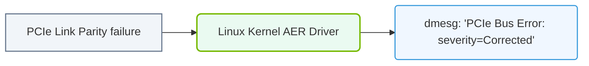

# 30.2f PCIe AER (Advanced Reporting): kernel-level PCIe error decoding

<div class="lesson-completion" data-lesson-id="30_2f_pcie_advanced_error_reporting"></div>
<div class="lesson-tags">
  <span class="lesson-tag">📦 Virtualization and Cloud</span>
  <span class="lesson-tag">📖 GPU Diagnostics and nvidia-smi Mastery</span>
</div>


When you're working with AI infrastructure, the PCI Express (PCIe) bus is the highway that connects your GPUs to the rest of the system. If this highway has potholes or crashes, your training jobs can stall, produce wrong results, or even crash the server. PCIe Advanced Error Reporting (AER) is a kernel-level mechanism that helps you detect, decode, and diagnose these issues before they become catastrophic failures. This topic explains how AER works and how you can use it to keep your AI infrastructure healthy.

---

## 🔍 What is PCIe AER?

PCIe AER is a standardized error reporting protocol built into the PCIe specification. It allows devices (like GPUs, NVMe drives, and network cards) to report detailed error information to the operating system kernel. The kernel then logs these errors, which you can inspect to understand what went wrong.

Key points about AER:
- It works at the kernel level, meaning it catches errors before they reach user-space applications.
- It supports two main error types: **correctable** (recoverable without data loss) and **uncorrectable** (may cause data corruption or system instability).
- Errors are reported through the kernel's **dmesg** ring buffer and can be viewed with standard Linux tools.
- AER is enabled by default in most modern Linux distributions.

---

## ⚙️ How AER Error Decoding Works

When a PCIe device encounters an error, it sends an error message to the root complex (the part of the motherboard that manages PCIe traffic). The kernel's AER driver then:
1. Captures the error from the hardware.
2. Decodes the error type and severity.
3. Logs a structured message to the kernel ring buffer.
4. Optionally triggers a recovery action (for correctable errors) or a system notification (for uncorrectable errors).

The decoded message includes:
- **Bus address**: Which PCIe slot and device experienced the error.
- **Error type**: Correctable or uncorrectable.
- **Error source**: The specific register or transaction that failed.
- **Severity**: Fatal, non-fatal, or corrected.

---

## 🕵️ Common PCIe Error Types You'll Encounter

Here are the most frequent PCIe errors you'll see in AI infrastructure logs:

| Error Type | Category | What It Means | Impact on GPU Workloads |
|------------|----------|---------------|-------------------------|
| **Corrected** | Correctable | A single-bit error was fixed by hardware | Usually none; workload continues |
| **Non-Fatal** | Uncorrectable | Data corruption detected but device can continue | May cause silent data corruption in training |
| **Fatal** | Uncorrectable | Device or link is broken; cannot continue | GPU will be reset or system may crash |
| **Unsupported Request** | Uncorrectable | Device tried an invalid transaction | Often indicates a driver or firmware bug |
| **Poisoned TLP** | Uncorrectable | Data packet had an error flag set | Data is discarded; training step may fail |
| **Completion Timeout** | Uncorrectable | Device didn't respond in time | GPU may hang; requires reset |

---

## 🛠️ How to Read PCIe AER Messages

When an AER error occurs, the kernel logs a message like this in **dmesg**:

For reference:
```
pcieport 0000:00:01.0: AER: Corrected error received: 0000:03:00.0
pcieport 0000:00:01.0: PCIe Bus Error: severity=Corrected, type=Transaction Layer, (Receiver ID)
pcieport 0000:00:01.0:   device [10de:1e04] error status/mask=00000001/00002000
pcieport 0000:00:01.0:    [ 0] RxErr
```

📤 **Output**: The message tells you:
- **pcieport 0000:00:01.0** — The PCIe root port that detected the error.
- **0000:03:00.0** — The actual device that reported the error (in this case, a GPU).
- **severity=Corrected** — The error was recoverable.
- **device [10de:1e04]** — The vendor and device ID (10de is NVIDIA).
- **[ 0] RxErr** — The specific error flag (Receiver Error).

---


### 📊 Visual Representation: PCIe Advanced Error Reporting (AER) alerts
This diagram displays how the Linux kernel AER driver logs hardware PCIe transmission errors, isolating bad slots.




## 📊 Where to Find AER Logs

You can inspect AER errors using these standard Linux tools:

- **dmesg** — Shows all kernel messages, including AER errors. Use it to see recent errors.
- **journalctl -k** — Shows kernel logs with timestamps, useful for correlating errors with workload events.
- **/sys/devices/pci0000:00/.../aer_dev_correctable** — A sysfs file that shows cumulative correctable error counts for a specific device.
- **/sys/devices/pci0000:00/.../aer_dev_nonfatal** — Cumulative non-fatal error counts.
- **/sys/devices/pci0000:00/.../aer_dev_fatal** — Cumulative fatal error counts.

To check a specific GPU's AER status, you first find its PCIe address using **nvidia-smi** (look for the "Bus-Id" field), then inspect the corresponding sysfs path.

---

## ⚠️ What to Do When You See AER Errors

When you encounter PCIe AER errors in your AI infrastructure, follow this troubleshooting workflow:

1. **Identify the affected device** — Note the PCIe bus address from the error message.
2. **Check the error severity** — Corrected errors are usually safe to ignore temporarily, but uncorrectable errors require immediate action.
3. **Verify GPU health** — Run **nvidia-smi** to check if the GPU is still visible and operational.
4. **Check for patterns** — Do errors occur during heavy data transfers (e.g., during training) or at idle?
5. **Inspect physical connections** — Reseat the GPU, check for dust or damage on the PCIe slot.
6. **Update firmware and drivers** — Outdated GPU firmware or kernel drivers can cause false AER errors.
7. **Monitor over time** — Use a script to periodically check sysfs error counters and alert if they increase rapidly.

---

## 🧠 Best Practices for Engineers

- **Treat uncorrectable errors seriously** — Even one non-fatal error can corrupt a training checkpoint. Investigate immediately.
- **Log AER errors to a monitoring system** — Forward kernel logs to your observability platform (e.g., Prometheus, ELK) to track error trends.
- **Don't ignore corrected errors** — While they don't crash your workload, a high rate of corrected errors indicates a failing PCIe link or GPU.
- **Use GPU health checks** — Combine AER monitoring with **nvidia-smi** diagnostics and ECC error counts for a complete picture.
- **Document error patterns** — Keep a record of which GPU slots and server models are prone to AER errors; this helps with capacity planning and RMA decisions.

---

## 🔗 Related Topics

- **30.1 GPU Health Monitoring** — How to use nvidia-smi for real-time GPU status.
- **30.2a ECC Error Detection** — Understanding memory errors on NVIDIA GPUs.
- **30.2b XID Errors** — NVIDIA-specific GPU error codes.
- **30.2c GPU Hang Detection** — Identifying and recovering from stuck GPUs.
- **30.2d Thermal Throttling** — How temperature affects GPU performance.
- **30.2e Power Capping** — Managing GPU power limits to prevent errors.

---

By understanding PCIe AER, you can catch hardware issues early, reduce unplanned downtime, and keep your AI training pipelines running smoothly. Remember: a healthy PCIe bus means a healthy GPU cluster.