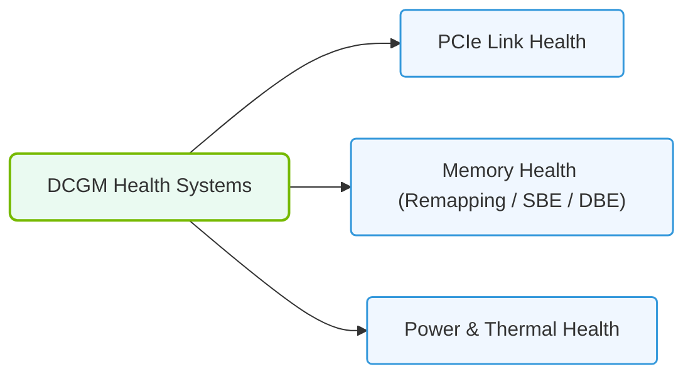

# 30.2i NVIDIA DCGM health checks: automating hardware validation before training runs

  📦 Virtualization and Cloud
  📖 GPU Diagnostics and nvidia-smi Mastery

---

## 🧠 Context Introduction

Before you kick off a large AI training run, you want to be sure your GPUs are healthy. Imagine spending hours or days training a model, only to discover halfway through that a GPU was silently failing — wasting time, compute, and money.  

NVIDIA Data Center GPU Manager (DCGM) provides a suite of health checks that automatically validate your hardware before training begins. This lets you catch issues early, avoid wasted resources, and keep your AI workflows running smoothly. For new engineers, think of DCGM health checks as a **pre-flight checklist** for your GPUs.

---

## ⚙️ What Are DCGM Health Checks?

DCGM health checks are a set of automated tests that verify the operational status of NVIDIA GPUs in a system. They check for:

- **Memory errors** — Corrupted or failing GPU memory
- **Thermal issues** — Overheating or failing cooling
- **Power problems** — Voltage or power delivery anomalies
- **PCIe link errors** — Connection issues between GPU and host
- **Clock and frequency stability** — Unexpected throttling or instability

These checks can be run individually or as a complete suite, and they return a simple pass/fail result for each GPU.

---

## 🛠️ Why Automate Health Checks Before Training?

Running DCGM health checks manually before every training job is impractical. Automation ensures consistency and saves time. Key benefits include:

- **Catch failures early** — Detect hardware problems before they corrupt training data or crash jobs
- **Reduce downtime** — Identify faulty GPUs before they affect production workloads
- **Improve reliability** — Ensure every training run starts on healthy hardware
- **Enable self-healing workflows** — Automatically reroute jobs away from failing GPUs

---

## 🕵️ How DCGM Health Checks Work

DCGM provides a command-line tool called **dcgmi** that runs health checks. The tool checks various GPU subsystems and reports results. Here's the general flow:

1. **Select the check type** — You can run a full suite or specific checks (e.g., memory only)
2. **Run the check** — The tool tests each GPU in the system
3. **Parse the output** — Results indicate pass, fail, or warning for each GPU
4. **Take action** — If a GPU fails, you can exclude it from training or trigger alerts

---

### 📊 Visual Representation: DCGM Health Monitor watches
This diagram displays how the DCGM engine monitors background metrics like PCIe lanes, thermal states, and memory errors.

## 📊 Comparison of Common Health Check Types

| Check Type | What It Tests | Why It Matters |
|------------|---------------|----------------|
| **Memory** | GPU VRAM integrity | Corrupted memory causes silent data errors in training |
| **Thermal** | Temperature sensors and cooling | Overheating leads to throttling or hardware damage |
| **Power** | Voltage rails and power draw | Unstable power can cause crashes or hardware failure |
| **PCIe** | Link speed and error counts | Poor PCIe connection reduces data transfer speeds |
| **Clock** | GPU and memory clock frequencies | Unexpected throttling indicates thermal or power issues |

---

## 🔧 Automating Health Checks in a Training Pipeline

To integrate DCGM health checks into your training workflow, you can:

- **Run checks as a pre-training script** — Execute health checks before launching your training job
- **Use exit codes** — If a check fails, halt the training pipeline and log the error
- **Combine with monitoring** — Send health check results to a logging or alerting system
- **Schedule periodic checks** — Run checks at regular intervals even during idle time

---

## ✅ Best Practices for New Engineers

- **Run the full health check suite** before every training run for maximum safety
- **Log all results** — Even passes are useful for trend analysis over time
- **Set up alerts** for failed checks so you can respond quickly
- **Test on a single GPU first** to understand the output format before scaling up
- **Combine with nvidia-smi** for a more complete picture of GPU health

---

## 🚨 Common Pitfalls to Avoid

- **Ignoring warnings** — A warning today can become a failure tomorrow
- **Only checking once** — GPU health can degrade over time; check regularly
- **Not parsing output** — Manual review is error-prone; automate result interpretation
- **Running checks during active training** — Health checks can interfere with running workloads

---

## 📝 Summary

NVIDIA DCGM health checks are a simple but powerful tool for ensuring your GPUs are ready for training. By automating these checks before every run, you protect your time, compute resources, and model quality. For new engineers, mastering DCGM health checks is a foundational skill for reliable AI infrastructure operations.

---

**Next step:** Try running a basic health check on a single GPU to see the output format and understand how to interpret pass/fail results.