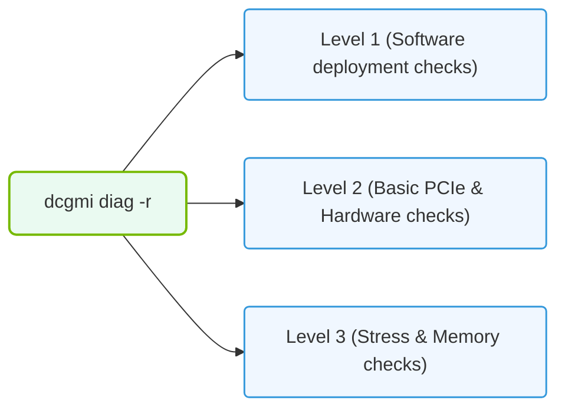

# 30.3b dcgmDiag: NVIDIA's hardware diagnostic tool for pre-flight cluster checks

  📦 Virtualization and Cloud
  📖 GPU Diagnostics and nvidia-smi Mastery

---

## 🔍 Context Introduction

Before deploying an AI workload on a cluster of NVIDIA GPUs, engineers need confidence that every GPU is healthy and performing as expected. **dcgmDiag** is NVIDIA's official hardware diagnostic tool that performs a series of tests to validate GPU health, memory integrity, and overall system stability. Think of it as a "pre-flight check" for your GPU infrastructure — it catches hardware issues early, before they cause training failures or data corruption.

---

## ⚙️ What is dcgmDiag?

dcgmDiag is part of the **NVIDIA Data Center GPU Manager (DCGM)** suite. It runs a battery of tests that simulate real-world GPU workloads to verify:

- **GPU compute functionality** — Can the GPU execute CUDA operations correctly?
- **Memory integrity** — Are there any faulty memory cells (ECC errors)?
- **Thermal and power behavior** — Does the GPU stay within safe limits under load?
- **PCIe connectivity** — Is the GPU communicating properly with the host system?
- **NVLink/GPU interconnect** — Are GPU-to-GPU links working (for multi-GPU setups)?

---

## 🛠️ How dcgmDiag Works

dcgmDiag runs a series of **test levels** that increase in intensity and duration:

- **Level 0 (Quick Check)** — A rapid 1–2 minute test that verifies basic GPU presence, driver compatibility, and minimal functionality. Use this for a fast sanity check.
- **Level 1 (Medium Check)** — Runs for 5–10 minutes and tests memory, compute, and basic stress scenarios. Good for routine maintenance.
- **Level 2 (Full Check)** — A comprehensive 20–30 minute test that stresses all GPU subsystems including memory bandwidth, tensor cores, and thermal management. Use this for pre-deployment validation.
- **Level 3 (Extended Check)** — A deep, multi-hour test designed for burn-in validation of new hardware or after repairs.

---

## 📊 Test Categories in dcgmDiag

| Test Category | What It Checks | Why It Matters |
|---------------|----------------|----------------|
| 🧠 **Compute** | CUDA core and tensor core operations | Ensures AI training/inference accuracy |
| 💾 **Memory** | ECC errors, memory bandwidth, and integrity | Prevents silent data corruption |
| 🌡️ **Thermal** | Temperature sensors and cooling performance | Avoids thermal throttling during long jobs |
| ⚡ **Power** | Power draw and voltage stability | Prevents unexpected shutdowns |
| 🔗 **PCIe/NVLink** | Interconnect bandwidth and link status | Ensures multi-GPU communication works |
| 🧪 **Stress** | Sustained load under maximum utilization | Validates long-term reliability |

---

## 🕵️ When to Run dcgmDiag

Engineers should run dcgmDiag during these key moments:

- **Before deploying a new cluster** — Validate all GPUs are healthy before workloads begin
- **After hardware changes** — Re-run after GPU replacement, driver updates, or system maintenance
- **When troubleshooting failures** — Isolate hardware issues from software bugs
- **As part of regular maintenance** — Schedule weekly or monthly checks for early detection
- **Before critical training runs** — Ensure no hardware issues will interrupt long jobs

---

### 📊 Visual Representation: DCGM Diagnostic Test levels
This diagram displays the three standard levels of DCGM diagnostic tests, ranging from simple software checks to intensive memory and load stresses.

## 🧰 Running dcgmDiag (Command Overview)

To run dcgmDiag, use the following approach:

For a quick validation (Level 0), run the diagnostic with the **-l 0** flag. This completes in about 1–2 minutes.

For a full system validation (Level 2), use the **-l 2** flag. This takes 20–30 minutes and is recommended before deploying production workloads.

To test only specific GPUs (e.g., GPU 0 and GPU 1), specify them with the **-i 0,1** flag.

To save results to a file for later review, use the **-j** flag to output JSON-formatted results.

**📤 Output:** The tool prints a pass/fail status for each test. A **PASSED** result means the GPU is healthy. A **FAILED** result includes error codes and descriptions to guide troubleshooting.

---

## 📋 Interpreting dcgmDiag Results

When reviewing output, focus on these key indicators:

- **Overall Result** — Look for "PASSED" at the end of the run. Any "FAILED" status requires investigation.
- **Error Codes** — Each failure includes a numeric code. Common codes include:
  - **100** — Memory test failure (bad VRAM)
  - **200** — Compute test failure (CUDA core issue)
  - **300** — Thermal or power limit exceeded
  - **400** — PCIe or NVLink communication error
- **Warnings** — Yellow warnings (not failures) indicate marginal performance but not immediate hardware failure. Monitor these GPUs closely.

---

## 🚦 Best Practices for Pre-Flight Checks

- **Run Level 2 before every major deployment** — It catches 95% of hardware issues
- **Automate dcgmDiag in your provisioning scripts** — Run it as part of your cluster bring-up process
- **Log all results** — Save JSON output to a central location for trend analysis
- **Compare across GPUs** — If one GPU shows significantly different performance metrics, investigate
- **Combine with nvidia-smi** — Use **nvidia-smi** for real-time monitoring and dcgmDiag for deep diagnostics

---

## ⚠️ Common Pitfalls to Avoid

- **Running only Level 0** — Quick checks miss memory and stress issues. Always run at least Level 1 for validation.
- **Ignoring warnings** — Yellow warnings often precede failures. Investigate and document them.
- **Running during active workloads** — dcgmDiag requires exclusive GPU access. Stop all jobs before running.
- **Not checking all GPUs** — A single bad GPU can corrupt a distributed training run. Test every GPU in the cluster.

---

## 🔗 Related Tools and Next Steps

- **nvidia-smi** — For real-time GPU monitoring and quick health checks
- **DCGM Exporter** — For integrating GPU metrics into Prometheus/Grafana dashboards
- **NVIDIA Fabric Manager** — For managing NVSwitch and NVLink configurations in large clusters
- **GPU Burn** — For extended stress testing beyond dcgmDiag's Level 3

---

## ✅ Summary

dcgmDiag is the essential first step in validating GPU hardware before running any AI workload. By running it regularly and interpreting results correctly, engineers can prevent costly training failures, reduce downtime, and ensure their AI infrastructure operates reliably at scale. Make it a standard part of your cluster operations checklist.