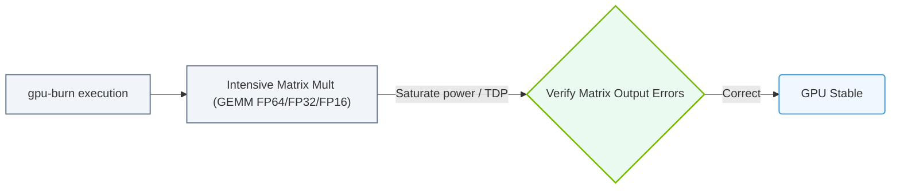

# 30.3c gpu-burn: stress testing GPU compute and memory to identify hardware defects

  📦 Virtualization and Cloud
  📖 GPU Diagnostics and nvidia-smi Mastery

When you're setting up or maintaining AI infrastructure, one of the most important checks you can perform is making sure your GPUs are physically healthy. **gpu-burn** is a lightweight, open-source tool designed specifically for this purpose. It stresses both the compute cores and memory of NVIDIA GPUs to uncover hardware defects like failing VRAM chips, unstable clock speeds, or thermal throttling issues. Think of it as a "torture test" that pushes the GPU to its limits so you can catch problems before they affect your AI workloads.

---

## 🧠 What is gpu-burn and Why Does It Matter?

gpu-burn is a simple but powerful stress-testing utility. It works by repeatedly running CUDA kernels that saturate the GPU's compute units and memory bandwidth. Unlike synthetic benchmarks that measure performance, gpu-burn's goal is to **find failures** — if a GPU has a hardware defect, it will likely crash, produce errors, or hang during the test.

- **Purpose:** Identify GPU hardware defects (bad memory, unstable cores, cooling issues)
- **How it works:** Runs continuous CUDA operations on all available GPUs simultaneously
- **Duration:** Typically run for 30 minutes to several hours
- **Output:** Reports success (no errors) or failure (errors, crashes, or hangs)

---

## ⚙️ How gpu-burn Works Under the Hood

gpu-burn performs two main types of stress:

- **Compute stress:** Executes dense matrix multiplication and other math-heavy CUDA kernels that max out the GPU's streaming multiprocessors (SMs)
- **Memory stress:** Continuously reads and writes to GPU VRAM, testing every memory cell and the memory controller

The tool runs these operations in a loop. If the GPU hardware has any latent defects — like a bad memory chip or a voltage regulator issue — the stress will expose them quickly.

---

## 🛠️ When Should You Run gpu-burn?

You should run gpu-burn in these scenarios:

- **New hardware validation:** After installing new GPUs in a server or workstation
- **After hardware changes:** Following GPU replacement, reseating, or thermal paste application
- **Intermittent issues:** When you see random CUDA errors, application crashes, or system hangs during AI training
- **Pre-deployment checks:** Before putting a GPU into production for critical AI workloads
- **RMA verification:** To confirm a suspected hardware defect before requesting a replacement

---

## 📊 Understanding gpu-burn Output

When you run gpu-burn, it provides real-time feedback. Here's what to look for:

| Output Indicator | Meaning | Action Required |
|------------------|---------|-----------------|
| **No errors after 30+ minutes** | GPU hardware is likely healthy | ✅ Proceed with deployment |
| **CUDA error messages** | Possible memory or compute defect | Run a longer test; consider RMA |
| **GPU hangs or system freeze** | Serious hardware or driver issue | Check cooling, power, or replace GPU |
| **ECC error counts increase** | Memory errors detected (on supported GPUs) | Monitor; if persistent, replace GPU |
| **Temperature > 85°C** | Thermal issue (may cause throttling) | Improve cooling or reduce ambient temp |

---

### 📊 Visual Representation: gpu-burn GEMM load test
This diagram displays gpu-burn: executing intensive GEMM calculations on Tensor Cores to verify GPU stability under max load.

## 🕵️ Best Practices for Effective Stress Testing

Follow these guidelines to get reliable results from gpu-burn:

- **Run for at least 30 minutes** — shorter tests may miss intermittent defects
- **Monitor temperatures** using **nvidia-smi** during the test (keep below 85°C)
- **Test one GPU at a time** if you suspect a specific card; test all GPUs simultaneously for system-level validation
- **Use a dedicated power supply** — unstable power can cause false failures
- **Log all output** to a file for later review and comparison
- **Run in a cool environment** — high ambient temperatures can mask thermal issues

---

## 🔍 Interpreting Common Failure Modes

When gpu-burn fails, the error messages give clues about the root cause:

- **"An illegal memory access was encountered"** — Likely a VRAM defect or memory controller issue
- **"Driver stopped responding"** — Could be a power delivery problem or thermal shutdown
- **"CUDA error: out of memory"** — May indicate a memory leak or failing VRAM chip
- **System completely freezes** — Usually a hardware-level fault (bad GPU, PSU, or motherboard)

---

## 🧪 Example Workflow for New Engineers

Here's a simple step-by-step approach for your first gpu-burn test:

1. **Check GPU health baseline** — Run **nvidia-smi** to confirm all GPUs are detected and have proper driver versions
2. **Start gpu-burn** — Launch the tool with a 30-minute duration
3. **Monitor in a separate terminal** — Use **watch -n 1 nvidia-smi** to watch temperatures and power draw
4. **Wait for completion** — Let the test run uninterrupted
5. **Review the output** — Look for any error messages or abnormal behavior
6. **Document results** — Record the test duration, temperatures, and any errors for future reference

---

## ✅ Summary

gpu-burn is an essential tool in your AI infrastructure toolkit. It helps you catch GPU hardware defects early, saving you from mysterious training failures, corrupted model checkpoints, and costly downtime. By running this stress test regularly — especially on new or suspect hardware — you ensure your AI workloads run on reliable, healthy GPUs.

**Key takeaway:** If a GPU passes a 30-minute gpu-burn test without errors, it's highly likely to be stable for AI workloads. If it fails, you've caught a problem before it impacts your work.