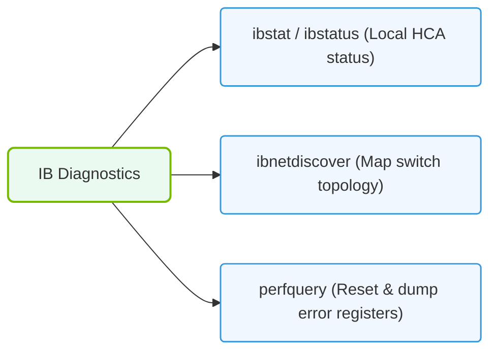

# 30.3e ibdiagnet and perfquery: InfiniBand fabric diagnostics and performance counters

  📦 Virtualization and Cloud
  📖 GPU Diagnostics and nvidia-smi Mastery

---

## 🧭 Context Introduction

When working with AI infrastructure, the network connecting your GPUs is just as critical as the GPUs themselves. InfiniBand is a high-speed, low-latency interconnect commonly used in AI clusters. Two essential tools for understanding and troubleshooting InfiniBand fabrics are **ibdiagnet** and **perfquery**. These tools help engineers diagnose network health, identify misconfigurations, and monitor performance counters — all of which directly impact the speed and reliability of distributed AI training workloads.

---

## ⚙️ What is ibdiagnet?

**ibdiagnet** is a comprehensive InfiniBand fabric diagnostic tool. It scans the entire network fabric and reports on:

- **Topology**: How switches and hosts are connected
- **Link status**: Which links are active, degraded, or down
- **Errors**: Physical and link-layer errors across the fabric
- **Configuration issues**: Mismatched settings, missing cables, or incorrect partitioning

Think of it as a network health scanner that gives you a bird's-eye view of your InfiniBand fabric.

---

## 📊 What is perfquery?

**perfquery** is a tool that reads performance counters from InfiniBand devices (switches, HCAs, and routers). These counters track:

- **Data throughput**: Bytes sent and received
- **Packet counts**: Total packets and error packets
- **Congestion indicators**: Buffer overflows, packet drops
- **Link utilization**: How busy each link is

perfquery helps you understand whether your network is performing optimally or if there are bottlenecks slowing down your AI workloads.

---

## 🛠️ How They Work Together

| Tool | Primary Purpose | When to Use |
|------|----------------|-------------|
| **ibdiagnet** | Fabric-wide diagnostics and topology discovery | Initial setup, after changes, or when troubleshooting connectivity issues |
| **perfquery** | Reading performance counters from specific devices | During performance testing, monitoring, or when investigating slowdowns |

Together, they provide both a **static health check** (ibdiagnet) and **dynamic performance monitoring** (perfquery) of your InfiniBand fabric.

---

### 📊 Visual Representation: InfiniBand Diagnostic Command execution
This diagram maps the primary IB commands used to check link statuses and verify clean communication paths.

## 🕵️ Common Use Cases

- **Fabric validation after installation**: Run ibdiagnet to confirm all links are active and error-free
- **Performance troubleshooting**: Use perfquery to check if a specific link is saturated or dropping packets
- **Pre-training checks**: Before launching a large AI training job, verify the fabric is healthy with ibdiagnet
- **Ongoing monitoring**: Periodically run perfquery to track link utilization trends

---

## 🔍 Key Concepts to Understand

- **Port counters**: Each InfiniBand port has hardware counters that track packets, bytes, errors, and more
- **Symbol errors**: Indicate physical layer issues (bad cables, transceivers, or connectors)
- **Link degradation**: A link may be up but running at a lower speed (e.g., 4x instead of 12x)
- **Congestion**: When too much data tries to flow through a link, causing packet drops and retransmissions

---

## ✅ Best Practices for New Engineers

- Always run **ibdiagnet** first to get a baseline of fabric health before deeper investigation
- Use **perfquery** to compare counters before and after running a workload to spot changes
- Look for **non-zero error counters** — they indicate problems that need attention
- Document normal counter values for your fabric so you can spot anomalies later
- Combine these tools with **nvidia-smi** to correlate GPU performance with network performance

---

## 📝 Summary

- **ibdiagnet** gives you a full fabric health report — topology, errors, and configuration
- **perfquery** reads detailed performance counters from individual ports
- Together, they help you ensure your InfiniBand network is ready for demanding AI workloads
- Start with ibdiagnet for broad diagnostics, then use perfquery for targeted performance analysis

Understanding these tools is a foundational skill for anyone managing AI infrastructure. They help you move from "the network is up" to "the network is performing optimally" — a critical distinction in high-performance AI environments.