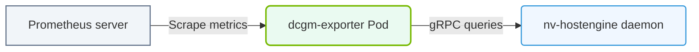

# 31.2a dcgm-exporter architecture: a Kubernetes DaemonSet exposing /metrics endpoint

  📦 Virtualization and Cloud
  📖 Cluster-Wide Telemetry

## 🧠 Context Introduction

When you run AI workloads on Kubernetes, your GPUs are the most valuable (and expensive) resources in the cluster. To keep them healthy and performant, you need real-time visibility into their behavior. This is where **dcgm-exporter** comes in.

DCGM-Exporter is a lightweight tool from NVIDIA that collects GPU telemetry (temperature, memory usage, power draw, etc.) using the NVIDIA Data Center GPU Manager (DCGM) library. It then exposes these metrics in a format that Prometheus can scrape — specifically, through an HTTP endpoint at **/metrics**.

In a Kubernetes environment, dcgm-exporter runs as a **DaemonSet**, meaning one pod runs on every node that has GPUs. Each pod collects metrics from the GPUs on its own node and makes them available for Prometheus to collect.

---

## ⚙️ What is a DaemonSet?

A DaemonSet is a Kubernetes resource that ensures a copy of a pod runs on every node (or a subset of nodes) in your cluster. Think of it as a "one-per-node" deployment.

- **Purpose**: Ensures that every GPU node has a dcgm-exporter pod running.
- **Node targeting**: You can use node selectors or taints to run dcgm-exporter only on nodes that actually have NVIDIA GPUs.
- **Lifecycle**: When a new GPU node joins the cluster, Kubernetes automatically starts a dcgm-exporter pod on it. When a node is removed, the pod is terminated.

---

## 📊 How dcgm-exporter Works

The dcgm-exporter pod does three main things:

1. **Collects GPU metrics** — It uses the DCGM library to query GPU state (e.g., utilization, memory used, temperature, power consumption).
2. **Formats metrics** — It converts the raw DCGM data into Prometheus-compatible metric names and labels.
3. **Exposes an HTTP endpoint** — It starts a small web server on a configurable port (default is **9400**) and serves the metrics at the **/metrics** path.

---

## 🕵️ The /metrics Endpoint

The **/metrics** endpoint is the standard Prometheus exposition format. When Prometheus scrapes this endpoint, it receives plain-text data that looks like this (conceptually):

- A line starting with **# HELP** describes what the metric is.
- A line starting with **# TYPE** defines the metric type (gauge, counter, histogram).
- Actual metric lines include the metric name, labels (like GPU index, UUID, model name), and the current value.

For example, a metric for GPU memory usage might appear as:

- **# HELP DCGM_FI_DEV_MEM_COPY_UTIL** — Memory utilization rate for a GPU device.
- **# TYPE DCGM_FI_DEV_MEM_COPY_UTIL** gauge
- **DCGM_FI_DEV_MEM_COPY_UTIL{gpu="0",UUID="GPU-abc123",model="A100"}** 45.2

---

## 🛠️ Architecture Diagram (Conceptual)

Here is how the components fit together in a Kubernetes cluster:

- **Kubernetes Cluster** contains multiple **GPU Nodes**.
- On each **GPU Node**, a **dcgm-exporter Pod** runs as part of a **DaemonSet**.
- Inside each pod, the **dcgm-exporter container** talks to the **NVIDIA DCGM library** to get GPU metrics.
- The container exposes an HTTP server on **port 9400** with a **/metrics** endpoint.
- **Prometheus** (running elsewhere in the cluster) scrapes each pod's **/metrics** endpoint at regular intervals.

---

### 📊 Visual Representation: dcgm-exporter Pipeline
This diagram displays dcgm-exporter: scraping metrics from nv-hostengine and exposing them as HTTP endpoints for Prometheus.

## 📋 Key Components Comparison

| Component | Role | Where it runs |
|-----------|------|---------------|
| **DaemonSet** | Ensures one pod per GPU node | Kubernetes control plane (scheduler) |
| **dcgm-exporter Pod** | Collects and serves GPU metrics | One per GPU node |
| **DCGM Library** | Provides low-level GPU telemetry | Inside the pod (linked as a library) |
| **/metrics Endpoint** | HTTP endpoint for Prometheus scraping | Inside each pod (port 9400) |
| **Prometheus** | Scrapes and stores metrics | Separate pod or service in the cluster |

---

## 🔍 How Prometheus Discovers dcgm-exporter Pods

Prometheus uses **service discovery** to find dcgm-exporter pods. There are two common approaches:

1. **Pod annotations** — You add a Prometheus-specific annotation to the dcgm-exporter DaemonSet template. Prometheus automatically discovers any pod with this annotation.
2. **Service + Endpoints** — You create a Kubernetes Service that targets the dcgm-exporter pods. Prometheus then scrapes the service's endpoints.

The annotation approach is simpler and more common for DaemonSets.

---

## ✅ Why This Architecture Matters for Engineers

Understanding this architecture helps you:

- **Troubleshoot missing metrics** — If a GPU node has no metrics, check if the dcgm-exporter pod is running on that node.
- **Scale monitoring** — Since dcgm-exporter runs as a DaemonSet, adding new GPU nodes automatically extends your monitoring coverage.
- **Optimize resource usage** — Each dcgm-exporter pod is lightweight (typically under 100MB RAM), so it won't starve your AI workloads.
- **Secure the endpoint** — The /metrics endpoint should not be exposed to the public internet. Use network policies or Prometheus-specific authentication.

---

## 🧪 Quick Verification Steps

To verify dcgm-exporter is working correctly in your cluster:

1. Check that the DaemonSet exists and has the expected number of pods (one per GPU node).
2. For any dcgm-exporter pod, confirm it is in **Running** state.
3. Access the pod's /metrics endpoint (e.g., via port-forwarding) and verify you see GPU-related metrics.
4. Confirm Prometheus can reach the endpoint and is scraping data successfully.

---

## 📌 Summary

- **dcgm-exporter** is a Kubernetes DaemonSet that runs one pod per GPU node.
- Each pod collects GPU metrics using the NVIDIA DCGM library.
- Metrics are exposed at a **/metrics** HTTP endpoint (default port 9400).
- Prometheus scrapes these endpoints to build a time-series database of GPU health and performance.
- This architecture ensures automatic, cluster-wide GPU telemetry collection with minimal overhead.