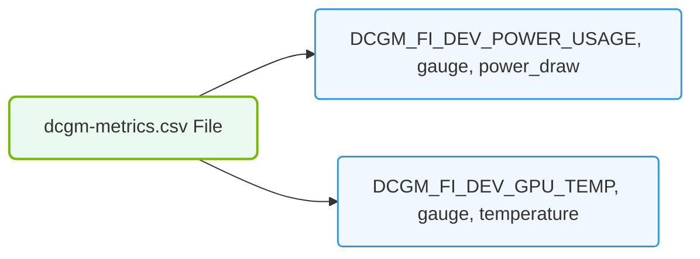

# 31.2b Customizing collected metrics: the dcgm-exporter configmap

<div class="lesson-completion" data-lesson-id="31_2b_dcgm_exporter_configuration"></div>
<div class="lesson-tags">
  <span class="lesson-tag">📦 Virtualization and Cloud</span>
  <span class="lesson-tag">📖 Cluster-Wide Telemetry</span>
</div>


---

## 🌱 Context Introduction

When you deploy DCGM-Exporter in a Kubernetes cluster, it automatically collects a default set of GPU metrics—things like GPU utilization, memory usage, temperature, and power draw. However, every AI workload is different. You might need to track specific metrics (like PCIe throughput or clock speeds) while ignoring others to reduce noise and storage costs. This is where the **ConfigMap** comes in. By customizing the DCGM-Exporter ConfigMap, you tell the exporter exactly which metrics to collect and how to label them, giving you full control over your telemetry data.

---

## ⚙️ What Is the DCGM-Exporter ConfigMap?

The ConfigMap is a Kubernetes resource that stores configuration data as key-value pairs. For DCGM-Exporter, it holds a list of **metric groups** and **individual metrics** that the exporter should scrape from NVIDIA GPUs.

- The ConfigMap is typically named **dcgm-exporter-config**.
- It is mounted into the DCGM-Exporter pod at runtime.
- Changes to the ConfigMap can be applied without rebuilding the container image.

---

## 📊 Default Metrics vs. Custom Metrics

By default, DCGM-Exporter collects a standard set of metrics defined in a file called **dcgm-metrics.csv**. When you customize the ConfigMap, you override this default list.

| Aspect | Default Metrics | Custom Metrics (via ConfigMap) |
|--------|----------------|--------------------------------|
| **Scope** | Predefined by NVIDIA | You choose exactly what to collect |
| **Flexibility** | Fixed set | Add or remove metrics freely |
| **Storage impact** | Collects everything | Reduce storage by omitting unused metrics |
| **Performance overhead** | Standard | Lower overhead if fewer metrics are collected |
| **Use case** | General monitoring | Tailored to specific workloads (e.g., training vs. inference) |

---

## 🛠️ How to Customize the ConfigMap

The process involves editing the ConfigMap YAML file to include only the metrics you care about. Each metric is defined by a **field ID** and a **metric name**.

- **Field ID**: A numeric identifier for the GPU metric (e.g., 100 for GPU utilization).
- **Metric Name**: A human-readable label that appears in Prometheus (e.g., **DCGM_FI_DEV_GPU_UTIL**).

You can find the full list of supported field IDs in the NVIDIA DCGM documentation.

### Steps to customize:

1. **Locate the existing ConfigMap** in your cluster. It is usually deployed alongside DCGM-Exporter.
2. **Edit the ConfigMap** to replace the default metric list with your custom list.
3. **Apply the updated ConfigMap** to the cluster.
4. **Restart the DCGM-Exporter pods** so they pick up the new configuration.

---


### 📊 Visual Representation: dcgm-exporter Metric filter CSV file
This diagram displays the metric configuration file structure used to filter which DCGM field IDs are exposed to Prometheus.




## 🕵️ Example: Selecting Only Key Metrics

Suppose you only want to monitor GPU utilization, memory usage, and temperature. Your custom ConfigMap would include only those three metrics.

For reference:
```
- field_id: 100
  metric_name: DCGM_FI_DEV_GPU_UTIL
- field_id: 150
  metric_name: DCGM_FI_DEV_MEM_COPY_UTIL
- field_id: 155
  metric_name: DCGM_FI_DEV_GPU_TEMP
```

📤 **Output:** After applying this ConfigMap, DCGM-Exporter will only report these three metrics to Prometheus, reducing data volume and simplifying your dashboards.

---

## 🔄 Applying Changes Without Downtime

Because the ConfigMap is mounted as a volume, you can update it dynamically. However, DCGM-Exporter may need a restart to reload the configuration.

- **Option A**: Delete the existing DCGM-Exporter pod. Kubernetes will recreate it with the new ConfigMap.
- **Option B**: Use a rolling update if DCGM-Exporter is deployed as a DaemonSet.

---

## ✅ Best Practices for New Engineers

- **Start with the default list** and remove metrics one by one to understand what each one represents.
- **Document your custom ConfigMap** in your team's repository so others know which metrics are being collected.
- **Test changes in a non-production cluster first** to ensure your custom metrics are being scraped correctly.
- **Monitor Prometheus targets** after applying changes to confirm the exporter is still healthy.

---

## 🧠 Key Takeaway

Customizing the DCGM-Exporter ConfigMap gives you surgical control over GPU telemetry. Instead of collecting everything, you focus on the metrics that matter for your AI workloads—saving storage, reducing noise, and making your dashboards cleaner and more actionable.