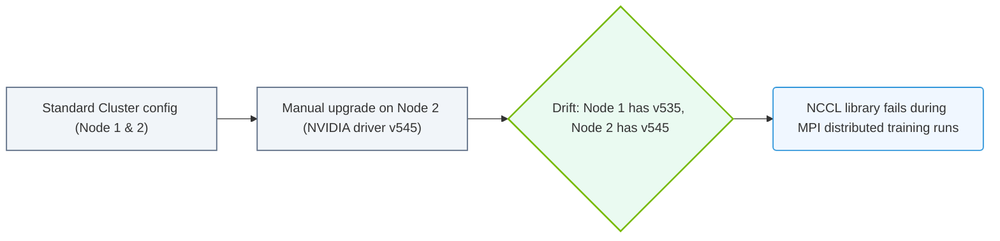

# 32.1c Configuration drift: why manually managed clusters diverge from their intended state

  📦 Virtualization and Cloud
  📖 Enterprise Cluster Management

---

## 🔍 Context Introduction

When you first start working with AI infrastructure, you might assume that once a cluster is set up correctly, it stays that way. In reality, manually managed clusters slowly and silently drift away from their intended configuration. This phenomenon is called **configuration drift**, and it is one of the most common reasons why AI workloads fail unexpectedly, performance degrades over time, or security vulnerabilities appear.

For new engineers, think of configuration drift like a house that you never maintain. The roof starts leaking, a window gets stuck, and the door doesn't close properly — all because no one checked or adjusted things regularly. In a cluster, the same happens with software settings, driver versions, and system files.

---

## ⚙️ What Causes Configuration Drift?

Configuration drift happens when individual changes are made to a cluster node without a centralized, repeatable process. Common causes include:

- **Ad-hoc manual fixes** — An engineer logs into a node to fix a temporary issue and changes a configuration file, but forgets to apply the same change to other nodes.
- **Software updates** — One node gets a security patch or driver update, while others remain on older versions.
- **Environment differences** — Nodes in the same cluster may have slightly different hardware, causing some settings to work on one node but fail on another.
- **Human error** — Typing mistakes, missed steps, or applying changes to the wrong node.
- **Time** — Over weeks and months, small inconsistencies accumulate until the cluster is no longer uniform.

---

## 🕵️ How Drift Manifests in AI Clusters

In an AI infrastructure context, configuration drift can cause serious problems:

| Symptom | Example |
|---------|---------|
| 🐢 Inconsistent performance | One GPU node runs training 20% slower because it has an older NVIDIA driver |
| ❌ Job failures | A distributed training job fails because nodes have different CUDA versions |
| 🔒 Security gaps | One node missed a critical security patch, exposing the entire cluster |
| 🧩 Dependency mismatches | Python libraries or container runtimes differ across nodes |
| 📉 Resource waste | Some nodes are over-provisioned while others are under-utilized |

---

## 🛠️ Why Manual Management Fails at Scale

Manually managing a cluster of 5 nodes might be feasible. But when you scale to 50, 500, or 5,000 nodes, manual management becomes impossible. Here is why:

- **No single source of truth** — Engineers rely on memory, notes, or spreadsheets to track what was changed and where.
- **Inconsistent application** — A fix applied to one node is rarely applied uniformly to all others.
- **No audit trail** — When something breaks, it is nearly impossible to trace back which change caused the issue.
- **Human fatigue** — Repetitive manual tasks lead to mistakes, especially under pressure.

---

### 📊 Visual Representation: Configuration Drift over time
This diagram displays how nodes diverge from standard configurations over time when manual changes bypass provisioning systems.

## 📊 Comparison: Intended State vs. Actual State

| Aspect | Intended State (What You Want) | Actual State (What Happens) |
|--------|-------------------------------|-----------------------------|
| NVIDIA driver version | 535.129.03 on all nodes | Node 1: 535.129.03, Node 2: 535.86.01, Node 3: 525.105.17 |
| CUDA toolkit | 12.2 on all nodes | Node 1: 12.2, Node 2: 12.1, Node 3: 11.8 |
| Network configuration | MTU 9000 on all interfaces | Node 1: MTU 9000, Node 2: MTU 1500 (default) |
| Security patches | All critical patches applied | Node 3 missing 3 critical patches |
| Storage mount points | /data mounted on all nodes | Node 2 has /data, Node 1 has /mnt/data instead |

---

## 🧠 How Tools Like NVIDIA Base Command Manager Prevent Drift

NVIDIA Base Command Manager (BCM) is designed to solve this exact problem. Instead of relying on manual changes, BCM uses:

- **Golden images** — A single, validated image that is deployed identically to every node.
- **Configuration management** — Centralized settings that are applied consistently across the cluster.
- **Automated provisioning** — New nodes are automatically configured to match the intended state.
- **Continuous monitoring** — BCM detects when a node has drifted and can automatically remediate it.
- **Audit logging** — Every change is tracked, so you always know who changed what and when.

---

## ✅ Key Takeaways for New Engineers

- Configuration drift is **inevitable** in manually managed clusters — it is not a sign of incompetence, but a natural consequence of human-driven processes.
- Drift causes **unpredictable behavior** in AI workloads, making debugging and performance tuning extremely difficult.
- The solution is **automation and centralized management** — tools like NVIDIA Base Command Manager enforce a consistent intended state across all nodes.
- As a new engineer, always prefer **automated, repeatable processes** over one-off manual fixes. If you must make a manual change, document it immediately and plan to automate it later.

---

## 📚 Further Reading

- NVIDIA Base Command Manager documentation
- Configuration management best practices (e.g., Ansible, Puppet, Chef)
- Infrastructure as Code (IaC) principles
- Immutable infrastructure concepts

---

*Remember: A cluster that is manually managed today will be a cluster with drift tomorrow. Automation is your best defense.*