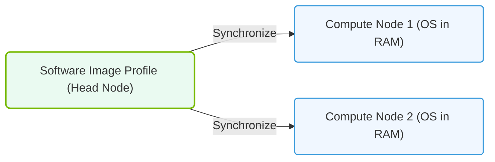

# 32.2c Software image management: golden images, image profiles, and OS provisioning

  📦 Virtualization and Cloud
  📖 Enterprise Cluster Management

When managing a large cluster of servers for AI workloads, you cannot afford to manually install and configure the operating system on every single machine. This is where software image management comes in. In NVIDIA Base Command Manager (BCM), you work with **golden images**, **image profiles**, and **OS provisioning** to automate the deployment and maintenance of consistent, reliable operating environments across your entire cluster.

Think of it like baking a cake: you create one perfect "master" recipe (the golden image), then use that recipe to quickly produce identical cakes (OS provisioning) for every node in your kitchen.

---

## 🖼️ What is a Golden Image?

A **golden image** is a pre-configured, fully patched, and optimized snapshot of an operating system (OS) that includes all the necessary drivers, libraries, and software for AI workloads. It serves as the single source of truth for what every node in your cluster should look like.

Key characteristics of a golden image:
- **Consistency**: Every node gets the exact same OS configuration
- **Optimization**: Pre-tuned for NVIDIA GPUs, networking, and storage
- **Security**: Includes all required security patches and hardening
- **Reproducibility**: Can be rebuilt and updated without manual intervention

Engineers typically create a golden image by:
1. Installing a base OS (e.g., Ubuntu, Rocky Linux)
2. Adding NVIDIA drivers, CUDA toolkit, and container runtime
3. Configuring networking, storage mounts, and monitoring agents
4. Applying security policies and user access controls
5. Testing the image on a single node before scaling out

---

## 📋 Understanding Image Profiles

An **image profile** is a configuration template that defines how a golden image should be applied to different types of nodes in your cluster. Not every node needs the same software — a GPU compute node might need different packages than a storage node or a login node.

Image profiles allow you to:
- **Assign different images** to different node roles (compute, storage, management)
- **Define post-installation scripts** that run after the OS is deployed
- **Specify kernel parameters** and boot options for specific hardware
- **Control partitioning** and filesystem layouts

For example, you might have:
- **Profile A**: Golden image + NVIDIA drivers + Docker for GPU compute nodes
- **Profile B**: Golden image + NFS client + monitoring agents for storage nodes
- **Profile C**: Golden image + SSH server + job scheduler for login nodes

---

## 🚀 OS Provisioning: How It Works

**OS provisioning** is the automated process of deploying your golden image (via an image profile) onto a bare-metal node. BCM handles this through a process called **PXE boot** (Preboot eXecution Environment) combined with network-based installation.

The provisioning flow generally looks like this:

1. **Node boots from network** — The target node is configured to boot from the network (PXE) instead of its local disk
2. **BCM provisioning server responds** — BCM detects the node's request and serves the appropriate image profile
3. **Image is streamed to the node** — The golden image is transferred over the network to the node's local storage
4. **Post-installation scripts run** — Custom scripts configure hostname, IP address, and role-specific settings
5. **Node reboots into the new OS** — The node boots from its local disk with the freshly installed operating system

This entire process can happen in minutes, allowing you to provision hundreds of nodes simultaneously.

---

### 📊 Visual Representation: BCM Software Image provision
This diagram displays BCM image management, showing how software profile updates are synchronized down to target compute nodes.

## 🛠️ Comparison: Golden Image vs. Image Profile vs. OS Provisioning

| Concept | What It Is | What It Does | Example |
|---------|------------|--------------|---------|
| **Golden Image** | A static OS snapshot | Serves as the base template for all nodes | Ubuntu 22.04 with NVIDIA driver 545 |
| **Image Profile** | A deployment configuration | Defines how and where to apply the image | "GPU Compute Profile" with Docker and CUDA |
| **OS Provisioning** | An automated process | Installs the image onto physical hardware | PXE boot + network install of the golden image |

---

## 🔄 Managing Updates with Golden Images

One of the biggest advantages of golden images is **update management**. Instead of patching each node individually, you:

1. **Update the golden image** — Install patches, new drivers, or software on a reference machine
2. **Create a new version** — Save the updated image with a version number (e.g., `golden-v2.1`)
3. **Reprovision nodes** — Use BCM to reinstall nodes with the new image version

This approach ensures that every node in your cluster remains identical and up-to-date, reducing configuration drift and troubleshooting time.

---

## 🧠 Best Practices for New Engineers

- **Start simple**: Create one golden image for your most common node type first
- **Version everything**: Always tag your golden images with version numbers (e.g., `ubuntu-22.04-cuda-12.2-v1`)
- **Test before deploying**: Always test a new golden image on a single node before rolling it out cluster-wide
- **Document your image**: Keep a record of what software and configurations are included in each image version
- **Use image profiles wisely**: Group nodes by function (compute, storage, management) and create profiles for each group

---

## ✅ Summary

Software image management in NVIDIA Base Command Manager gives you the power to treat your entire cluster as a single, consistent system. By mastering **golden images**, **image profiles**, and **OS provisioning**, you can:

- Deploy new nodes in minutes instead of hours
- Ensure every node runs the exact same OS configuration
- Quickly roll out security patches and software updates
- Recover failed nodes by simply reprovisioning them

This foundation is essential for scaling AI infrastructure reliably and efficiently.