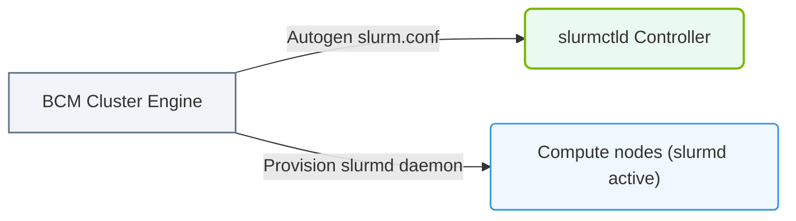

# 32.3b Integrated Slurm management: job submission, monitoring, and accounting through BCM

  📦 Virtualization and Cloud
  📖 Enterprise Cluster Management

---

## 🧠 Context Introduction

When managing an AI cluster, engineers need a way to share compute resources (GPUs, CPUs, memory) among many users and jobs. **Slurm** (Simple Linux Utility for Resource Management) is a popular workload manager that handles job scheduling, monitoring, and accounting. **NVIDIA Base Command Manager (BCM)** integrates Slurm directly into its management platform, giving engineers a unified view of cluster health, job queues, and resource usage — all from one interface.

This integration means you don't have to jump between separate tools. BCM handles the Slurm configuration, user management, and reporting, while Slurm does the heavy lifting of running and tracking jobs.

---

## ⚙️ Job Submission Through BCM

BCM simplifies how engineers submit jobs to the Slurm cluster. Instead of only using the command line, BCM provides a web-based interface and automated workflows.

### Key Points:
- **Job submission** can be done via the BCM web dashboard or through standard Slurm commands (like `sbatch` or `srun`).
- BCM automatically maps users and groups to Slurm accounts, so permissions are consistent.
- Engineers can define **job templates** in BCM for common AI workloads (e.g., training, inference, data preprocessing).
- Templates include resource requirements (GPUs, memory, walltime) and environment setup (containers, Conda environments).

### Example Workflow:
1. An engineer selects a job template from the BCM dashboard.
2. They specify the number of GPUs and nodes required.
3. BCM translates this into a Slurm submission script and queues the job.
4. The job runs on available nodes, and BCM tracks its progress.

---

## 📊 Monitoring Jobs and Cluster Health

BCM provides real-time visibility into Slurm jobs and cluster resources. This helps engineers identify bottlenecks, failed jobs, or underutilized GPUs.

### What You Can Monitor:
- **Job status**: Running, pending, completed, or failed.
- **Resource usage**: GPU utilization, memory consumption, CPU load per node.
- **Queue depth**: How many jobs are waiting and their priority.
- **Node health**: Which nodes are online, offline, or draining.

### BCM Monitoring Features:
- A **dashboard** with live graphs and tables for all active jobs.
- **Alerts** for job failures, node failures, or resource exhaustion.
- **Historical views** to analyze past job performance and trends.

---

### 📊 Visual Representation: BCM Slurm cluster integration
This diagram displays how BCM automatically configures slurm.conf and provisions partitions based on node labels.

## 🕵️ Accounting and Usage Tracking

BCM integrates Slurm's accounting database (`slurmdbd`) to track who used what resources and for how long. This is essential for chargebacks, capacity planning, and auditing.

### Accounting Capabilities:
- **Per-user and per-group usage reports** — see how many GPU-hours each team consumed.
- **Job-level details** — start time, end time, exit code, resources requested vs. used.
- **Billing or allocation tracking** — BCM can tie Slurm accounts to budgets or project codes.
- **Exportable reports** — download usage data as CSV or PDF for management reviews.

---

## 🛠️ Comparison: Slurm Alone vs. Slurm + BCM

| Feature | Slurm Alone | Slurm + BCM |
|---------|-------------|-------------|
| Job submission | Command line only | Web UI + command line + templates |
| Monitoring | CLI tools (`squeue`, `sinfo`) | Real-time dashboard with graphs |
| Accounting | `sacct` command | Built-in reports and export |
| User management | Manual (user accounts, groups) | Automatic sync with BCM users |
| Alerting | Manual scripts | Built-in alerts and notifications |
| Configuration | Manual `slurm.conf` editing | GUI-based or automated via BCM |

---

## ✅ Summary for New Engineers

- **Slurm** manages job scheduling and resource allocation.
- **BCM** wraps Slurm with a user-friendly interface, automated workflows, and integrated monitoring.
- **Job submission** becomes easier with templates and a web dashboard.
- **Monitoring** gives you a live view of cluster health and job progress.
- **Accounting** tracks resource usage for reporting and chargebacks.

As you work with AI infrastructure, think of BCM as the "control center" and Slurm as the "engine" — together they make cluster management scalable and accessible.

---

*Next step: Try submitting a test job through the BCM dashboard and watch its progress in the monitoring view.*