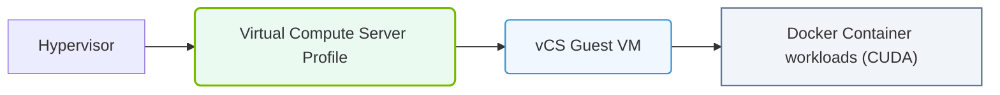

# 33.2c NVIDIA Virtual Compute Server (vCS): vGPU profiles for AI training and inference VMs

  📦 Virtualization and Cloud
  📖 GPU Virtualization

## 🌐 Context Introduction

In modern AI infrastructure, not every workload needs a full physical GPU. NVIDIA Virtual Compute Server (vCS) allows engineers to partition a single physical GPU into multiple virtual GPUs (vGPUs). This enables multiple virtual machines (VMs) to share GPU resources efficiently. For AI training and inference, choosing the right vGPU profile is critical — it determines how much GPU memory, compute power, and performance each VM receives.

This guide explains vGPU profiles in simple terms, helping new engineers understand which profile to use for AI training VMs versus inference VMs.

---

## ⚙️ What is NVIDIA vCS and vGPU?

- **NVIDIA Virtual Compute Server (vCS)** is a software layer that enables GPU virtualization in data centers.
- **vGPU (Virtual GPU)** allows a physical GPU to be split into smaller, isolated GPU instances.
- Each vGPU profile defines:
  - Amount of **GPU memory** allocated to a VM.
  - **Compute capacity** (percentage of GPU cores).
  - **Number of display heads** (usually not needed for compute workloads).
- vCS is designed for **compute-intensive workloads** like AI training and inference, not just graphics.

---

## 📊 vGPU Profiles for AI Training vs. Inference

AI training and inference have different resource needs. Training requires large memory and high compute for long periods, while inference needs lower latency and can often run on smaller profiles.

### 🧠 AI Training VMs

- **Goal**: Train deep learning models with large datasets.
- **Requirements**:
  - Large GPU memory (e.g., 16 GB, 32 GB, or more).
  - High compute throughput (many CUDA cores).
  - Sustained performance over hours or days.
- **Recommended vGPU profiles**:
  - **1q** (e.g., 16 GB on an A100) — for smaller models.
  - **2q** (e.g., 32 GB on an A100) — for medium models.
  - **4q** (e.g., 64 GB on an A100) — for large models.
- **Key point**: Training VMs typically use **larger profiles** to avoid out-of-memory errors.

### ⚡ AI Inference VMs

- **Goal**: Run trained models to make predictions (low latency).
- **Requirements**:
  - Moderate GPU memory (e.g., 4 GB, 8 GB).
  - Fast response times.
  - Ability to serve many concurrent users.
- **Recommended vGPU profiles**:
  - **1q** (e.g., 4 GB on an A100) — for small models.
  - **2q** (e.g., 8 GB on an A100) — for medium models.
  - **4q** (e.g., 16 GB on an A100) — for large models.
- **Key point**: Inference VMs can use **smaller profiles** and run multiple VMs on one physical GPU.

---

### 📊 Visual Representation: vCS (Virtual Compute Server) architecture
This diagram displays vCS: exposing GPU hardware virtualization to enterprise AI containers and VMs.

## 🛠️ Comparison Table: Training vs. Inference vGPU Profiles

| Feature | AI Training VMs | AI Inference VMs |
|---------|----------------|------------------|
| **Primary goal** | Model training | Model serving |
| **GPU memory needed** | Large (16 GB – 64 GB+) | Small to medium (4 GB – 16 GB) |
| **Compute intensity** | High (sustained) | Moderate (bursty) |
| **Typical vGPU profile** | 2q, 4q, 8q | 1q, 2q, 4q |
| **Number of VMs per GPU** | Few (1–4) | Many (4–16) |
| **Latency sensitivity** | Low | High |
| **Example GPU** | NVIDIA A100 80 GB | NVIDIA A100 80 GB |
| **Best for** | Deep learning, large batches | Real-time predictions, small batches |

---

## 🕵️ How to Choose the Right vGPU Profile

Follow these simple guidelines when selecting a profile for your AI VMs:

- **Check model memory requirements**: Use tools like **nvidia-smi** to see how much GPU memory your model needs. For example, a model requiring 12 GB of memory needs at least a 16 GB vGPU profile.
- **Consider concurrent VMs**: If you need many inference VMs, choose smaller profiles (e.g., 1q) to maximize density.
- **Balance performance vs. isolation**: Larger profiles give better performance but reduce the number of VMs per GPU.
- **Test with representative workloads**: Run a short training or inference job to verify the profile meets your needs.

---

## ✅ Key Takeaways for New Engineers

- **vGPU profiles** define how a physical GPU is shared among VMs.
- **Training VMs** need large profiles (2q, 4q, 8q) for memory and compute.
- **Inference VMs** can use smaller profiles (1q, 2q) for higher VM density.
- Always match the profile to your model's GPU memory requirements.
- Use **nvidia-smi** inside a VM to verify the allocated vGPU memory and compute.

---

## 📚 Further Learning

- NVIDIA vGPU documentation on profile definitions.
- NVIDIA Virtual Compute Server (vCS) deployment guides.
- Hands-on labs: Creating VMs with different vGPU profiles and running AI workloads.

---

*This guide is part of the NVIDIA-Certified Associate: AI Infrastructure and Operations curriculum.*