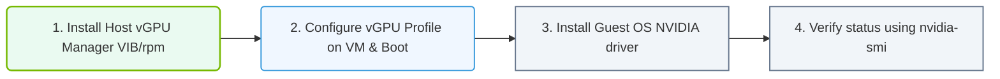

# 33.2d vGPU Manager installation on ESXi and KVM hosts

<div class="lesson-completion" data-lesson-id="33_2d_vgpu_manager_installation"></div>
<div class="lesson-tags">
  <span class="lesson-tag">📦 Virtualization and Cloud</span>
  <span class="lesson-tag">📖 GPU Virtualization</span>
</div>


---

## 🧭 Context Introduction

When you virtualize GPUs using NVIDIA vGPU, the physical GPU is shared across multiple virtual machines (VMs). To make this work, you need to install a special software component called the **vGPU Manager** on your hypervisor host — whether that is VMware ESXi or KVM (Linux-based). The vGPU Manager acts as the bridge between the physical GPU hardware and the virtual GPU devices assigned to each VM.

This guide explains the installation process for both ESXi and KVM hosts, focusing on what a new engineer needs to know to get started.

---

## ⚙️ What is the vGPU Manager?

The vGPU Manager is a kernel-level driver installed directly on the hypervisor host. It performs the following key functions:

- **Splits the physical GPU** into multiple virtual GPU (vGPU) instances
- **Manages GPU memory** allocation across VMs
- **Handles scheduling** of GPU compute tasks from different VMs
- **Provides compatibility** with NVIDIA graphics drivers inside guest VMs

Without the vGPU Manager, the hypervisor cannot virtualize the GPU.

---

## 🛠️ Pre-Installation Requirements

Before installing the vGPU Manager on any host, ensure the following:

- ✅ **Supported GPU hardware** — Only NVIDIA GPUs with vGPU support (e.g., NVIDIA A16, A40, A100, H100, L40S)
- ✅ **Supported hypervisor version** — Check the NVIDIA vGPU Software User Guide for your specific version
- ✅ **NVIDIA vGPU software license** — A valid license from NVIDIA Licensing Portal
- ✅ **Hypervisor host prepared** — ESXi host in maintenance mode or KVM host with proper kernel headers

---

## 📊 Comparison: ESXi vs KVM vGPU Manager Installation

| Feature | ESXi | KVM (Linux) |
|---------|------|-------------|
| Installation method | VMware VIB (vSphere Installation Bundle) | RPM or Debian package |
| Host reboot required | Yes | Yes |
| Management tool | vSphere Client | `nvidia-smi` and `mdevctl` |
| Driver type | Kernel module (vmkernel) | Linux kernel module |
| License activation | Via NVIDIA Licensing Server | Via NVIDIA Licensing Server |

---


### 📊 Visual Representation: vGPU Manager installation steps
This flowchart maps installing vGPU: loading vibs on hypervisors, booting VMs, and loading guest drivers.




## 🖥️ Installing vGPU Manager on ESXi Hosts

### 🔹 Step 1: Download the vGPU Manager VIB

- Obtain the correct VIB file from the **NVIDIA Enterprise Application Hub** (requires login)
- Match the VIB version to your ESXi build number (e.g., ESXi 7.0 U3, ESXi 8.0)

### 🔹 Step 2: Place the ESXi host in Maintenance Mode

- Use the vSphere Client or SSH to the host
- Ensure no VMs are running on the host before proceeding

### 🔹 Step 3: Install the VIB

- Transfer the VIB file to the ESXi host (e.g., via SCP or datastore upload)
- Run the installation command from the ESXi shell

**For reference:**
```
esxcli software vib install -v /path/to/NVIDIA-vGPU-VIB.vib
```

📤 Output: A message confirming successful installation, including the VIB name and version.

### 🔹 Step 4: Reboot the ESXi Host

- After installation, reboot the host to load the new vGPU kernel module
- Verify the module is loaded using the ESXi command

**For reference:**
```
esxcli system module list | grep nvidia
```

📤 Output: A line showing the NVIDIA vGPU module (e.g., `nvidia-vgpu`)

### 🔹 Step 5: Verify GPU Detection

- Use the vSphere Client to check the host's GPU status
- The GPU should appear under **Host > Manage > Hardware > PCI Devices**

---

## 🐧 Installing vGPU Manager on KVM Hosts

### 🔹 Step 1: Download the vGPU Manager Package

- Download the appropriate package from the **NVIDIA Enterprise Application Hub**
- Choose between **RPM** (for RHEL/CentOS/Rocky Linux) or **Debian** (for Ubuntu/Debian) format

### 🔹 Step 2: Install Required Dependencies

- Ensure your KVM host has the correct kernel headers and development tools installed

**For reference (RHEL-based):**
```
sudo yum install kernel-devel kernel-headers gcc make
```

**For reference (Debian-based):**
```
sudo apt-get install linux-headers-$(uname -r) build-essential
```

### 🔹 Step 3: Install the vGPU Manager Package

- Use the package manager appropriate for your distribution

**For reference (RPM):**
```
sudo rpm -ivh NVIDIA-vGPU-Manager-<version>.x86_64.rpm
```

**For reference (Debian):**
```
sudo dpkg -i NVIDIA-vGPU-Manager-<version>.amd64.deb
```

📤 Output: Installation progress and a final confirmation message.

### 🔹 Step 4: Reboot the KVM Host

- Reboot the host to load the NVIDIA kernel module
- After reboot, verify the module is loaded

**For reference:**
```
lsmod | grep nvidia
```

📤 Output: A list showing `nvidia` and `nvidia-vgpu-vfio` modules

### 🔹 Step 5: Verify GPU and vGPU Capabilities

- Use the NVIDIA management tool to check GPU status

**For reference:**
```
nvidia-smi
```

📤 Output: A table showing GPU name, driver version, and vGPU capabilities (look for "vGPU" in the GPU name line)

---

## 🕵️ Post-Installation Verification Checklist

After installation on either hypervisor, confirm the following:

- [ ] **GPU is visible** to the hypervisor (check PCI devices or `nvidia-smi`)
- [ ] **vGPU types are available** — You can list supported vGPU profiles
- [ ] **Licensing is configured** — The vGPU Manager can communicate with the NVIDIA Licensing Server
- [ ] **No driver conflicts** — No error messages in system logs (`/var/log/messages` on KVM, `/var/log/vmkernel` on ESXi)

---

## ⚠️ Common Troubleshooting Tips

- **"No supported GPU found" error** — Verify the GPU is in the NVIDIA vGPU compatibility list and that the GPU firmware is up to date
- **Module fails to load after reboot** — Check Secure Boot settings; you may need to sign the NVIDIA kernel module or disable Secure Boot
- **Licensing errors** — Ensure the host can reach the NVIDIA Licensing Server (port 443) and that the license is activated
- **VIB installation fails on ESXi** — Confirm the VIB matches your exact ESXi build version; use `esxcli software vib list` to check for conflicts

---

## 📚 Summary

Installing the vGPU Manager is the foundational step for enabling GPU virtualization on ESXi and KVM hosts. While the process differs slightly between the two hypervisors, the core concept remains the same: the vGPU Manager allows a single physical GPU to be securely shared across multiple VMs. Once installed and verified, you can proceed to create vGPU profiles and assign them to your virtual machines.

Remember to always refer to the **NVIDIA vGPU Software User Guide** for your specific version, as installation steps and supported configurations can vary between releases.