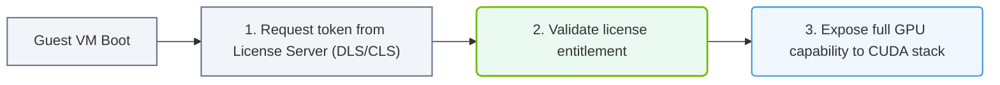

# 33.2e vGPU licensing server: NVIDIA License System (NLS) and license management

  📦 Virtualization and Cloud
  📖 GPU Virtualization

---

## 🧭 Context Introduction

When you use NVIDIA vGPU to share a physical GPU across multiple virtual machines (VMs), each VM needs a valid software license to activate the vGPU feature. Without a license, the vGPU will not function or will run in a degraded mode. The **NVIDIA License System (NLS)** is the modern, cloud-connected licensing solution that manages these vGPU licenses. As a new engineer, understanding how NLS works and how to manage licenses is essential for keeping your virtualized AI infrastructure operational and compliant.

---

## ⚙️ What is the NVIDIA License System (NLS)?

The NVIDIA License System is a software-based licensing platform that replaces older methods like hardware dongles or static license files. It allows you to:

- **Centrally manage** vGPU licenses across multiple hosts.
- **Track license usage** in real time.
- **Support both online and offline** (air-gapped) environments.
- **Automatically renew** or release licenses when VMs start or stop.

NLS consists of two main components:

- **NLS Client** – Runs on each hypervisor host (e.g., VMware ESXi, KVM) and communicates with the license server.
- **NLS License Server** – A dedicated server (physical or virtual) that hosts the license pool and responds to client requests.

---

## 🛠️ How License Management Works

### 🔑 License Types

| License Type | Description | Use Case |
|--------------|-------------|----------|
| **Evaluation License** | Temporary, time-limited license (usually 90 days) | Testing vGPU before purchase |
| **Subscription License** | Time-based license (e.g., 1 year, 3 years) | Production environments with ongoing support |
| **Perpetual License** | One-time purchase, no expiration | Long-term deployments (less common now) |

### 🔄 License Flow

1. A VM with vGPU starts.
2. The hypervisor’s NLS Client contacts the NLS License Server.
3. The server checks if a license is available in the pool.
4. If available, the server **leases** a license to the VM for a period (default: 24 hours).
5. The VM continues to renew the lease while running.
6. When the VM stops, the license is released back to the pool.

---

## 📊 NLS Deployment Options

### ☁️ Online Mode (Cloud-Connected)

- The NLS License Server connects to NVIDIA’s cloud portal to validate and download licenses.
- Requires internet access.
- Simplest to set up — licenses are automatically synchronized.

### 🏠 Offline (Air-Gapped) Mode

- The NLS License Server has no internet connection.
- You manually download a **license file (.bin)** from the NVIDIA Licensing Portal and upload it to the server.
- Used in secure or isolated environments (e.g., government, defense).

---

### 📊 Visual Representation: NVIDIA Cloud License System (CLS) token checkout
This flowchart demonstrates how client VMs checkout license tokens from license servers to enable CUDA compute.

## 🕵️ Key Management Tasks

### ✅ Installing the NLS License Server

- The NLS License Server is a lightweight application that runs on Linux (Ubuntu, RHEL) or Windows Server.
- After installation, you configure it with a **server name** and **port** (default: 8080 for HTTP, 443 for HTTPS).
- You then activate the server using a **product activation key** from NVIDIA.

### ✅ Configuring the NLS Client on Hypervisors

- On each hypervisor host, you install the NLS Client package.
- You point the client to the NLS License Server’s IP address or hostname.
- The client will automatically request licenses when vGPU VMs are created.

### ✅ Monitoring License Usage

- Access the NLS License Server’s web interface (e.g., `https://nls-server:8080`).
- You can see:
  - Total licenses available.
  - Licenses currently in use.
  - Which VMs or hosts are consuming licenses.
  - License expiration dates.

### ✅ Troubleshooting Common Issues

- **"No licenses available"** – Check if the license pool is exhausted or if licenses have expired.
- **"License server unreachable"** – Verify network connectivity between the hypervisor and the NLS server (firewall rules, DNS).
- **"License lease expired"** – Ensure the NLS Client service is running and can reach the server.

---

## 📋 Comparison: NLS vs. Legacy Licensing

| Feature | NVIDIA License System (NLS) | Legacy (Dongle/File-based) |
|---------|----------------------------|----------------------------|
| Connection | Cloud-connected or offline | Static file or USB dongle |
| Scalability | Centralized, supports many hosts | Per-host or per-dongle limits |
| License Reclamation | Automatic when VM stops | Manual or requires reboot |
| Monitoring | Real-time web dashboard | No built-in monitoring |
| Updates | Automatic via cloud | Manual file replacement |

---

## 🧩 Best Practices for New Engineers

- **Start with evaluation licenses** to test your vGPU setup before committing to production licenses.
- **Use a dedicated VM or small physical server** for the NLS License Server — do not run it on a hypervisor host.
- **Back up your license server configuration** and license files regularly.
- **Monitor license usage** weekly to avoid running out of licenses during critical workloads.
- **Plan for redundancy** — in large deployments, run multiple NLS License Servers in a cluster for high availability.

---

## ✅ Summary

The NVIDIA License System (NLS) is the modern way to manage vGPU licenses in virtualized AI environments. It replaces old dongles and static files with a flexible, centralized server that can work online or offline. As a new engineer, your main tasks will be installing the NLS server, configuring clients on hypervisors, and monitoring license usage to ensure your vGPU-enabled VMs always have the licenses they need to run AI workloads.