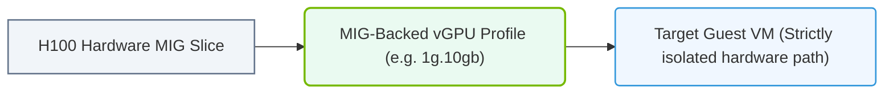

# 33.3a MIG-backed vGPU: using MIG instances as the underlying resource for vGPU

  📦 Virtualization and Cloud
  📖 GPU Virtualization

---

## 🌐 Context Introduction

In modern AI infrastructure, engineers often need to share a single physical GPU across multiple virtual machines (VMs) while maintaining performance isolation and security. Traditionally, vGPU (virtual GPU) allowed splitting a GPU into multiple virtual devices, but each partition had fixed resource boundaries.

With NVIDIA Hopper architecture (H100 and later), a powerful new capability emerged: **MIG-backed vGPU**. This combines two technologies:
- **MIG (Multi-Instance GPU)** — hardware-level partitioning of a GPU into isolated instances
- **vGPU (Virtual GPU)** — software-level GPU virtualization for VMs

The result is that each MIG instance becomes the *underlying resource* for a vGPU device, giving VMs dedicated, isolated GPU slices with predictable performance.

---

## ⚙️ How MIG-backed vGPU Works

- MIG creates **hardware-isolated GPU instances** (e.g., 1g.10gb, 2g.20gb, 3g.40gb profiles)
- Each MIG instance is assigned to a **vGPU device** via the NVIDIA virtual GPU Manager
- The hypervisor (e.g., VMware vSphere, Red Hat Virtualization) presents these vGPU devices to VMs
- Each VM sees a **dedicated virtual GPU** backed by a real MIG partition
- No other VM can access that MIG instance — full isolation is guaranteed at the hardware level

---

## 🛠️ Key Benefits for AI Workloads

- **Deterministic performance** — MIG instances provide guaranteed compute and memory slices
- **Enhanced security** — hardware-level isolation between tenants (no "noisy neighbor" effects)
- **Flexible sizing** — mix different MIG profiles (1g, 2g, 4g) across VMs on the same physical GPU
- **GPU oversubscription prevention** — each vGPU maps 1:1 to a MIG instance, preventing resource contention
- **Supports live migration** — vGPU with MIG backing can be live-migrated between hosts (with compatible GPUs)

---

### 📊 Visual Representation: MIG-Backed vGPU hardware slicing
This diagram displays how combining MIG hardware blocks with vGPU virtualization provides clean, isolated slices to VMs.

## 📊 Comparison: MIG-backed vGPU vs. Traditional vGPU

| Feature | Traditional vGPU | MIG-backed vGPU |
|---------|-----------------|-----------------|
| Isolation level | Software (GPU driver) | Hardware (MIG partition) |
| Performance guarantee | Best-effort | Deterministic |
| Max partitions per GPU | Limited by vGPU profiles | Up to 7 MIG instances (H100) |
| Memory isolation | Shared framebuffer | Dedicated per-instance |
| Live migration support | Limited | Supported (Hopper+) |
| Use case | General virtualization | AI/ML workloads, multi-tenant |

---

## 🕵️ Configuration Overview (Conceptual)

To set up MIG-backed vGPU, engineers follow this general workflow:

1. **Enable MIG mode** on the physical GPU (via NVIDIA tools)
2. **Create MIG instances** using desired profiles (e.g., 1g.10gb for small AI inference VMs)
3. **Install NVIDIA vGPU Manager** on the hypervisor host
4. **Configure vGPU devices** in the hypervisor, selecting MIG-backed vGPU type
5. **Assign vGPU devices** to VMs (one MIG instance per vGPU per VM)
6. **Install NVIDIA guest drivers** inside each VM

Each VM then operates as if it has its own dedicated GPU, but the underlying resource is a hardware-partitioned MIG slice.

---

## ✅ Practical Considerations for New Engineers

- **Check GPU compatibility** — MIG-backed vGPU requires Hopper (H100, H200) or newer architecture
- **Plan MIG profiles carefully** — match MIG size to workload requirements (e.g., training vs. inference)
- **Understand licensing** — vGPU features may require NVIDIA AI Enterprise or vGPU software licenses
- **Monitor MIG utilization** — use NVIDIA tools to verify each MIG instance is properly assigned to its VM
- **Test isolation** — run concurrent workloads in different VMs to confirm no performance interference

---

## 📌 Summary

MIG-backed vGPU represents the evolution of GPU virtualization for AI infrastructure. By combining hardware-level MIG partitioning with software-level vGPU abstraction, engineers can deliver **secure, predictable, and flexible GPU resources** to virtual machines — essential for multi-tenant AI environments, cloud deployments, and enterprise data centers.

This approach simplifies resource management while maximizing GPU utilization, making it a cornerstone of modern AI infrastructure operations.