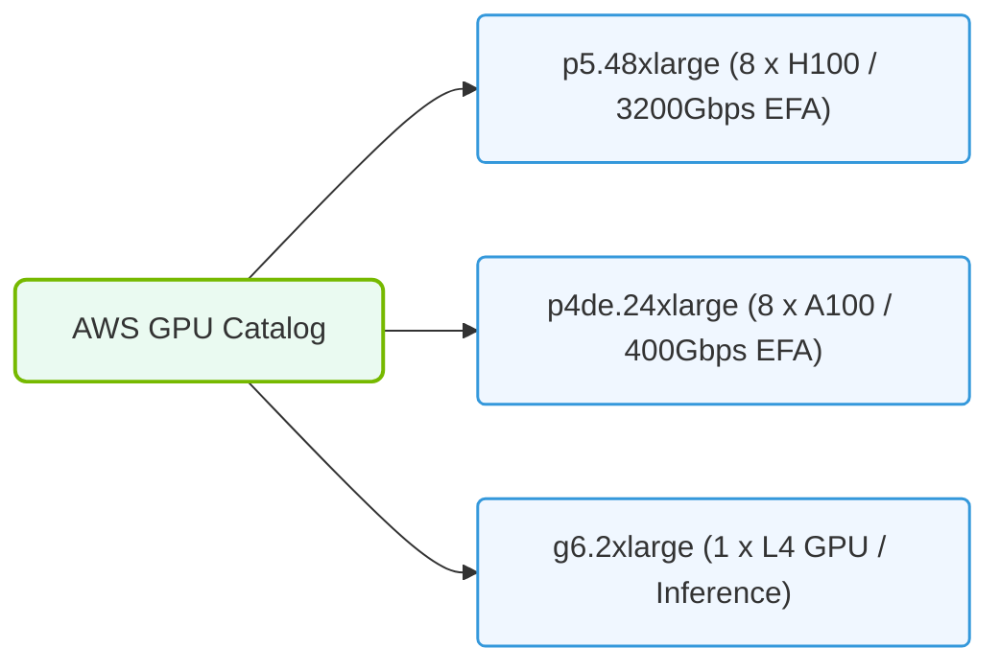

# 34.1a AWS EC2: P4d (A100), P5 (H100), P5e (H200) instance families

  📦 Virtualization and Cloud
  📖 Cloud AI Infrastructure

## 🌐 Context Introduction

When you start working with AI workloads in the cloud, one of the first decisions you'll face is choosing the right GPU instance. AWS offers three powerful families—**P4d**, **P5**, and **P5e**—each built around NVIDIA's latest data center GPUs. These instances are designed for training large language models, running scientific simulations, and accelerating machine learning pipelines. Understanding their differences helps you match the right hardware to your workload's memory, compute, and networking needs.

---

## ⚙️ What Are These Instance Families?

These are **Amazon EC2 instances** optimized for high-performance computing (HPC) and machine learning. They provide direct access to NVIDIA GPUs with high-speed interconnects.

- **P4d (A100):** Built on NVIDIA A100 Tensor Core GPUs. Ideal for training and inference of medium-to-large models.
- **P5 (H100):** Built on NVIDIA H100 Tensor Core GPUs. Designed for next-generation AI workloads with higher throughput.
- **P5e (H200):** Built on NVIDIA H200 Tensor Core GPUs. Offers the largest memory capacity for massive models like LLMs.

All three families use **Elastic Fabric Adapter (EFA)** for low-latency networking, critical for distributed training across multiple instances.

---

## 📊 Comparison Table: P4d vs P5 vs P5e

| Feature | P4d (A100) | P5 (H100) | P5e (H200) |
|---------|------------|-----------|------------|
| **GPU** | NVIDIA A100 (40 GB HBM2e) | NVIDIA H100 (80 GB HBM3) | NVIDIA H200 (141 GB HBM3e) |
| **GPU Memory per GPU** | 40 GB | 80 GB | 141 GB |
| **Interconnect** | NVSwitch (600 GB/s) | NVSwitch (900 GB/s) | NVSwitch (900 GB/s) |
| **Max GPUs per instance** | 8 | 8 | 8 |
| **Networking** | 400 Gbps EFA | 3,200 Gbps EFA | 3,200 Gbps EFA |
| **Use Case** | General AI training, inference | Large model training, HPC | Massive LLMs, memory-bound workloads |
| **Launch Year** | 2020 | 2023 | 2024 |

---

### 📊 Visual Representation: AWS EC2 GPU Instance types
This diagram displays AWS GPU instance types, grouping H100s (p5), A100s (p4), and L4s (g6).

## 🛠️ Key Features to Understand

### 🖥️ GPU Architecture
- **A100 (Ampere):** Supports FP16, TF32, and sparse operations. Good for most current models.
- **H100 (Hopper):** Adds Transformer Engine, FP8 support, and faster memory bandwidth.
- **H200 (Hopper+):** Same architecture as H100 but with **1.8x more memory** and higher bandwidth.

### 🌐 Networking and Scaling
- All instances use **EFA** for low-latency, high-throughput communication.
- P5 and P5e offer **8x more networking bandwidth** than P4d, making them better for distributed training across hundreds of GPUs.

### 💾 Memory Hierarchy
- **P4d:** 40 GB per GPU — fits models like BERT-large or GPT-2.
- **P5:** 80 GB per GPU — fits models like Llama 2 70B or Falcon 40B.
- **P5e:** 141 GB per GPU — fits models like Llama 3 405B or GPT-3 175B without model parallelism.

---

## 🕵️ When to Use Each Family

### ✅ Choose P4d (A100) when:
- You are running established models that fit within 40 GB GPU memory.
- Your budget is constrained, and you need cost-effective training.
- You are prototyping or running inference on smaller models.

### ✅ Choose P5 (H100) when:
- You need to train large models (70B+ parameters) with high throughput.
- You require FP8 precision for faster training.
- You are building production-scale distributed training clusters.

### ✅ Choose P5e (H200) when:
- Your model requires more than 80 GB of GPU memory per GPU.
- You are working with massive LLMs or multi-modal models.
- You want to reduce model parallelism complexity by fitting larger models on fewer GPUs.

---

## 💡 Practical Tips for New Engineers

### 🚀 Launching an Instance
When you launch a P4d, P5, or P5e instance via the AWS Management Console, you must:
1. Choose an **Amazon Machine Image (AMI)** that includes NVIDIA drivers (e.g., Deep Learning AMI).
2. Select a **security group** that allows inbound SSH (port 22) and your training framework ports.
3. Enable **EFA** during launch if you plan distributed training.

### 🔧 Verifying GPU Availability
After connecting to your instance, run:
- **nvidia-smi** — to see GPU count, memory, and driver version.
- **efa-info** — to confirm EFA is enabled and working.

### 📈 Cost Management
- Use **Spot Instances** for non-critical training jobs to save up to 90%.
- Consider **Reserved Instances** for steady-state production workloads.
- Monitor GPU utilization with **Amazon CloudWatch** to avoid over-provisioning.

---

## 🧠 Summary

| Instance Family | Best For | Key Limitation |
|----------------|----------|----------------|
| P4d (A100) | General AI, cost-sensitive workloads | Lower memory, older architecture |
| P5 (H100) | Large model training, high throughput | Higher cost per hour |
| P5e (H200) | Massive models, memory-bound tasks | Newest, may have limited availability |

As a new engineer, start with **P4d** for learning and prototyping. Move to **P5** or **P5e** when you need to scale up to production-grade models. Always test your workload on a smaller instance first to estimate memory and compute requirements before committing to larger, more expensive instances.

---

*Next step: Explore how to set up a multi-node training cluster using P5 instances with EFA and NVIDIA Collective Communications Library (NCCL).*