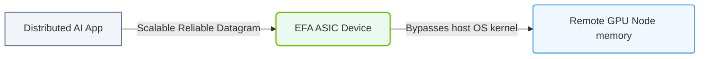

# 34.2a Elastic Fabric Adapter (EFA) on AWS: low-latency networking for P5 clusters

  📦 Virtualization and Cloud
  📖 Cloud AI Infrastructure

---

## 🌐 Context Introduction

When training large AI models, standard cloud networking (like TCP/IP) introduces delays that slow down distributed training. AWS created the **Elastic Fabric Adapter (EFA)** to solve this problem. EFA is a network interface that provides **ultra-low latency** and **high throughput** for tightly coupled workloads — specifically for **P5 GPU instances** (powered by NVIDIA H100 GPUs). Think of EFA as a dedicated, high-speed highway for AI training traffic, bypassing the slower, congested roads of regular cloud networking.

---

## ⚙️ What is EFA and Why Does It Matter?

EFA is a custom network adapter that uses **OS-bypass** technology. This means data moves directly between GPUs and the network, skipping the operating system's kernel. This reduces latency dramatically — from milliseconds to microseconds.

**Key benefits for AI training:**
- **Microsecond-level latency** — critical for synchronizing gradients across hundreds of GPUs
- **Up to 400 Gbps throughput** per adapter on P5 instances
- **Scalable** — supports thousands of GPUs in a single cluster
- **Compatible with NVIDIA Collective Communications Library (NCCL)** — the standard for GPU-to-GPU communication

---

## 🛠️ How EFA Works in a P5 Cluster

In a P5 cluster, each instance has multiple EFAs. The network topology is designed as a **fat-tree** structure, meaning there are no bottlenecks. Every GPU can talk to any other GPU with minimal hops.

**Typical P5 instance configuration:**
- **32 x NVIDIA H100 GPUs** per instance
- **4 x EFAs** per instance (each providing 400 Gbps)
- **Total network bandwidth:** 1.6 Tbps per instance

---

## 📊 EFA vs. Standard Networking (ENA)

| Feature | Elastic Network Adapter (ENA) | Elastic Fabric Adapter (EFA) |
|---------|-------------------------------|------------------------------|
| **Latency** | Milliseconds | Microseconds |
| **Throughput** | Up to 100 Gbps | Up to 400 Gbps per adapter |
| **OS-bypass** | No | Yes |
| **Best for** | General workloads, web servers | HPC, AI/ML distributed training |
| **GPU Direct** | Not supported | Supported (RDMA over converged Ethernet) |
| **NCCL compatibility** | Limited | Full support |

---

### 📊 Visual Representation: Elastic Fabric Adapter (EFA) OS Bypass
This diagram displays EFA: bypasses kernel protocols to stream data directly into target VM instance memory.

## 🧩 Setting Up EFA for a P5 Cluster

To use EFA, engineers need to configure several components correctly:

**1. Instance type and AMI**
- Use **P5 instances** (p5.48xlarge or larger)
- Use an **AWS Deep Learning AMI** (DLAMI) or a custom AMI with EFA drivers pre-installed

**2. Security group rules**
- Allow inbound and outbound traffic on **TCP port 2049** (for NFS) and **UDP ports 8192-8201** (for EFA control traffic)

**3. EFA attachment**
- Each P5 instance automatically attaches up to 4 EFAs
- Verify attachment using the AWS CLI or AWS Management Console

**4. NCCL configuration**
- Set environment variables to tell NCCL to use EFA:
  - **NCCL_DEBUG=INFO** (to verify EFA is detected)
  - **NCCL_SOCKET_IFNAME=efa** (to force NCCL to use EFA interfaces)
  - **NCCL_IB_DISABLE=1** (disable InfiniBand if not used)

**5. Placement group**
- Launch all P5 instances in a **cluster placement group** to ensure low-latency physical proximity

---

## 🕵️ Monitoring and Troubleshooting EFA

**Check if EFA is attached:**
- Run the command: **efa-check** (included in DLAMI)
- Expected output: **EFA device found: efa_0, efa_1, efa_2, efa_3**

**Verify NCCL is using EFA:**
- Set **NCCL_DEBUG=INFO** before running training
- Look for log lines containing: **NCCL INFO Using network: AWS Libfabric**

**Common issues:**
- **EFA not detected** — ensure the instance type supports EFA (only P5, P4d, P4de, and some HPC instances)
- **High latency** — check placement group membership; instances must be in the same cluster placement group
- **NCCL timeout** — verify security group rules allow all traffic between instances on the EFA subnet

---

## 🚀 Best Practices for New Engineers

- **Start small** — test with 2 P5 instances before scaling to hundreds
- **Use the latest DLAMI** — it includes optimized EFA drivers and NCCL configurations
- **Monitor network metrics** — use Amazon CloudWatch to track **EFA packets sent/received** and **EFA errors**
- **Benchmark before training** — run NCCL all-reduce benchmarks to verify EFA performance
- **Consider cost** — P5 instances are expensive; use **spot instances** for fault-tolerant training jobs

---

## 📝 Summary

EFA is the backbone of high-performance AI training on AWS. For new engineers, the key takeaways are:

- EFA provides **microsecond latency** and **400 Gbps throughput** per adapter
- It works seamlessly with **NVIDIA NCCL** for GPU-to-GPU communication
- **P5 instances** are the recommended platform for large-scale distributed training
- Proper configuration of **placement groups**, **security groups**, and **NCCL environment variables** is essential
- Always **verify EFA attachment** and **monitor network performance** during training runs

With EFA, engineers can build AI clusters that rival on-premises supercomputers — without the hardware management overhead.