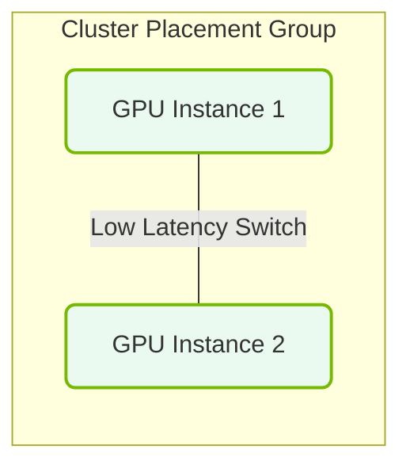

# 34.2b Placement groups: packing instances in the same physical rack for minimum latency

  📦 Virtualization and Cloud
  📖 Cloud AI Infrastructure

---

## 🌐 Context Introduction

When running AI workloads in the cloud, network latency between compute instances can significantly impact training performance. For distributed training jobs (like those using NVIDIA GPUs across multiple nodes), every millisecond of delay adds up. Cloud providers offer **placement groups** — a feature that lets you control where your virtual instances are physically located in the data center. By packing instances into the same physical rack, you achieve the lowest possible network latency between them.

---

## ⚙️ What Is a Placement Group?

A placement group is a logical grouping of instances within a single Availability Zone (AZ). When you launch instances into a placement group, the cloud provider ensures they are placed close together — ideally on the same physical hardware rack.

**Key benefits for AI workloads:**
- 🚀 **Lower latency** — Data travels shorter physical distances between GPUs
- 📈 **Higher bandwidth** — Rack-level networking often provides faster interconnects
- 🔗 **Better for distributed training** — Frameworks like NCCL (NVIDIA Collective Communications Library) benefit from low-latency links

---

## 🛠️ Types of Placement Groups

Cloud providers offer several placement strategies. The one we focus on here is the **cluster placement group**.

| Type | Description | Best For |
|------|-------------|----------|
| **Cluster** | Packs instances close together within a single rack | Lowest latency, highest throughput |
| **Partition** | Spreads instances across logical partitions (e.g., different racks) | Fault tolerance for large distributed systems |
| **Spread** | Places instances on distinct hardware | High availability, failure isolation |

> ✅ For AI training, **cluster placement groups** are the go-to choice.

---

## 🕵️ How It Works (Simplified)

Imagine a cloud data center with hundreds of racks. Each rack contains servers with GPUs. Without a placement group, your instances might be scattered across different racks, floors, or even rooms. With a **cluster placement group**, the cloud scheduler reserves capacity on the same physical rack for all your instances.

**The result:**
- Network packets travel through fewer switches
- Latency drops from microseconds to nanoseconds
- GPU-to-GPU communication (via NVLink or InfiniBand) becomes much faster

---

### 📊 Visual Representation: Cluster Placement Group low-latency layout
This diagram displays a Cluster Placement Group: co-locating GPU instances close together on the network fabric to minimize inter-node network latency.

## 📊 Comparison: With vs. Without Placement Group

| Factor | Without Placement Group | With Cluster Placement Group |
|--------|------------------------|------------------------------|
| Physical location | Random across data center | Same rack |
| Network hops | Multiple switches | Single top-of-rack switch |
| Latency (typical) | 100–500 microseconds | 10–50 microseconds |
| Bandwidth | Shared with other tenants | Dedicated rack-level bandwidth |
| AI training speed | Slower due to communication overhead | Faster, more predictable |

---

## 🧩 When to Use Placement Groups for AI

Use cluster placement groups when:
- You are running **multi-node distributed training** (e.g., using PyTorch DDP or Horovod)
- Your workload requires **NVIDIA GPUs** with high-speed interconnects (NVLink, InfiniBand)
- You need **consistent, low-latency** communication between instances
- You are using **NVIDIA NCCL** for collective operations (all-reduce, all-gather)

**Avoid** when:
- You need high availability across different racks (use spread or partition groups instead)
- Your workload is single-instance or does not require inter-node communication

---

## 🧰 Practical Considerations for Engineers

- **Capacity constraints** — Cluster placement groups have limited capacity per rack. You may not be able to launch hundreds of instances in a single group.
- **Launch order** — All instances in a cluster placement group must be launched together or added carefully. You cannot move existing instances into a group.
- **Instance types** — Not all instance types support placement groups. Check your cloud provider's documentation for GPU-accelerated instance compatibility.
- **Region and AZ** — Placement groups are scoped to a single Availability Zone. You cannot span multiple AZs with a cluster group.

---

## ✅ Summary

Placement groups are a powerful tool for AI engineers deploying distributed training workloads in the cloud. By packing GPU instances into the same physical rack, you minimize network latency and maximize training performance. Use **cluster placement groups** when low latency is critical, and remember to plan for capacity and instance type compatibility.

---

*Next step: Learn how to create a placement group using your cloud provider's console or CLI, and test the latency improvement with a simple NCCL benchmark.*