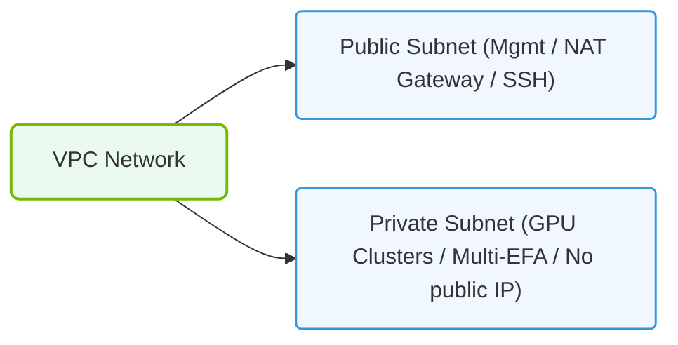

# 34.2c VPC design for AI clusters: subnets, security groups, and VPC endpoints

  📦 Virtualization and Cloud
  📖 Cloud AI Infrastructure

---

## 🧠 Context Introduction

When building AI clusters in the cloud, the Virtual Private Cloud (VPC) is your private network environment. For new engineers, think of a VPC as your own data center inside AWS — you control IP addresses, subnets, routing, and security. AI workloads are unique because they require massive data transfers between GPUs (often using technologies like NVIDIA GPUDirect RDMA), low-latency communication, and high-bandwidth connections to storage services. A poorly designed VPC can cripple training performance. This guide covers the three critical VPC components for AI clusters: **subnets**, **security groups**, and **VPC endpoints**.

---

## 🌐 Subnets for AI Clusters

Subnets divide your VPC into smaller network segments. For AI clusters, subnet design directly impacts performance and scalability.

### 🎯 Key Considerations

- **Placement strategy**: Use **private subnets** for GPU compute nodes. Public subnets are only needed for jump hosts or load balancers.
- **CIDR block sizing**: AI clusters can scale to thousands of nodes. Use a large CIDR (e.g., **10.0.0.0/16**) to avoid IP exhaustion.
- **Availability Zone (AZ) awareness**: Distribute subnets across multiple AZs for fault tolerance, but keep GPU nodes within the same AZ to minimize inter-node latency.
- **Subnet types**:
  - **Compute subnet**: Hosts GPU instances (e.g., p4d, p5 instances). Requires large IP ranges.
  - **Storage subnet**: Dedicated subnet for data lakes or FSx for Lustre connections.
  - **Management subnet**: For orchestration tools (Kubernetes control plane, Slurm controllers).

### 📊 Recommended Subnet Layout

| Subnet Type | Purpose | Example CIDR | Route to Internet? |
|-------------|---------|--------------|-------------------|
| Compute | GPU instances | 10.0.1.0/20 | No (private) |
| Storage | Data access | 10.0.2.0/24 | No (private) |
| Management | Orchestration | 10.0.3.0/24 | No (private) |
| Public | Jump hosts | 10.0.100.0/24 | Yes (via IGW) |

---

## 🛡️ Security Groups for AI Workloads

Security groups act as virtual firewalls for your instances. For AI clusters, you must balance strict security with high-performance communication.

### 🔑 Key Rules for AI Clusters

- **Allow all traffic within the compute subnet** — GPU nodes communicate via NCCL (NVIDIA Collective Communications Library) using random high ports. Blocking this will break training.
- **Restrict inbound SSH/management access** — Only allow from your management subnet or a bastion host.
- **Open specific ports for orchestration**:
  - **TCP 6443** for Kubernetes API server
  - **TCP 22** for SSH (from management only)
  - **TCP 443** for HTTPS endpoints
- **Allow outbound traffic to storage endpoints** — Use VPC endpoints (covered next) instead of NAT gateways.

### 🛠️ Example Security Group Rules (Inline Format)

**Compute Security Group (sg-compute):**

- **Inbound**: Allow all TCP/UDP from **sg-compute** itself (self-referencing rule)
- **Inbound**: Allow TCP 22 from **sg-management**
- **Outbound**: Allow all traffic to **sg-storage** and **sg-management**

**Storage Security Group (sg-storage):**

- **Inbound**: Allow TCP 2049 (NFS) from **sg-compute**
- **Inbound**: Allow TCP 443 (HTTPS) from **sg-compute** for S3 access
- **Outbound**: Deny all (default)

---

### 📊 Visual Representation: VPC Subnet Architecture for GPU clusters
This diagram displays VPC subnets, isolating public management gateways from private high-speed backend RDMA interconnect fabrics.

## 🔗 VPC Endpoints for AI Data Access

VPC endpoints allow your GPU instances to access AWS services (S3, DynamoDB, ECR) without traversing the public internet. This is critical for AI clusters because:
- **Lower latency**: Data stays within the AWS network
- **No NAT gateway costs**: Avoids expensive data transfer fees
- **Improved security**: No public IPs required

### 🧩 Types of VPC Endpoints

| Type | Service | Use Case for AI |
|------|---------|-----------------|
| **Gateway endpoint** | S3, DynamoDB | Model artifacts, training datasets |
| **Interface endpoint** | ECR, CloudWatch, SQS | Container images, logging, job queues |

### ⚙️ Configuration Best Practices

- **Create one S3 Gateway endpoint** per VPC — it's free and uses prefix lists.
- **Use interface endpoints** for ECR (Elastic Container Registry) to pull GPU-optimized containers (e.g., NVIDIA PyTorch containers).
- **Attach endpoint policies** to restrict access to specific S3 buckets or ECR repositories.
- **Route tables**: Gateway endpoints automatically add routes — no manual routing needed.

### 🕵️ Verification Steps (No Commands)

1. Check that the S3 gateway endpoint is associated with your compute subnet's route table.
2. Verify that an interface endpoint for ECR has a security group that allows inbound HTTPS from your compute security group.
3. Confirm that your GPU instances can access S3 without a NAT gateway by testing with a simple object listing.

---

## 📐 Putting It All Together: AI VPC Design Checklist

- ✅ Use **private subnets** for all GPU compute nodes
- ✅ Allocate a **/16 CIDR** or larger for scalability
- ✅ Create a **self-referencing security group** for compute nodes
- ✅ Add **VPC endpoints** for S3 and ECR
- ✅ **Avoid NAT gateways** — use endpoints instead
- ✅ Place all GPU instances in the **same Availability Zone** for optimal NCCL performance
- ✅ Use **separate subnets** for storage and management traffic

---

## 🚦 Common Pitfalls to Avoid

- ❌ **Using public subnets for GPU instances** — exposes nodes to the internet
- ❌ **Overly restrictive security groups** — blocks NCCL communication, causing training failures
- ❌ **Forgetting VPC endpoints** — forces traffic through NAT, adding latency and cost
- ❌ **Small CIDR blocks** — leads to IP exhaustion when scaling to hundreds of GPUs

---

## ✅ Summary

For new engineers, remember this simple formula for AI VPC design:

**Large private subnets + Self-referencing security groups + S3/ECR VPC endpoints = Fast, secure, and scalable AI training**

Start with this foundation, and you'll avoid the most common networking bottlenecks that plague cloud-based AI clusters. As you grow, you can add advanced features like Elastic Fabric Adapter (EFA) placement groups and RDMA over Converged Ethernet (RoCE) — but the basics above will get you 90% of the way there.