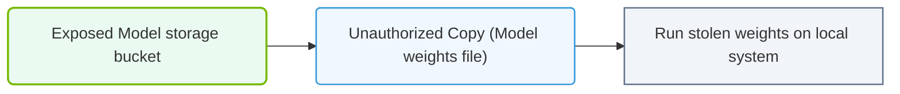

# 35.1a Model theft: protecting valuable trained model weights from unauthorized access

  📦 AI Infra Security & Compliance
  📖 Securing the AI Infrastructure Stack

---

## 🔍 Context Introduction

Trained AI models are among the most valuable assets in any organization. The model weights — the learned parameters that define how a model makes predictions — represent months of engineering effort, expensive compute resources, and proprietary data. If stolen, these weights can be copied, reverse-engineered, or used by competitors without any of the original investment. For new engineers, understanding how to protect these weights is a foundational part of AI infrastructure security.

---

## 🧠 What Is Model Theft?

Model theft occurs when an unauthorized party gains access to a trained model's weights, architecture, or functionality. Unlike traditional software theft, model theft can be subtle — an attacker may not need the full model file; they might extract enough information through queries to replicate the model's behavior.

**Common attack vectors include:**
- Direct file access to model storage (cloud buckets, file servers)
- Insider threats from employees or contractors
- API-based extraction (querying the model repeatedly to build a copy)
- Side-channel attacks on shared GPU hardware
- Compromised CI/CD pipelines that export model artifacts

---

## 🛡️ Core Protection Strategies

### 🔐 Encryption at Rest and in Transit

- Encrypt model weight files using strong algorithms (AES-256) before storing them
- Use TLS/SSL for any transfer of model files between systems
- Store encryption keys separately from the model files (use a key management service)

### 📦 Access Control and Authentication

- Apply strict Identity and Access Management (IAM) policies to model storage locations
- Use role-based access control (RBAC) so only specific services or users can read model weights
- Implement multi-factor authentication (MFA) for any system that can export models

### 🧪 Model Watermarking

- Embed unique, invisible markers into model weights during training
- If a stolen model is later discovered, the watermark proves ownership
- Watermarks can be designed to degrade model performance if removed

### 🚦 API Rate Limiting and Monitoring

- Limit the number of API queries a single user can make per time period
- Monitor for unusual query patterns that suggest extraction attempts
- Add noise or reduce precision in API responses to make exact copying harder

### 🧰 Secure Model Serving

- Run model inference in isolated environments (containers, sandboxes)
- Never expose raw model weights through inference endpoints
- Use hardware security modules (HSMs) or trusted execution environments (TEEs) for sensitive models

---

## 📊 Comparison: Protection Methods

| Method | Strength | Performance Impact | Complexity |
|--------|----------|-------------------|------------|
| Encryption at rest | High | Minimal (decryption overhead) | Low |
| Access control (IAM) | Medium | None | Low |
| Model watermarking | Medium | Slight training overhead | Medium |
| API rate limiting | Low-Medium | None | Low |
| Hardware security modules | Very High | Moderate latency | High |

---

### 📊 Visual Representation: Model Weights exfiltration path
This diagram displays model theft: unauthorized download of model weights files through exposed storage endpoints.

## 🕵️ Real-World Example: Protecting a Model in Storage

Imagine you have a trained model file called **model_weights.h5** stored in a cloud bucket. Here is how a secure workflow might look:

1. **Encrypt the file** using a tool like OpenSSL with a key stored in a key management service
2. **Set bucket permissions** so only a specific service account can read the encrypted file
3. **At inference time**, the serving application decrypts the weights in memory only — never writing the decrypted file to disk
4. **Log all access attempts** to the bucket and alert on any unauthorized reads

**📤 Output:** The model is never exposed in plaintext, and any attempt to copy the file yields only encrypted, unusable data.

---

## ⚠️ Common Mistakes New Engineers Make

- Storing model weights in public or unlisted cloud storage buckets
- Hardcoding encryption keys in application code or configuration files
- Allowing model download endpoints without authentication
- Using the same encryption key for all models across environments
- Ignoring logging and monitoring for model access events

---

## ✅ Quick Checklist for Engineers

- [ ] Are all model weight files encrypted at rest?
- [ ] Is access to model storage restricted to the minimum necessary roles?
- [ ] Are encryption keys stored in a secure key management system?
- [ ] Are inference APIs rate-limited and monitored?
- [ ] Is there a process for revoking access when engineers leave the team?
- [ ] Have you considered watermarking for high-value models?

---

## 📚 Summary

Model theft is a serious threat because trained weights are irreplaceable and expensive to produce. Protecting them requires a layered approach: encrypt the files, control who can access them, monitor for suspicious behavior, and consider watermarking for traceability. As a new engineer, start with the basics — encryption and access control — then build up to more advanced protections as your understanding grows.