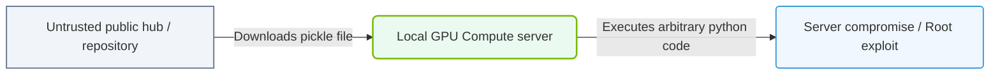

# 35.1c Supply chain attacks: compromised containers and malicious packages in NGC

  📦 AI Infra Security & Compliance
  📖 Securing the AI Infrastructure Stack

---

## 🔍 Context Introduction

When you pull a container image or install a software package from NVIDIA NGC (NVIDIA GPU Cloud), you are trusting that the content is safe and authentic. However, attackers can compromise this trust by injecting malicious code into containers or packages that appear legitimate. This is called a **supply chain attack** — where the vulnerability is introduced not in your own code, but in the components you depend on.

For new engineers, think of it like this: if you order a sealed box of electronics from a trusted store, but someone tampered with the box before it reached you, you might unknowingly install a device that spies on you. Similarly, a compromised container from NGC could run hidden malware inside your AI infrastructure.

---

## 🧠 What Are Supply Chain Attacks in NGC?

Supply chain attacks targeting NGC involve attackers modifying or replacing legitimate NVIDIA containers, models, or software packages with malicious versions. These attacks exploit the trust engineers place in official repositories.

**Key characteristics:**
- Attackers often target popular containers (e.g., TensorFlow, PyTorch, CUDA images)
- Malicious code may be hidden inside model weights, configuration files, or startup scripts
- The compromised component appears to function normally while performing malicious actions in the background
- Attacks can spread laterally across your AI infrastructure once the container is deployed

---

## 🎯 Common Attack Vectors

| Attack Vector | Description | Example in NGC Context |
|---------------|-------------|------------------------|
| **Container image poisoning** | Malicious code inserted into a container image | A CUDA container that exfiltrates GPU training data |
| **Dependency confusion** | Malicious package with same name as internal package uploaded to public registry | A fake `nvidia-dali` package on PyPI that steals credentials |
| **Typosquatting** | Slightly misspelled package names to trick users | `nvidia-cuda` instead of `nvidia-cuda-toolkit` |
| **Compromised base images** | Official base image altered at the source | A modified `nvidia/cuda:12.0-base` with a cryptominer |
| **Malicious model weights** | Hidden payloads inside AI model files | A ResNet model that contains a backdoor trigger |

---

## 🛠️ How Compromised Containers and Packages Work

**Compromised containers** typically execute malicious code during:
- Container startup (via `ENTRYPOINT` or `CMD` scripts)
- Model loading (through modified inference scripts)
- Data preprocessing (hidden in transformation pipelines)

**Malicious packages** often:
- Mimic legitimate package names and versions
- Execute payload during installation (`setup.py` or `postinstall` scripts)
- Phone home to attacker-controlled servers
- Steal environment variables, API keys, or model weights

---

### 📊 Visual Representation: Model Hub supply chain exploit
This diagram displays how downloading untrusted public models or packages can execute malicious code on local systems.

## 🕵️ Detection Strategies for Engineers

**Before pulling from NGC:**
- Verify container signatures using NVIDIA's verification tools
- Check the container's SHA256 digest against the official NGC listing
- Review the container's Dockerfile or build history when available
- Use only containers tagged with specific versions (avoid `latest` tags)

**After deployment:**
- Monitor container behavior for unexpected network connections
- Check for unexpected file modifications or new processes
- Compare running container checksums against known-good values
- Use runtime security tools to detect anomalous system calls

---

## 🛡️ Mitigation Best Practices

- **Always verify signatures** — NVIDIA signs official containers; verify the signature before use
- **Pin exact versions** — Use specific image tags like `nvidia/cuda:12.0.1-runtime-ubuntu22.04` instead of `latest`
- **Scan containers** — Use vulnerability scanners on all NGC images before deployment
- **Use private registries** — Mirror trusted NGC images to your own private registry for additional control
- **Implement least privilege** — Run containers with minimal permissions; never run as root
- **Audit dependencies** — Review all packages installed inside containers for known vulnerabilities
- **Enable network policies** — Restrict outbound traffic from AI containers to only necessary endpoints

---

## ⚙️ Practical Verification Steps

When pulling a container from NGC, engineers should:

1. **Check the image digest** — Compare the SHA256 hash from NGC's website with the one shown after pulling
2. **Inspect the image layers** — Review each layer's history for unexpected commands
3. **Scan for vulnerabilities** — Run a container security scanner on the pulled image
4. **Test in isolation** — Deploy the container in a sandboxed environment first
5. **Monitor initial behavior** — Watch for unexpected network calls or file writes during first execution

---

## 📊 Real-World Impact Example

A compromised NGC container could:
- Steal proprietary training data and model weights
- Use GPU resources for cryptocurrency mining (reducing your AI performance)
- Create backdoor accounts for persistent access
- Exfiltrate API keys for cloud services
- Modify model outputs to introduce subtle biases or errors

---

## ✅ Summary Checklist for New Engineers

- [ ] Always verify container signatures from NGC
- [ ] Never use `latest` tags in production
- [ ] Scan all containers and packages before deployment
- [ ] Monitor container runtime behavior
- [ ] Use private registries for approved images
- [ ] Keep container images minimal (remove unnecessary tools)
- [ ] Stay updated on NGC security advisories

---

> **Key takeaway:** Trust but verify. Even official NGC content can be compromised. Always validate what you pull, and monitor what you run. Supply chain security is a shared responsibility between NVIDIA and every engineer deploying AI workloads.