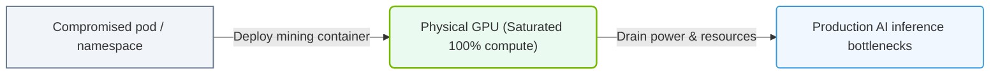

# 35.1d Cryptojacking: unauthorized GPU compute usage for cryptocurrency mining

  📦 AI Infra Security & Compliance
  📖 Securing the AI Infrastructure Stack

---

## 🔍 Context Introduction

Cryptojacking is a type of cyberattack where malicious actors secretly use your organization's GPU compute resources to mine cryptocurrency without your permission. In AI infrastructure, where GPUs are the most expensive and powerful assets, cryptojacking can silently drain performance, increase electricity costs, and degrade model training and inference workloads. For engineers new to AI operations, understanding this threat is critical because GPUs are specifically designed for parallel processing—exactly what cryptocurrency mining requires.

---

## ⚙️ How Cryptojacking Works

- Attackers gain access to your AI infrastructure through:
  - **Phishing emails** that trick users into running malicious scripts
  - **Unsecured APIs** or exposed Jupyter notebooks
  - **Vulnerable container images** pulled from public registries
  - **Weak SSH credentials** or misconfigured cloud instances
- Once inside, they deploy a **miner binary** or **in-browser script** that:
  - Connects to a mining pool controlled by the attacker
  - Uses your GPU's processing power to solve complex mathematical problems
  - Sends the resulting cryptocurrency (often Monero or Bitcoin) to the attacker's wallet
- The miner runs in the **background**, often disguised as a legitimate process (e.g., `systemd`, `kworker`, or `python3`)

---

## 🕵️ Why AI Infrastructure Is a Prime Target

| Factor | Explanation |
|--------|-------------|
| 🖥️ **High GPU Density** | AI clusters have dozens or hundreds of powerful GPUs (e.g., A100, H100) ideal for mining |
| ⚡ **Always-On Compute** | Training jobs run 24/7, making it easy to hide mining activity |
| 🔄 **Parallel Workloads** | Mining algorithms (e.g., Ethash, RandomX) exploit the same parallelism as AI training |
| 🧾 **Shared Resources** | Multi-tenant environments (Kubernetes, Slurm) increase attack surface |
| 💰 **Cost Transfer** | Victims pay for electricity and cooling while attackers collect the crypto rewards |

---

## 📊 Signs of Cryptojacking on Your GPU Infrastructure

- **Unexpected GPU utilization** — GPUs show 80-100% usage even when no training jobs are running
- **Spiking power consumption** — Power draw increases without corresponding AI workload
- **Temperature anomalies** — GPU temperatures rise above normal operating ranges
- **Network traffic to unknown IPs** — Outbound connections to mining pool addresses (check port 3333, 4444, 5555)
- **Strange process names** — Look for processes named `xmrig`, `minerd`, `cpuminer`, or random alphanumeric strings
- **Performance degradation** — AI training jobs take longer to complete due to resource contention

---

### 📊 Visual Representation: GPU Cryptojacking process hijack
This diagram displays cryptojacking: unauthorized mining containers saturating GPU compute resources.

## 🛠️ Detection Techniques for Engineers

### 🔎 Manual Inspection Methods

- **Check GPU utilization** using the **nvidia-smi** command. Look for processes consuming GPU memory that you do not recognize.
- **Review running processes** with **ps aux** and filter for suspicious names or high CPU/GPU usage.
- **Inspect network connections** using **netstat -tunap** or **ss -tunap** to find connections to known mining pools.
- **Examine container logs** in Kubernetes with **kubectl logs** to spot unexpected mining-related output.
- **Monitor systemd services** with **systemctl list-units** to find unauthorized persistent services.

### 🤖 Automated Detection Tools

- **NVIDIA GPU Monitoring Tools** — Use **DCGM (Data Center GPU Manager)** to track power, temperature, and utilization baselines
- **Intrusion Detection Systems (IDS)** — Deploy tools like **Wazuh** or **Osquery** to alert on known miner process signatures
- **Resource Anomaly Detection** — Set up **Prometheus** alerts for GPU usage spikes beyond normal thresholds
- **Container Security Scanners** — Use **Trivy** or **Clair** to scan container images for embedded miner binaries

---

## 🚫 Prevention and Mitigation Strategies

### ✅ Best Practices for Engineers

- **Restrict GPU access** — Use **NVIDIA MIG (Multi-Instance GPU)** or **Kubernetes device plugins** to limit which containers can access GPUs
- **Harden container images** — Only use trusted base images from verified registries (e.g., NVIDIA GPU Cloud, Docker Official)
- **Enable network segmentation** — Block outbound traffic to known mining pool IPs and ports using firewall rules
- **Implement resource quotas** — Set CPU, memory, and GPU limits in Kubernetes namespaces or Slurm partitions
- **Use read-only filesystems** — Prevent miners from writing persistent binaries to containers or pods
- **Regularly rotate credentials** — Change SSH keys, API tokens, and service account passwords frequently
- **Audit user activity** — Enable detailed logging of GPU job submissions and SSH logins

### 🚨 Incident Response Steps

1. **Isolate affected GPUs** — Immediately stop all jobs on compromised nodes using **kubectl cordon** or **scontrol hold**
2. **Kill malicious processes** — Terminate miner processes with **kill -9** and remove associated binaries
3. **Revoke compromised credentials** — Rotate all API keys, tokens, and SSH keys that may have been exposed
4. **Scan for persistence mechanisms** — Check cron jobs, systemd services, and startup scripts for miner reinstallation
5. **Patch vulnerabilities** — Update software, apply security patches, and reconfigure exposed services
6. **Notify security team** — Report the incident following your organization's incident response plan

---

## 📚 Key Takeaways for New Engineers

- Cryptojacking is a **silent resource thief** — it does not delete data or crash systems, making it hard to detect
- GPUs are the **primary target** because they are optimized for the parallel math that mining requires
- **Proactive monitoring** is your best defense — set baselines for GPU usage and alert on deviations
- **Container security** matters — always scan images and restrict GPU access to authorized workloads only
- **Never ignore small anomalies** — a 5% GPU usage increase across 100 GPUs can cost thousands of dollars monthly

---

## 🔗 Related Topics in This Series

- 35.1a Model Poisoning: adversarial data injection during training
- 35.1b Data Exfiltration: stealing training datasets and model weights
- 35.1c Model Inversion: reconstructing private training data from model outputs
- 35.2 Securing the ML Pipeline: CI/CD security for AI workflows