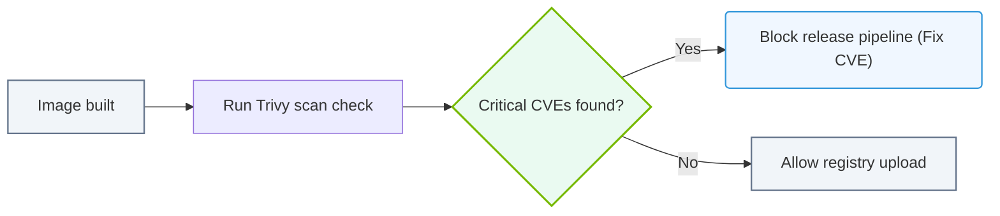

# 35.2c CVE scanning: Trivy, Clair, and Grype for container vulnerability scanning

  📦 AI Infra Security & Compliance
  📖 Securing the AI Infrastructure Stack

---

## 🔍 Context Introduction

When building AI infrastructure, you will often use container images—packaged environments that include your AI models, libraries (like CUDA or TensorRT), and dependencies. These containers can contain **Common Vulnerabilities and Exposures (CVEs)**—known security flaws in software packages. Scanning these containers is critical to prevent attackers from exploiting weaknesses in your AI pipeline. Three popular open-source tools for this task are **Trivy**, **Clair**, and **Grype**. This guide explains what each tool does and how they compare, so you can choose the right one for your NVIDIA-based AI stack.

---

## 🕵️ What is CVE Scanning?

CVE scanning is the process of inspecting container images for known vulnerabilities listed in public databases (like the National Vulnerability Database). The scanner:
- Checks each software package inside the container (e.g., Python libraries, system binaries).
- Compares package versions against a database of known CVEs.
- Reports which vulnerabilities exist and their severity (e.g., Critical, High, Medium, Low).

For AI workloads, this is especially important because NVIDIA containers (like **NVIDIA CUDA**, **NVIDIA Triton Inference Server**, or **NVIDIA TensorRT**) often bundle many dependencies that may have outdated or vulnerable components.

---

## 🛠️ Tool 1: Trivy

**Trivy** (by Aqua Security) is a fast, easy-to-use scanner that supports containers, filesystems, and Git repositories.

- **Key Features:**
  - Scans OS packages (Alpine, Ubuntu, CentOS) and language-specific packages (Python, Node.js, Go).
  - Detects vulnerabilities in NVIDIA container images from NVIDIA GPU Cloud (NGC).
  - Provides severity ratings and links to CVE details.
  - Can be integrated into CI/CD pipelines (e.g., Jenkins, GitLab CI).
- **Best For:** Engineers who want a simple, all-in-one scanner with minimal configuration.
- **Example Use:** Scan an NVIDIA CUDA container for critical CVEs before deploying it to production.

---

## 🛠️ Tool 2: Clair

**Clair** (by Red Hat) is an open-source static analysis tool for container images. It was one of the first popular CVE scanners.

- **Key Features:**
  - Uses a layered approach—analyzes each layer of the container image.
  - Supports multiple OS distributions (Ubuntu, Debian, Red Hat, etc.).
  - Provides an API for integration with other tools (e.g., Quay.io registry).
  - Requires a database setup (PostgreSQL) for storing vulnerability data.
- **Best For:** Engineers who need a scalable, API-driven scanner for large container registries.
- **Example Use:** Set up Clair to automatically scan all images pushed to a private NVIDIA container registry.

---

### 📊 Visual Representation: Trivy CVE Scanning pipeline
This flowchart demonstrates scanning container layers to block images containing critical vulnerabilities.

## 🛠️ Tool 3: Grype

**Grype** (by Anchore) is a modern, fast vulnerability scanner focused on accuracy and usability.

- **Key Features:**
  - Scans containers, directories, and SBOMs (Software Bill of Materials).
  - Supports a wide range of package types (including Python, Java, and Go modules).
  - Integrates with **Syft** (a tool for generating SBOMs) for deeper analysis.
  - Provides a simple command-line interface with clear output.
- **Best For:** Engineers who want a lightweight, accurate scanner with strong SBOM support.
- **Example Use:** Use Grype to scan an NVIDIA Triton Inference Server container and generate a detailed vulnerability report.

---

## ⚖️ Comparison Table: Trivy vs. Clair vs. Grype

| Feature | Trivy | Clair | Grype |
|---------|-------|-------|-------|
| **Ease of Use** | Very easy (single command) | Moderate (requires database setup) | Easy (simple CLI) |
| **Speed** | Fast | Moderate | Fast |
| **Supported OS** | Alpine, Ubuntu, CentOS, etc. | Ubuntu, Debian, Red Hat, etc. | Alpine, Ubuntu, CentOS, etc. |
| **Language Support** | Python, Node.js, Go, Java, etc. | Limited (mostly OS packages) | Python, Node.js, Go, Java, etc. |
| **SBOM Support** | Yes (via CycloneDX) | No | Yes (via Syft) |
| **API/Integration** | Yes (REST API) | Yes (REST API) | Yes (via CLI or library) |
| **Best For** | Quick scans and CI/CD | Large registries and automation | Accuracy and SBOM workflows |
| **NVIDIA Container Compatibility** | Excellent (works with NGC images) | Good (requires manual config) | Excellent (works with NGC images) |

---

## 🧠 How to Choose the Right Tool for Your AI Infrastructure

- **Use Trivy** if you are new to CVE scanning and want a tool that works out of the box with NVIDIA containers. It’s ideal for quick checks during development.
- **Use Clair** if you manage a large registry of AI containers and need an automated, API-driven scanning pipeline. It requires more setup but scales well.
- **Use Grype** if you need precise vulnerability data and want to generate SBOMs for compliance (e.g., for NVIDIA AI Enterprise). It pairs well with **Syft** for full transparency.

---

## ✅ Best Practices for CVE Scanning in AI Infrastructure

- **Scan every container** before deployment, especially those from third-party sources (e.g., public NGC images).
- **Automate scanning** in your CI/CD pipeline to catch vulnerabilities early.
- **Prioritize critical and high-severity CVEs**—these can directly impact AI model performance or data security.
- **Rebuild containers regularly** to incorporate security patches from NVIDIA and OS vendors.
- **Use a vulnerability database feed** that is up-to-date (e.g., Trivy updates its database daily).

---

## 📌 Summary

CVE scanning is a non-negotiable step in securing AI infrastructure. **Trivy**, **Clair**, and **Grype** each offer unique strengths:
- **Trivy** for simplicity and speed.
- **Clair** for scalability and API integration.
- **Grype** for accuracy and SBOM support.

By integrating one of these tools into your workflow, you can confidently deploy NVIDIA containers that are free from known vulnerabilities, keeping your AI operations secure and compliant.