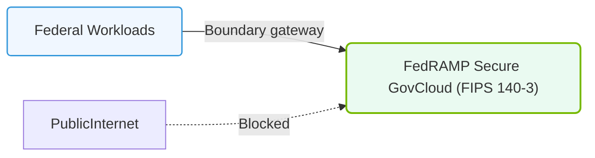

# 35.4c FedRAMP: U.S. government AI infrastructure authorization

  📦 AI Infra Security & Compliance
  📖 Securing the AI Infrastructure Stack

## 📘 Context Introduction

When engineers work with AI infrastructure that processes, stores, or transmits data for U.S. government agencies, they must follow a strict security framework called **FedRAMP** (Federal Risk and Authorization Management Program). FedRAMP is a government-wide program that standardizes how cloud services — including AI platforms — are assessed for security. Think of it as a "security stamp of approval" that proves an AI infrastructure provider meets the U.S. government's rigorous data protection requirements.

For new engineers, understanding FedRAMP means knowing why your AI workloads might need special configurations, encryption standards, and audit trails when running in government environments.

---

## ⚙️ What is FedRAMP?

FedRAMP provides a standardized approach to security assessment, authorization, and continuous monitoring for cloud products and services used by federal agencies. For AI infrastructure, this means:

- **All AI services** (training, inference, data storage) must comply with FedRAMP controls
- **Third-party assessment** by an accredited organization validates security posture
- **Continuous monitoring** is required — not just a one-time check
- **Authorization** can be granted at different impact levels (Low, Moderate, High)

---

## 📊 Why FedRAMP Matters for AI Infrastructure

| Aspect | Why It's Important for AI |
|--------|---------------------------|
| 🔐 Data Protection | AI models often train on sensitive government data — FedRAMP ensures encryption at rest and in transit |
| 🧪 Model Integrity | Prevents unauthorized tampering with AI training pipelines or inference results |
| 📋 Audit Trails | Every AI operation (data access, model deployment) must be logged and reviewable |
| 🌐 Multi-Cloud | FedRAMP authorization can span across hybrid or multi-cloud AI deployments |
| 🛡️ Supply Chain | Validates that third-party AI libraries and tools used in infrastructure are secure |

---

## 🛠️ Key FedRAMP Concepts for Engineers

### 🔹 Impact Levels
FedRAMP classifies data sensitivity into three levels:

- **Low Impact**: Public information, minor financial loss
- **Moderate Impact**: Personally identifiable information (PII), law enforcement data
- **High Impact**: National security, life safety, critical infrastructure

Most AI workloads for government fall under **Moderate** or **High** impact.

### 🔹 Authorization Types
- **Agency Authorization**: A single federal agency grants approval for use
- **Joint Authorization Board (JAB)**: Centralized approval by a board of government CIOs
- **Provisional Authorization**: Temporary approval while full assessment is completed

### 🔹 Continuous Monitoring Requirements
- Monthly vulnerability scans
- Quarterly security assessments
- Annual full re-authorization review
- Real-time incident reporting (within 1 hour for critical events)

---

### 📊 Visual Representation: FedRAMP High-Boundary network segment
This diagram displays FedRAMP: separating cloud services inside secure government boundaries.

## 🕵️ How FedRAMP Affects AI Infrastructure Operations

Engineers managing AI infrastructure under FedRAMP must:

- **Encrypt all data** — both at rest (storage) and in transit (network)
- **Implement strict access controls** — role-based access for data scientists, MLOps engineers, and auditors
- **Log everything** — every API call to AI models, every training job, every data access
- **Use FedRAMP-authorized cloud providers** — AWS GovCloud, Azure Government, Google Cloud for Government
- **Deploy AI models in isolated environments** — separate from public internet
- **Perform regular penetration testing** on AI endpoints and data pipelines

---

## 📋 FedRAMP vs. Other Compliance Frameworks (Quick Comparison)

| Framework | Focus Area | FedRAMP Relationship |
|-----------|------------|----------------------|
| **SOC 2** | Service organization controls | FedRAMP often builds on SOC 2 controls |
| **ISO 27001** | Information security management | FedRAMP uses similar control families |
| **HIPAA** | Healthcare data privacy | FedRAMP can cover HIPAA requirements |
| **ITAR** | Defense-related technical data | FedRAMP High aligns with ITAR protections |

---

## ✅ Practical Steps for New Engineers

1. **Identify your data classification** — Is the AI data Low, Moderate, or High impact?
2. **Choose a FedRAMP-authorized cloud** — Use government-only regions (e.g., AWS GovCloud)
3. **Enable encryption** — Turn on server-side encryption for all AI storage buckets
4. **Set up audit logging** — Enable CloudTrail (AWS), Activity Logs (Azure), or Audit Logs (GCP)
5. **Restrict network access** — Use private subnets, VPNs, or Direct Connect for AI training clusters
6. **Document everything** — FedRAMP requires detailed architecture diagrams and data flow maps
7. **Test regularly** — Run vulnerability scans on AI model endpoints and data pipelines

---

## 📌 Key Takeaway

FedRAMP is not optional when building AI infrastructure for U.S. government customers. It transforms how engineers design, deploy, and monitor AI systems — emphasizing security, transparency, and continuous compliance. Start by understanding your data's impact level, then choose authorized cloud services and implement the required controls from day one.

> 💡 **Remember:** In FedRAMP environments, security is not a feature — it's the foundation of every AI operation you build.