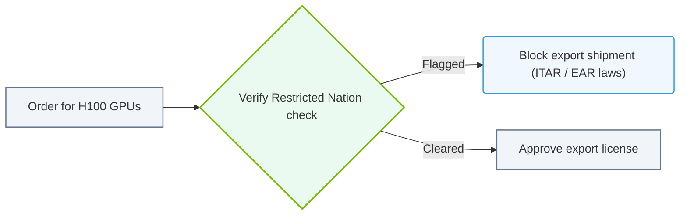

# 35.4d Export controls (EAR/ITAR): implications for H100 and A100 deployment in restricted countries

  📦 AI Infra Security & Compliance
  📖 Securing the AI Infrastructure Stack

---

## 🌍 Context Introduction

As an engineer working with AI infrastructure, you will likely encounter high-performance NVIDIA GPUs like the **H100** and **A100**. These are not just powerful hardware—they are also subject to strict **export control regulations** because they can be used for advanced computing, including military and intelligence applications.

Two key regulations govern where and how these GPUs can be deployed:
- **EAR (Export Administration Regulations)** – U.S. rules that control the export of dual-use technologies (civilian and military).
- **ITAR (International Traffic in Arms Regulations)** – U.S. rules that control defense-related articles and services.

If you deploy H100 or A100 GPUs in a restricted country (e.g., China, Russia, or certain other nations), you may violate U.S. law, leading to severe penalties, including fines, loss of export privileges, or even criminal charges.

---

## ⚙️ What are EAR and ITAR?

### EAR (Export Administration Regulations)
- Governed by the **U.S. Department of Commerce** (Bureau of Industry and Security).
- Controls items that have both commercial and military applications (dual-use).
- H100 and A100 GPUs are classified under **ECCN 3A090** or **4A090** due to their high performance and potential for AI/ML workloads.
- **Key restriction:** Export to countries like China, Russia, Venezuela, and others is **prohibited or requires a license**.

### ITAR (International Traffic in Arms Regulations)
- Governed by the **U.S. Department of State** (Directorate of Defense Trade Controls).
- Controls items specifically designed for military use (e.g., weapons, satellites, encryption).
- Most AI GPUs like H100 and A100 are **not ITAR-controlled** by default, but if they are integrated into a defense system or used for military AI, they may fall under ITAR.
- **Key restriction:** Export to most foreign countries requires a license, and **no exports to embargoed nations** (e.g., Iran, North Korea, Syria).

---

## 🛡️ Implications for H100 and A100 Deployment

### 🚫 Restricted Countries (Examples)
The U.S. government maintains a list of countries where H100 and A100 exports are **restricted or prohibited**:

| Country | EAR Restriction | ITAR Restriction | Notes |
|---------|----------------|------------------|-------|
| China | ❌ Prohibited (unless license obtained) | ❌ Prohibited | Includes Hong Kong and Macau |
| Russia | ❌ Prohibited | ❌ Prohibited | Full embargo |
| Iran | ❌ Prohibited | ❌ Prohibited | Full embargo |
| North Korea | ❌ Prohibited | ❌ Prohibited | Full embargo |
| Syria | ❌ Prohibited | ❌ Prohibited | Full embargo |
| Venezuela | ⚠️ Restricted (license required) | ⚠️ Restricted | Case-by-case review |
| Belarus | ⚠️ Restricted (license required) | ⚠️ Restricted | Since 2022 sanctions |

### 🧠 What This Means for Engineers
- **You cannot deploy H100 or A100 GPUs** in data centers or cloud regions located in restricted countries.
- **You cannot ship** these GPUs to a partner or customer in a restricted country.
- **You cannot transfer** access to these GPUs (e.g., via cloud services) to entities in restricted countries.
- **You must verify** the end-user and end-use of the GPUs before deployment.

---

## 🕵️ How to Stay Compliant

### ✅ Best Practices for Engineers

- **Check the ECCN** of your GPU model. For H100 and A100, it is typically **3A090** or **4A090**.
- **Use the U.S. Commerce Control List (CCL)** to confirm restrictions.
- **Verify the physical location** of your data center or cloud region. Do not deploy in restricted countries.
- **Review your cloud provider's compliance** – AWS, Azure, and GCP have export control policies. Ensure they do not route your workloads to restricted regions.
- **Document end-user and end-use** – If you are deploying for a customer, get written assurance that the GPUs will not be re-exported to restricted countries.
- **Consult your legal/compliance team** before any international deployment.

### ❌ Common Mistakes to Avoid

- Assuming that cloud deployment bypasses export controls (it does not).
- Using a VPN or proxy to access GPUs from a restricted country (this is a violation).
- Sharing GPU access with a colleague or partner located in a restricted country.
- Deploying GPUs in a "free trade zone" or special economic zone in a restricted country (still illegal).

---

### 📊 Visual Representation: US Commerce Export Controls screening
This flowchart demonstrates screening orders to block restricted GPU hardware shipments to flagged nations.

## 📊 Comparison: H100 vs A100 Export Controls

| Feature | H100 | A100 |
|---------|------|------|
| ECCN Classification | 3A090 / 4A090 | 3A090 / 4A090 |
| Export to China | ❌ Prohibited (since Oct 2022) | ❌ Prohibited (since Oct 2022) |
| Export to Russia | ❌ Prohibited | ❌ Prohibited |
| License Exception (NLR) | ❌ Not available for restricted countries | ❌ Not available for restricted countries |
| Cloud Deployment Restrictions | Same as physical export | Same as physical export |
| ITAR Applicability | Only if integrated into defense systems | Only if integrated into defense systems |

---

## 🔍 Real-World Scenario Example

**Scenario:** Your company wants to deploy H100 GPUs in a new AI research lab located in **Singapore**.

**Checklist for engineers:**
1. **Is Singapore a restricted country?** No, Singapore is not on the restricted list.
2. **Is the end-user a sanctioned entity?** Verify the lab is not owned by a Chinese or Russian entity.
3. **Is the end-use for military AI?** If yes, ITAR may apply.
4. **Do you need an export license?** For Singapore, no license is required under EAR (as of 2025), but always double-check with your compliance team.

**Action:** You can proceed with deployment, but document the end-user and end-use for audit purposes.

---

## 🧰 Summary

- **H100 and A100 GPUs are export-controlled** under EAR (ECCN 3A090/4A090).
- **Deployment in restricted countries (China, Russia, Iran, etc.) is prohibited** without a license.
- **ITAR may apply** if the GPUs are used in defense-related applications.
- **Cloud deployment does not bypass export controls** – you are still responsible for the physical location and end-user.
- **Always verify** the country, end-user, and end-use before deploying.

---

## 📚 Further Resources

- **U.S. Bureau of Industry and Security (BIS)** – Official EAR guidelines
- **U.S. Directorate of Defense Trade Controls (DDTC)** – ITAR guidelines
- **NVIDIA Export Compliance Page** – Specific guidance for H100 and A100
- **Your company's legal/compliance team** – Always consult them for specific scenarios

---

*Remember: Export control violations can result in fines of up to $1 million per violation and up to 20 years in prison. When in doubt, ask your compliance team before deploying.*