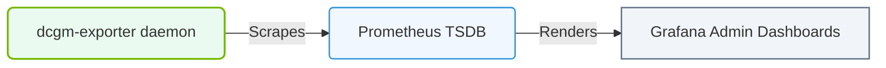

# 36.1g Domain 7 analysis: Monitoring and Operations — DCGM and Xid error scenarios

  📦 Exam Prep & Certification
  📖 NCA-AIIO Blueprint Deep Dive

Welcome, new engineer! This section of the NCA-AIIO blueprint focuses on how to monitor NVIDIA GPUs and interpret critical error signals. Understanding **DCGM (Data Center GPU Manager)** and **Xid errors** is essential for keeping AI workloads stable and performing well. Let's break down these concepts in a simple, practical way.

---

## 🧠 Context: Why Monitoring Matters

In AI infrastructure, GPUs are the workhorses. If a GPU fails or behaves unexpectedly, training jobs can crash, inference can produce wrong results, or hardware can degrade. **DCGM** is your health dashboard, and **Xid errors** are the warning lights. Knowing how to read both helps you respond quickly and prevent downtime.

---

## ⚙️ What is DCGM?

DCGM is a set of tools and libraries from NVIDIA for managing and monitoring GPUs in data centers. It provides:

- **Real-time metrics**: temperature, power usage, memory utilization, GPU clock speeds
- **Health checks**: automated diagnostics to detect hardware issues
- **Policy-based management**: set thresholds for alerts (e.g., "warn if temperature exceeds 85°C")
- **Integration**: works with popular monitoring tools like Prometheus, Grafana, and Kubernetes

**Key DCGM features for engineers:**

- **dcgm-exporter**: a service that exposes GPU metrics for scraping by Prometheus
- **Health monitoring**: runs periodic checks for memory, PCIe, and thermal issues
- **Configuration validation**: ensures GPUs are running within expected parameters

---

## 🛠️ Common DCGM Metrics to Watch

| Metric | What It Tells You | Healthy Range |
|--------|-------------------|---------------|
| GPU Temperature | Thermal stress | Below 85°C |
| GPU Power Draw | Energy consumption | Within TDP limits |
| Memory Utilization | How much GPU memory is used | Below 90% |
| GPU Utilization | Compute engine activity | Varies by workload |
| PCIe Link Speed | Data transfer bandwidth | Should match expected generation |
| Memory Clock | Memory speed | Stable, not throttled |

---

## 🕵️ What are Xid Errors?

**Xid errors** are error messages generated by the NVIDIA GPU driver when something goes wrong at the hardware or software level. They appear in system logs (e.g., **dmesg** or **/var/log/syslog**) and are critical for diagnosing GPU issues.

**Common Xid error codes and their meanings:**

- **Xid 13**: GPU memory page fault — often caused by a bad memory chip or driver bug
- **Xid 31**: GPU hardware hang — the GPU stopped responding; may require a reset
- **Xid 43**: GPU stopped processing — usually a driver crash or thermal shutdown
- **Xid 48**: Double bit error in GPU memory — indicates failing hardware
- **Xid 64**: GPU fell off the bus — PCIe connection issue or power problem
- **Xid 79**: GPU has fallen off the bus (persistent) — requires physical inspection

**How to spot Xid errors:**

- Check system logs using the command: **dmesg | grep -i xid**
- Look for lines containing "NVRM: Xid" followed by the error number
- In Kubernetes, check pod logs or node events for GPU-related failures

---

### 📊 Visual Representation: DCGM Metrics telemetry scraping
This diagram displays telemetry collection: pulling node temperatures, power metrics, and ECC errors into central DBs.

## 📊 DCGM vs Xid Errors: A Quick Comparison

| Aspect | DCGM | Xid Errors |
|--------|------|------------|
| Purpose | Continuous monitoring and health checks | Error reporting for critical failures |
| Frequency | Constant (metrics stream) | Event-driven (only when errors occur) |
| Severity | Can indicate trends or warnings | Usually indicates a problem needing action |
| Action Required | Set alerts, adjust policies | Investigate, reset, or replace hardware |
| Example | "GPU temperature rising" | "Xid 48: double bit error detected" |

---

## 🔍 How to Respond to Xid Errors

When you see an Xid error, follow this simple triage:

1. **Identify the error code** — note the number (e.g., Xid 48)
2. **Check the GPU index** — the error message usually includes which GPU failed
3. **Review recent changes** — new drivers, workload changes, or power events?
4. **Run DCGM diagnostics** — use **dcgmi diag -r 1** to run a quick health check
5. **Reset the GPU** — if safe, try **nvidia-smi --gpu-reset -i <GPU_ID>**
6. **Escalate** — if errors persist, the GPU may need replacement

**Important**: Some Xid errors (like Xid 13) can be transient and caused by software bugs. Others (like Xid 48) almost always mean hardware failure.

---

## 🧪 Practical Monitoring Workflow

For day-to-day operations, combine DCGM and Xid monitoring like this:

- **Set up DCGM exporter** to stream GPU metrics to your monitoring system
- **Create alerts** for:
  - Temperature exceeding 85°C
  - Memory utilization above 95%
  - Any Xid error appearing in logs
- **Schedule periodic health checks** using **dcgmi diag** (e.g., weekly)
- **Log all Xid errors** with timestamps and GPU IDs for trend analysis
- **Automate responses** — for example, restart a pod if Xid 43 occurs

---

## ✅ Key Takeaways for New Engineers

- DCGM is your **proactive** monitoring tool — it helps you catch issues before they cause failures
- Xid errors are your **reactive** signal — they tell you something is already wrong
- Not all Xid errors are equal: some are recoverable, others require hardware replacement
- Always correlate Xid errors with DCGM metrics (e.g., temperature spikes before a hang)
- Practice reading **dmesg** output and interpreting DCGM metrics in a test environment

---

## 📚 Next Steps

- Explore the **dcgmi** command-line tool to run diagnostics manually
- Set up a simple Prometheus + Grafana dashboard with DCGM metrics
- Review NVIDIA's official Xid error documentation for a complete list of error codes
- Practice responding to simulated Xid errors in a lab environment

Remember: monitoring is not just about watching numbers — it's about understanding what your GPUs are telling you. With DCGM and Xid errors, you have two powerful tools to keep your AI infrastructure healthy and reliable.