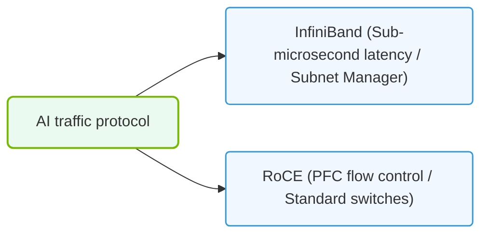

# 36.2d InfiniBand vs Ethernet: scenario-based selection questions

  📦 Exam Prep & Certification
  📖 NCA-AIIO Blueprint Deep Dive

---

## 📘 Context Introduction

When building or operating an AI cluster, one of the most critical decisions is choosing the right network interconnect. The two dominant technologies are **InfiniBand** and **Ethernet**. For the NVIDIA-Certified Associate exam, you'll need to understand not just the technical differences, but also how to select the right one based on real-world scenarios. This guide breaks down the key factors in a simple, practical way for new engineers.

---

## ⚙️ Core Differences at a Glance

| Feature | InfiniBand | Ethernet |
|---------|------------|----------|
| **Primary Use** | High-performance computing (HPC) & AI training | General-purpose networking & cloud |
| **Latency** | Ultra-low (sub-microsecond) | Low to moderate (microsecond to millisecond) |
| **Bandwidth** | Very high (up to 400 Gbps per link) | High (up to 800 Gbps, but often shared) |
| **Lossless Transport** | Native (built-in flow control) | Requires additional protocols (RoCE, DCB) |
| **CPU Offload** | Excellent (hardware-based transport) | Good (with RDMA, but more CPU overhead) |
| **Cost** | Higher per port | Lower per port |
| **Ecosystem** | Specialized (NVIDIA, Mellanox) | Ubiquitous (Cisco, Arista, Broadcom) |
| **Management** | Requires specific tools (UFM, ibdiagnet) | Standard tools (SNMP, CLI) |

---

## 🕵️ Scenario-Based Selection Questions

### Scenario 1: "We need to train a large language model (LLM) with 1000 GPUs."

**Best choice:** **InfiniBand**

**Why:**
- AI training requires massive parallel communication between GPUs (all-reduce, all-gather operations).
- InfiniBand provides native lossless transport and ultra-low latency, which directly speeds up training time.
- The built-in Remote Direct Memory Access (RDMA) offloads CPU work, keeping GPUs fed with data.

**When Ethernet might work:**
- If the cluster is smaller (under 100 GPUs) and cost is a major concern.
- If you already have a high-performance Ethernet fabric with RoCE (RDMA over Converged Ethernet) support.

---

### Scenario 2: "We are building a multi-tenant cloud for AI inference and general workloads."

**Best choice:** **Ethernet**

**Why:**
- Ethernet is the standard for cloud environments — it integrates easily with existing network management, security, and virtualization tools.
- Inference workloads are less sensitive to latency than training, so Ethernet's performance is sufficient.
- Multi-tenancy requires VLANs, VXLANs, and QoS — all mature on Ethernet.

**When InfiniBand might work:**
- If the cloud is dedicated to high-performance AI training only (no general workloads).
- If you can accept the higher cost and specialized management.

---

### Scenario 3: "We need to connect storage servers to GPU servers for data loading."

**Best choice:** **Ethernet**

**Why:**
- Most storage systems (NAS, SAN, object storage) use Ethernet natively.
- Data loading is typically sequential and less latency-sensitive than GPU-to-GPU communication.
- Ethernet is easier to scale for storage traffic without specialized hardware.

**When InfiniBand might work:**
- If the storage is also high-performance (e.g., NVMe over Fabrics) and requires the lowest possible latency.
- If the entire cluster is InfiniBand-based and you want a unified fabric.

---

### Scenario 4: "We have a budget constraint and need to build a small AI cluster for research."

**Best choice:** **Ethernet**

**Why:**
- Ethernet switches and NICs are significantly cheaper per port.
- For small clusters (under 32 GPUs), the performance gap between Ethernet and InfiniBand is less noticeable.
- You can use RoCE to get some RDMA benefits without the full InfiniBand cost.

**When InfiniBand might work:**
- If the research requires the absolute fastest training times (e.g., for competitive benchmarks).
- If you can get used or refurbished InfiniBand hardware at a discount.

---

### 📊 Visual Representation: InfiniBand vs. Ethernet transport boundaries
This diagram contrasts network types: comparing lossless, hardware-driven InfiniBand fabrics with scalable RoCE Ethernet networks.

## 🛠️ Key Decision Framework

When faced with a scenario-based question, ask yourself these three questions:

1. **What is the primary workload?**
   - AI training → lean toward InfiniBand
   - Inference, storage, or general cloud → lean toward Ethernet

2. **What is the scale?**
   - Large clusters (100+ GPUs) → InfiniBand becomes more beneficial
   - Small clusters (under 32 GPUs) → Ethernet is often sufficient

3. **What is the budget and existing infrastructure?**
   - Greenfield project with budget → InfiniBand is ideal
   - Brownfield project with existing Ethernet → stick with Ethernet

---

## 📊 Exam Tips for Scenario Questions

- **Look for keywords:** "training," "large-scale," "low latency," "GPU-to-GPU" → InfiniBand
- **Look for keywords:** "cloud," "multi-tenant," "storage," "cost-effective," "general purpose" → Ethernet
- **Remember the trade-off:** InfiniBand gives you performance; Ethernet gives you flexibility and lower cost.
- **Don't overthink:** The exam scenarios are usually clear-cut. If the question mentions "AI training at scale," the answer is almost always InfiniBand.

---

## ✅ Summary

| Scenario | Recommended | Key Reason |
|----------|-------------|------------|
| Large-scale AI training (1000 GPUs) | InfiniBand | Native RDMA, ultra-low latency |
| Multi-tenant cloud with inference | Ethernet | Mature virtualization, lower cost |
| Storage connectivity | Ethernet | Standard protocol, easy integration |
| Small research cluster on budget | Ethernet | Lower cost, sufficient performance |

Keep this guide handy as you study — it will help you quickly match scenarios to the right interconnect choice on the exam.