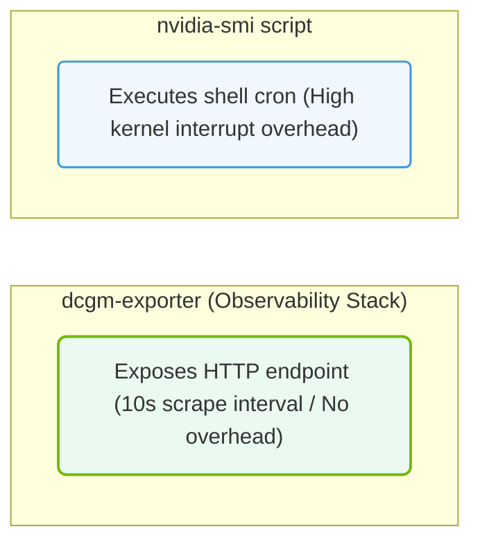

# 36.2e DCGM vs nvidia-smi: when each tool is appropriate

  📦 Exam Prep & Certification
  📖 NCA-AIIO Blueprint Deep Dive

---

## 🔍 Context Introduction

As a new engineer working with NVIDIA GPUs, you will frequently need to monitor GPU health, performance, and utilization. Two primary tools are available: **nvidia-smi** and **DCGM (Data Center GPU Manager)**. While both provide GPU information, they serve different purposes and are appropriate in different scenarios. Understanding when to use each tool is critical for efficient AI infrastructure operations.

---

## ⚙️ What is nvidia-smi?

**nvidia-smi** (NVIDIA System Management Interface) is a command-line utility that comes bundled with NVIDIA drivers. It provides a quick snapshot of GPU status.

**Key characteristics:**
- Lightweight and always available with NVIDIA drivers
- Provides real-time, one-time queries of GPU metrics
- Best for ad-hoc troubleshooting and quick checks
- Shows basic information like GPU utilization, memory usage, temperature, and power draw
- Limited to single-node, single-GPU queries at a time

**When to use nvidia-smi:**
- Quickly checking if a GPU is detected and operational
- Verifying driver version and CUDA compatibility
- Monitoring GPU utilization during a training job in real-time
- Debugging why a specific GPU is not being used by an application
- Checking temperature or power limits on a single machine

---

## 🛠️ What is DCGM?

**DCGM** (Data Center GPU Manager) is a more advanced monitoring and management tool designed for large-scale data center deployments. It runs as a service and provides persistent, historical, and aggregated GPU telemetry.

**Key characteristics:**
- Runs as a background service (dcgmd) for continuous monitoring
- Collects and stores historical metrics over time
- Supports multi-node, multi-GPU environments
- Provides health monitoring, diagnostics, and policy-based management
- Integrates with monitoring systems like Prometheus, Grafana, and Datadog
- Offers GPU profiling and field diagnostics

**When to use DCGM:**
- Monitoring GPU clusters with hundreds or thousands of GPUs
- Setting up automated health checks and alerts
- Collecting historical utilization data for capacity planning
- Diagnosing intermittent GPU issues that require long-term data
- Integrating GPU metrics into existing enterprise monitoring dashboards
- Enforcing GPU power and thermal policies across a data center

---

### 📊 Visual Representation: dcgm-exporter vs. nvidia-smi scrape profiles
This diagram contrasts querying modes: comparing periodic CLI parsing scripts with continuous HTTP exporter metrics endpoints.

## 📊 Comparison Table: nvidia-smi vs DCGM

| Feature | nvidia-smi | DCGM |
|---------|------------|------|
| **Deployment** | Installed with driver | Requires separate installation |
| **Scope** | Single node, single query | Multi-node, continuous monitoring |
| **Data collection** | On-demand, one-time | Persistent, historical |
| **Health monitoring** | Basic (manual check) | Advanced (automated alerts) |
| **Diagnostics** | Limited | Comprehensive field diagnostics |
| **Integration** | Standalone CLI | Integrates with Prometheus, Grafana, etc. |
| **Best for** | Quick checks and debugging | Production monitoring and management |
| **Resource overhead** | Minimal | Moderate (runs as service) |

---

## 🕵️ When to Use Each Tool: Decision Guide

**Use nvidia-smi when:**
- You need a quick answer about GPU status right now
- You are troubleshooting a single machine or a small cluster
- You want to verify GPU availability before starting a job
- You are working in an environment without DCGM installed
- You need to check basic metrics like memory usage or temperature

**Use DCGM when:**
- You are managing a production AI infrastructure with many GPUs
- You need to track GPU performance trends over days or weeks
- You want automated alerts for GPU failures or anomalies
- You need to integrate GPU metrics into a centralized monitoring system
- You are performing root cause analysis for intermittent GPU issues
- You need to enforce power capping or thermal policies across nodes

---

## ✅ Practical Example: Choosing the Right Tool

**Scenario 1:** A training job is running slowly. You want to check if the GPU is being utilized.

- **Best tool:** nvidia-smi — Run a quick check to see GPU utilization percentage and memory usage in real-time.

**Scenario 2:** You need to set up a monitoring dashboard for a 100-GPU cluster and receive alerts when any GPU exceeds 85°C.

- **Best tool:** DCGM — Deploy DCGM to collect metrics continuously and integrate with Prometheus/Grafana for dashboards and alerts.

**Scenario 3:** A GPU intermittently crashes during long-running jobs. You need to capture data around the crash time.

- **Best tool:** DCGM — Use DCGM's historical logging and field diagnostics to analyze events leading up to the crash.

**Scenario 4:** You just installed a new GPU and want to confirm it is recognized by the system.

- **Best tool:** nvidia-smi — Quick verification of GPU presence, driver version, and basic health.

---

## 📌 Key Takeaway for Engineers

Think of **nvidia-smi** as your **flashlight** — great for quick, immediate visibility. Think of **DCGM** as your **security camera system** — always recording, providing historical data, and alerting you to problems. In a production AI infrastructure, you will use both: nvidia-smi for quick checks and DCGM for comprehensive, automated monitoring and management.