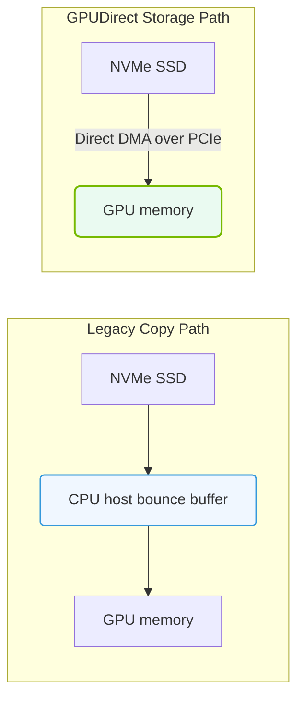

# 36.2f GPUDirect Storage: architecture questions and performance impact

  📦 Exam Prep & Certification
  📖 NCA-AIIO Blueprint Deep Dive

## 📘 Context Introduction

GPUDirect Storage (GDS) is a technology that creates a direct data path between local or remote storage (like NVMe SSDs or network storage) and GPU memory. For new engineers, think of it as a "fast lane" that bypasses the CPU and system memory when moving data into and out of GPUs. This dramatically reduces latency and improves throughput for AI training and inference workloads, where large datasets must be fed to GPUs quickly.

---

## ⚙️ How GPUDirect Storage Works (Architecture Overview)

- **Direct Memory Access (DMA) Engine**: GDS uses the GPU's built-in DMA engine to move data directly from storage to GPU memory without involving the CPU for every byte.
- **Bypasses System Memory**: Traditional data paths go: Storage → CPU → System RAM → GPU. GDS goes: Storage → GPU directly.
- **CUDA-Aware Storage Drivers**: Storage devices (NVMe, NFS, Lustre) must have CUDA-aware drivers that understand GPU memory addresses.
- **GPU Page Migration**: GDS can handle data that spans multiple GPU memory pages, automatically migrating pages as needed.
- **Bar1 (Base Address Register) Mapping**: The GPU's BAR1 aperture is used to map storage data directly into GPU-accessible memory regions.

---

## 📊 Performance Impact — Why GDS Matters

| Metric | Without GDS (Traditional Path) | With GDS | Performance Gain |
|--------|-------------------------------|----------|------------------|
| **Data Transfer Latency** | High (CPU + system RAM involved) | Low (direct path) | 3–5x reduction |
| **CPU Utilization** | 60–80% busy moving data | <10% busy | Frees CPU for other tasks |
| **Throughput (GB/s)** | Limited by PCIe lanes and CPU memory bandwidth | Near PCIe theoretical max | 2–4x improvement |
| **GPU Idle Time** | High (waiting for data) | Low (data arrives faster) | Up to 50% less idle |
| **Scalability** | Bottlenecks at CPU/RAM | Scales with GPU count | Linear scaling possible |

---

## 🛠️ Key Architecture Components to Understand

- **CUDA Streams**: GDS operations are asynchronous and use CUDA streams to overlap data movement with GPU computation.
- **GPU Direct RDMA**: Often used together with GDS for remote storage access over networks (InfiniBand, RoCE).
- **File System Support**: GDS works with POSIX-compliant file systems (ext4, XFS, NFS, Lustre) when configured correctly.
- **Memory Registration**: Storage buffers must be registered with the GPU's memory manager before transfers can happen.
- **Multi-GPU Support**: GDS can distribute data across multiple GPUs in a single node or across nodes.

---

### 📊 Visual Representation: GPUDirect Storage (GDS) vs. CPU read path
This diagram contrasts GDS (direct NVMe-to-GPU data transfers) against legacy paths (CPU bounce buffers).

## 🕵️ Common Architecture Questions (Exam Focus)

### 1. "Does GDS require special hardware?"
- **Yes**: NVIDIA GPUs with Pascal architecture or newer (Tesla P100, V100, A100, H100, etc.)
- **Yes**: NVMe SSDs or storage systems with CUDA-aware drivers
- **Yes**: Compatible PCIe switches and network adapters for RDMA

### 2. "Can GDS work with cloud storage?"
- **Yes**, if the cloud instance provides:
  - Direct-attached NVMe SSDs
  - Elastic Fabric Adapter (EFA) or InfiniBand with RDMA support
  - NVIDIA GPU instances (e.g., AWS P3/P4/P5, Azure ND-series)

### 3. "What happens if the storage is not GDS-aware?"
- The system falls back to the traditional CPU-mediated path
- Performance degrades to normal levels
- No data corruption — just slower transfers

### 4. "How does GDS handle large datasets?"
- Data is streamed directly to GPU memory in chunks
- Supports overlapping data transfer with kernel execution
- Can use multiple CUDA streams for parallel data loading

---

## 📈 Performance Optimization Tips for Engineers

- **Align memory allocations** to 4KB or 2MB pages for best DMA performance
- **Use asynchronous CUDA operations** to overlap data transfer with computation
- **Monitor GPU BAR1 utilization** — if it's full, performance drops
- **Test with nvidia-smi** to verify GDS is active: look for "GPU Direct Storage" in the driver info
- **Benchmark with gdsio** (NVIDIA's GDS benchmark tool) to measure real-world throughput

---

## ✅ Key Takeaways for Exam Preparation

- GDS is a **data path optimization**, not a new storage technology
- It **reduces CPU overhead** and **increases GPU utilization**
- Requires **hardware and driver support** at every layer
- Works best with **NVMe SSDs and RDMA-capable networks**
- Performance gains are most visible in **data-intensive AI workloads** (training, inference, data preprocessing)

---

## 📚 Quick Reference: GDS vs. Traditional Path

| Aspect | Traditional Path | GPUDirect Storage |
|--------|------------------|-------------------|
| Data flow | Storage → CPU → RAM → GPU | Storage → GPU |
| CPU involvement | High (copies data) | Low (initiates transfer) |
| Latency | High | Low |
| Throughput | Moderate | High |
| GPU idle time | Significant | Minimal |
| Complexity | Simple | Moderate (requires setup) |

---

> 💡 **Remember for the exam**: GDS is about **eliminating unnecessary data copies** and **reducing CPU bottlenecks**. The architecture is designed to keep GPUs fed with data as fast as they can consume it — critical for modern AI workloads.