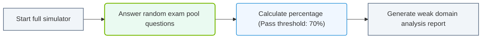

# 37.2c Mock Exam 3: Mixed adaptive exam — full NCA-AIIO simulation with score analysis

  📦 Exam Prep & Certification
  📖 Comprehensive Practice Assessments

---

## 🧠 Context Introduction

Welcome to your final full-length simulation before the real NVIDIA-Certified Associate: AI Infrastructure and Operations exam. This **Mixed Adaptive Exam** is designed to mimic the actual certification experience by combining question types from all domains you've studied so far. Unlike the previous two mock exams, this one adapts its difficulty based on your performance, just like the real NCA-AIIO test.

As a new engineer entering the AI infrastructure field, this simulation will help you:
- Build confidence with the exam format and timing
- Identify weak areas in your knowledge
- Practice managing time across 60 questions
- Understand how adaptive scoring works

---

## ⚙️ Exam Structure Overview

This mock exam follows the same blueprint as the official NCA-AIIO certification:

- **Total Questions:** 60 mixed-format questions
- **Time Limit:** 90 minutes
- **Question Types:** Multiple choice, multiple select, drag-and-drop, and scenario-based
- **Adaptive Logic:** Questions become harder or easier based on your previous answers
- **Passing Score:** 70% (42 out of 60 correct)

### Domain Breakdown Covered

| Domain | Weight | Key Topics |
|--------|--------|------------|
| 🖥️ AI Infrastructure Fundamentals | 25% | GPU architectures, memory hierarchy, NVLink, NVSwitch |
| 📦 Deployment & Orchestration | 20% | Kubernetes, Docker, MIG, GPU operator |
| 🔧 Performance Optimization | 20% | Profiling tools, data pipelines, model parallelism |
| 🛡️ Monitoring & Troubleshooting | 20% | DCGM, Prometheus, Grafana, logs analysis |
| 🔐 Security & Compliance | 15% | Multi-tenancy, data privacy, access controls |

---

## 📊 Adaptive Exam Mechanics

The adaptive engine in this mock exam works as follows:

- **Starting Point:** You begin with medium-difficulty questions
- **Correct Answer:** Next question increases in difficulty (worth more points)
- **Incorrect Answer:** Next question decreases in difficulty (worth fewer points)
- **Final Score:** Calculated based on difficulty level of correctly answered questions, not just raw count

### Why This Matters for Engineers

- **You cannot skip questions** — the adaptive engine needs every response to calibrate
- **Early mistakes are costly** — they lower the ceiling for your maximum possible score
- **Consistency beats brilliance** — answering medium questions correctly is better than guessing on hard ones

---

## 🛠️ What to Expect During the Simulation

### Before You Start

- Find a quiet environment with stable internet
- Have scratch paper and a pen ready for calculations
- Close all other browser tabs and applications
- Set a timer for exactly 90 minutes

### During the Exam

- **Question 1–15:** Warm-up phase with foundational topics
- **Question 16–40:** Core adaptive phase where difficulty shifts
- **Question 41–60:** Final assessment phase with scenario-based questions

### After Completing

You will receive a detailed score analysis including:

- **Raw Score:** Number of correct answers out of 60
- **Adaptive Score:** Weighted score based on question difficulty
- **Domain Breakdown:** Percentage correct per domain
- **Time Analysis:** How long you spent per question
- **Weakness Indicators:** Topics where you scored below 60%

---

### 📊 Visual Representation: Full Simulator scoring pipeline
This flowchart maps simulator pipelines: taking exam questions, scoring output results, and generating certificate reports.

## 🕵️ Score Analysis Example

Here is what your score report might look like after completing the simulation:

**Overall Performance:**
- Raw Score: 45/60 (75%)
- Adaptive Score: 78% (above passing threshold)
- Time Used: 82 minutes (8 minutes remaining)

**Domain Performance:**

| Domain | Your Score | Target | Status |
|--------|------------|--------|--------|
| AI Infrastructure Fundamentals | 85% | 70% | ✅ Strong |
| Deployment & Orchestration | 72% | 70% | ✅ Pass |
| Performance Optimization | 68% | 70% | ⚠️ Needs Work |
| Monitoring & Troubleshooting | 80% | 70% | ✅ Strong |
| Security & Compliance | 65% | 70% | ❌ Review Needed |

**Key Recommendations:**
- Focus on **model parallelism strategies** (tensor vs. pipeline)
- Review **GPU operator configuration** for Kubernetes
- Practice **DCGM metric interpretation** for real-time monitoring

---

## 📋 Preparation Checklist Before Taking This Mock

Use this checklist to ensure you're ready:

- [ ] Reviewed all domain study guides from previous sections
- [ ] Completed Mock Exam 1 and Mock Exam 2
- [ ] Practiced with at least 20 scenario-based questions
- [ ] Familiar with NVIDIA's documentation for DCGM and GPU operator
- [ ] Can explain the difference between data parallelism and model parallelism
- [ ] Know how to interpret GPU utilization metrics
- [ ] Understand MIG profiles and partitioning

---

## 🎯 Final Tips for Engineers New to AI Infrastructure

- **Don't panic if questions get harder** — that means you're answering correctly
- **Read scenario questions twice** — they often contain hidden constraints
- **Eliminate obviously wrong answers first** — this improves your odds on adaptive exams
- **Watch your time per question** — aim for 90 seconds average
- **Use the scratch paper** — especially for bandwidth and memory calculations

---

## 🚀 Next Steps After This Mock Exam

1. **Review your score report** carefully — focus on domains below 70%
2. **Revisit study materials** for weak areas identified
3. **Take a 30-minute targeted quiz** on your lowest-scoring domain
4. **Repeat this mock exam** after 48 hours if you scored below 70%
5. **Schedule your real exam** once you consistently score above 75%

---

*Good luck, engineer — you've prepared for this. Trust the process and show what you know.*