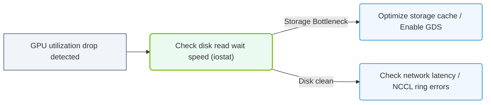

# 37.3b Case Study: Diagnosing a training job that suddenly drops GPU utilization to 20%

  📦 Exam Prep & Certification
  📖 Comprehensive Practice Assessments

---

## 🧠 Context Introduction

Imagine you are monitoring a deep learning training job that has been running smoothly for several hours. Suddenly, you notice that GPU utilization drops from near 100% to just 20%. The training job is still running, but it is now progressing much slower. This case study walks you through how engineers diagnose this common issue, identify root causes, and apply fixes to restore training performance.

---

## ⚙️ Understanding the Problem

When GPU utilization drops unexpectedly, it usually means the GPU is waiting for something. The GPU is a powerful compute engine, but it can only work as fast as the data and instructions it receives.

**Key symptoms of this scenario:**
- GPU utilization falls from ~95-100% to ~20% or lower
- Training loss continues to decrease, but very slowly
- CPU usage may spike or remain low depending on the root cause
- Memory usage on the GPU may remain high

---

## 🕵️ Common Root Causes

Engineers typically investigate these five areas when GPU utilization drops:

| Root Cause Category | What Happens | Typical Indicator |
|-------------------|--------------|-------------------|
| **Data Loading Bottleneck** | CPU cannot feed data to GPU fast enough | CPU near 100%, disk I/O high |
| **I/O Wait** | Reading data from disk is slow | High disk latency, low CPU usage |
| **Network Communication** | Distributed training nodes wait for each other | Network bandwidth saturated |
| **Preprocessing Overhead** | Data augmentation or transforms are CPU-heavy | CPU spikes, GPU idle |
| **Small Batch Size** | GPU finishes computation too quickly | GPU utilization oscillates wildly |

---

## 📊 Diagnostic Approach

Engineers follow a systematic process to isolate the issue:

### Step 1: Check GPU Metrics
- Monitor **GPU utilization** using tools like **nvidia-smi** or **nvtop**
- Look for **memory usage** — if memory is full, the job may be swapping
- Observe **power and temperature** — throttling can reduce utilization

### Step 2: Examine CPU and Memory
- Check **CPU utilization** — if it is near 100%, the CPU is the bottleneck
- Look at **system memory usage** — swapping to disk slows everything down

### Step 3: Analyze I/O Performance
- Monitor **disk read/write speeds** — slow storage can starve the GPU
- Check **file system latency** — network file systems (NFS) are common culprits

### Step 4: Review Training Code
- Look at **batch size** — too small means GPU finishes work too fast
- Check **data loading workers** — too few workers cannot prefetch enough data
- Examine **preprocessing pipeline** — heavy transforms on CPU block data flow

### Step 5: Inspect Network (for distributed training)
- Monitor **network bandwidth** between nodes
- Check for **synchronization barriers** — all nodes must finish before the next step
- Look for **straggler nodes** — one slow node holds up the entire job

---

### 📊 Visual Representation: GPU Utilization drop debug path
This flowchart demonstrates debugging low GPU utilization: identifying IO storage bottlenecks vs. network latency.

## 🛠️ Common Fixes

Once the root cause is identified, engineers apply targeted solutions:

**For data loading bottlenecks:**
- Increase the number of data loading workers (e.g., from 4 to 8 or 16)
- Use **memory-mapped files** or **pre-cached datasets**
- Move data to faster storage (NVMe SSDs instead of HDDs)

**For I/O wait issues:**
- Pre-load data into RAM before training starts
- Use **data sharding** to distribute reads across multiple disks
- Switch to a faster file system (local SSD vs. network storage)

**For preprocessing overhead:**
- Move preprocessing to GPU using libraries like **DALI** or **Albumentations**
- Preprocess data offline and save as a prepared dataset
- Use **mixed precision training** to reduce GPU compute time

**For small batch sizes:**
- Increase batch size to keep GPU busy longer
- Use **gradient accumulation** if memory is limited
- Enable **automatic mixed precision (AMP)** to fit larger batches

**For network issues in distributed training:**
- Use **gradient compression** to reduce communication overhead
- Enable **asynchronous communication** where appropriate
- Ensure all nodes have identical hardware and software configurations

---

## 📋 Real-World Example Walkthrough

Here is how an engineer would diagnose a real training job that drops to 20% GPU utilization:

**Step 1 — Observe the symptoms:**
- GPU utilization: 20%
- CPU utilization: 95%
- Disk I/O: 500 MB/s (near maximum for the storage device)

**Step 2 — Initial hypothesis:**
- The CPU is busy, but the GPU is idle — this suggests a data loading bottleneck

**Step 3 — Check data loading configuration:**
- The training script uses **4 data loading workers**
- The dataset is stored on a **network file system (NFS)**
- Each image undergoes **heavy augmentation** on the CPU

**Step 4 — Apply fixes:**
- Increase workers from 4 to 12
- Move dataset to local NVMe SSD
- Simplify augmentation or move it to GPU

**Step 5 — Verify results:**
- GPU utilization returns to 95%
- Training speed improves by 4x

---

## ✅ Key Takeaways for Engineers

- **GPU utilization below 80%** is a red flag — investigate immediately
- **Always check CPU and I/O first** — the GPU is rarely the problem
- **Data loading is the most common bottleneck** in deep learning pipelines
- **Small changes** (worker count, storage type, batch size) can have huge impacts
- **Monitor all resources** — not just GPU — to find the true bottleneck

---

## 📚 Further Learning

- Study **profiling tools** like NVIDIA Nsight Systems and PyTorch Profiler
- Practice **bottleneck analysis** on sample training scripts
- Learn about **distributed training communication patterns** (all-reduce, ring topology)
- Experiment with **data pipeline optimizations** (prefetching, caching, sharding)

---

*This case study is part of the NVIDIA-Certified Associate: AI Infrastructure and Operations curriculum. Understanding how to diagnose performance issues is a critical skill for engineers managing AI workloads at scale.*