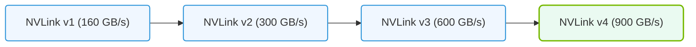

# 38.1b NVLink bandwidth progression table by generation

  📦 Exam Prep & Certification
  📖 Reference Appendices and Quick-Reference Guides

---

## 🔍 Context Introduction

NVLink is NVIDIA's high-speed, direct GPU-to-GPU interconnect technology. It allows multiple GPUs to share data and memory much faster than traditional PCIe connections. For engineers working with AI infrastructure, understanding NVLink bandwidth progression across generations is critical for designing efficient multi-GPU systems and optimizing training workloads.

This guide provides a simple, generation-by-generation breakdown of NVLink bandwidth improvements, from the first generation to the latest.

---

## 📊 NVLink Bandwidth Progression Table

Below is a comparison table showing the key bandwidth specifications for each NVLink generation. Bandwidth is listed per link (one direction) and per GPU (total bidirectional).

| Generation | Year Introduced | Per Link Bandwidth (One Direction) | Total Bandwidth per GPU (Bidirectional) | Key GPU Support |
|---|---|---|---|---|
| **NVLink 1.0** | 2016 | 20 GB/s | 160 GB/s (8 links) | Tesla P100 |
| **NVLink 2.0** | 2017 | 25 GB/s | 300 GB/s (6 links per GPU, 2 per NVSwitch) | Tesla V100 |
| **NVLink 3.0** | 2020 | 50 GB/s | 600 GB/s (12 links) | A100 |
| **NVLink 4.0** | 2022 | 50 GB/s | 900 GB/s (18 links) | H100 |
| **NVLink 4.0 (NVSwitch)** | 2022 | 50 GB/s | 900 GB/s (18 links per GPU, 7 NVSwitch links) | H100 with NVSwitch |

> **Note:** Bandwidth values are theoretical maximums. Real-world performance depends on system configuration, workload, and cooling.

---

## ⚙️ How to Read the Table

- **Per Link Bandwidth (One Direction):** The speed of a single NVLink connection in one direction (e.g., from GPU A to GPU B).
- **Total Bandwidth per GPU (Bidirectional):** The combined speed of all NVLink connections on a single GPU, counting both send and receive. This is the most useful number for system design.
- **Key GPU Support:** The primary GPU generation that introduced or fully utilized that NVLink version.

---

## 🕵️ Key Takeaways for Engineers

- **NVLink 1.0 to 2.0:** A modest 25% per-link increase (20 to 25 GB/s), but total bandwidth nearly doubled due to more links per GPU (8 to 12).
- **NVLink 2.0 to 3.0:** A major leap — per-link bandwidth doubled to 50 GB/s, and total bandwidth doubled to 600 GB/s.
- **NVLink 3.0 to 4.0:** Per-link bandwidth stayed at 50 GB/s, but total bandwidth increased by 50% (600 to 900 GB/s) thanks to more links (12 to 18).
- **NVSwitch Impact:** With NVLink 4.0, the NVSwitch allows all GPUs in a system to communicate at full bandwidth simultaneously, which is essential for large-scale AI training.

---

### 📊 Visual Representation: NVLink bandwidth scaling progress
This diagram displays NVLink bandwidth progression, detailing speeds from NVLink v1 (160 GB/s) to NVLink v4 (900 GB/s).

## 🛠️ Practical Implications for System Design

- **Small Clusters (2-4 GPUs):** NVLink 3.0 or 4.0 provides ample bandwidth for most workloads. Focus on GPU memory capacity first.
- **Medium Clusters (4-8 GPUs):** NVLink 4.0's 900 GB/s per GPU is critical for data-parallel training where gradients must be shared quickly.
- **Large Clusters (8+ GPUs):** NVSwitch with NVLink 4.0 is essential to avoid bandwidth bottlenecks. Without it, GPU-to-GPU communication becomes a limiting factor.

---

## 📈 Bandwidth Growth Trend

- **NVLink 1.0 (2016):** 160 GB/s per GPU
- **NVLink 2.0 (2017):** 300 GB/s per GPU (1.9x increase)
- **NVLink 3.0 (2020):** 600 GB/s per GPU (2x increase)
- **NVLink 4.0 (2022):** 900 GB/s per GPU (1.5x increase)

This represents a **5.6x total bandwidth improvement** over six years.

---

## ✅ Quick Reference for Exam Preparation

- **NVLink 1.0:** 160 GB/s — Tesla P100
- **NVLink 2.0:** 300 GB/s — Tesla V100
- **NVLink 3.0:** 600 GB/s — A100
- **NVLink 4.0:** 900 GB/s — H100

Remember: **NVLink 4.0 doubled per-link bandwidth from NVLink 2.0** (25 to 50 GB/s) and **increased total bandwidth by 3x** (300 to 900 GB/s).

---

## 💡 Final Tip

When designing AI infrastructure, always consider the NVLink generation of your GPUs. For training large models (like GPT or BERT), NVLink 3.0 or 4.0 is strongly recommended to avoid communication bottlenecks. If you're using older GPUs with NVLink 1.0 or 2.0, expect slower multi-GPU scaling.