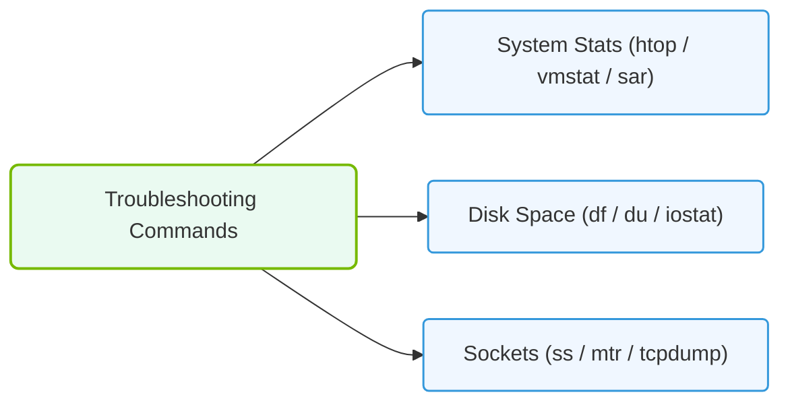

# 38.2d Linux administration cheat sheet: 40 commands every AI operator must know

  📦 Exam Prep & Certification
  📖 Reference Appendices and Quick-Reference Guides

Welcome, new engineer! As you begin working with AI infrastructure, you'll quickly find that Linux is the backbone of nearly every AI workload — from training deep learning models to serving inference endpoints. This cheat sheet covers 40 essential commands that every AI operator should have at their fingertips. These commands help you manage files, monitor system health, inspect hardware (especially GPUs), control processes, and troubleshoot issues.

---

## ⚙️ File System Navigation & Management

These commands help you move around the file system, find files, and understand disk usage — critical for locating datasets, model checkpoints, and logs.

- **pwd** — Prints the current working directory path. Use this to confirm where you are in the file system.
- **ls** — Lists files and directories. Common flags: **ls -l** (long format with permissions), **ls -a** (show hidden files), **ls -lh** (human-readable sizes).
- **cd** — Changes the current directory. Example: **cd /data/datasets** moves you into the datasets folder.
- **mkdir** — Creates a new directory. Use **mkdir -p** to create nested directories in one command.
- **cp** — Copies files or directories. Use **cp -r** for recursive copy of directories.
- **mv** — Moves or renames files and directories.
- **rm** — Removes files. Use **rm -r** for directories and **rm -f** to force deletion without prompts. Be very careful with this command.
- **find** — Searches for files and directories by name, type, or size. Example: **find /models -name "*.pt"** finds all PyTorch model files.
- **du** — Estimates file and directory disk usage. Use **du -sh *** to see sizes of all items in the current directory.
- **df** — Reports file system disk space usage. Use **df -h** for human-readable output.

---

## 📊 System Monitoring & Resource Usage

AI workloads are resource-intensive. These commands help you monitor CPU, memory, disk I/O, and network activity.

- **top** — Displays real-time system processes and resource usage. Press **q** to quit.
- **htop** — An improved, interactive version of **top** with color and mouse support. Install if not present.
- **free** — Shows memory usage. Use **free -h** for human-readable output (RAM and swap).
- **vmstat** — Reports virtual memory statistics, including processes, memory, paging, and CPU activity.
- **iostat** — Monitors system input/output device loading. Useful for spotting disk bottlenecks.
- **netstat** — Displays network connections, routing tables, and interface statistics. Use **netstat -tuln** to see listening ports.
- **ss** — A modern replacement for **netstat**. Use **ss -tuln** to list TCP and UDP sockets.
- **uptime** — Shows how long the system has been running, number of users, and load averages.
- **dmesg** — Prints kernel ring buffer messages. Great for checking hardware errors or driver issues after boot.

---

## 🛠️ Process & Job Control

AI training jobs can run for hours or days. Knowing how to manage processes is essential.

- **ps** — Lists running processes. Use **ps aux** for a full snapshot of all processes.
- **kill** — Terminates a process by PID. Use **kill -9** as a forceful last resort.
- **pkill** — Kills processes by name. Example: **pkill python** stops all Python processes.
- **nohup** — Runs a command immune to hangups, keeping it running after you log out. Example: **nohup python train.py &**
- **&** — Runs a command in the background. Example: **python train.py &**
- **jobs** — Lists background jobs in the current shell session.
- **fg** — Brings a background job to the foreground.
- **bg** — Resumes a suspended job in the background.
- **screen** — A terminal multiplexer that keeps sessions alive. Start with **screen -S training**, detach with **Ctrl+A D**, reattach with **screen -r training**.
- **tmux** — Similar to **screen** but more modern. Start with **tmux new -s training**, detach with **Ctrl+B D**, reattach with **tmux attach -t training**.

---

## 🕵️ GPU & Hardware Inspection

For AI operators, GPU monitoring is non-negotiable. These commands help you check GPU health, memory, and processes.

- **nvidia-smi** — The primary tool for NVIDIA GPU monitoring. Shows GPU utilization, memory usage, temperature, and running processes.
- **nvidia-smi pmon** — Displays per-process GPU usage in a rolling format.
- **nvidia-smi topo -m** — Shows GPU topology and connectivity (NVLink, PCIe). Important for multi-GPU setups.
- **lspci** — Lists all PCI devices. Use **lspci | grep -i nvidia** to find NVIDIA GPUs.
- **lscpu** — Displays CPU architecture information, including cores, threads, and cache.
- **lsmem** — Lists memory blocks and their status. Useful for checking available memory regions.
- **lshw** — Lists hardware configuration. Use **sudo lshw -short** for a compact summary.

---

### 📊 Visual Representation: Linux Admin troubleshooting Commands
This diagram groups diagnostic CLI commands for checking system statistics, monitoring filesystems, and inspecting sockets.

## 🔐 Permissions & User Management

AI systems often have multiple users sharing resources. Proper permissions prevent accidental data loss.

- **chmod** — Changes file permissions (read, write, execute). Example: **chmod 755 script.sh** gives owner full access, others read/execute.
- **chown** — Changes file owner and group. Example: **sudo chown user:group file.txt**
- **useradd** — Creates a new user. Example: **sudo useradd -m newuser** creates a user with a home directory.
- **passwd** — Changes a user's password. Use **sudo passwd username** to set another user's password.
- **id** — Displays user and group IDs for the current user or a specified user.
- **who** — Shows who is logged into the system.
- **sudo** — Executes a command with superuser privileges. Use sparingly and only when necessary.

---

## 📦 Package Management & Software

Installing AI frameworks, drivers, and tools requires package management skills.

- **apt** (Debian/Ubuntu) — Package manager. Use **sudo apt update** to refresh package lists, **sudo apt install package** to install.
- **yum** (RHEL/CentOS) — Package manager for Red Hat-based systems. Use **sudo yum install package**.
- **dnf** (Fedora) — Modern replacement for **yum**. Use **sudo dnf install package**.
- **pip** — Python package installer. Use **pip install package** for Python libraries like TensorFlow or PyTorch.
- **conda** — Package and environment manager for data science. Use **conda install package** or **conda create -n env_name python=3.9**.

---

## 🔄 Networking & Connectivity

AI systems often need to communicate across nodes for distributed training or data transfer.

- **ping** — Tests network connectivity to a host. Example: **ping -c 4 google.com**
- **curl** — Transfers data from or to a server. Use **curl -O URL** to download a file.
- **wget** — Another download tool, supports recursive downloads. Example: **wget URL**
- **scp** — Securely copies files between hosts. Example: **scp file.txt user@remote:/path/**
- **rsync** — Efficiently syncs files and directories. Use **rsync -avz source/ user@remote:/dest/** for archive mode with compression.
- **ssh** — Securely connects to a remote machine. Example: **ssh user@hostname**
- **hostname** — Displays or sets the system's hostname.
- **ifconfig** — Shows network interface configuration (IP addresses, netmasks). Use **ifconfig -a** for all interfaces.
- **ip addr** — Modern replacement for **ifconfig**. Shows IP addresses and interface details.

---

## 📋 Comparison Table: Essential Monitoring Commands

| Command | Primary Use | Key Flags for AI Workloads |
|---------|-------------|----------------------------|
| **nvidia-smi** | GPU monitoring | **--query-gpu=utilization.gpu,memory.used** |
| **top** | CPU/process monitoring | **-u username** to filter by user |
| **htop** | Interactive process monitoring | **F6** to sort by CPU or memory |
| **free** | Memory usage | **-h** for human-readable |
| **df** | Disk space | **-h** for human-readable |
| **du** | Directory size | **-sh** for summary |
| **iostat** | Disk I/O performance | **-x** for extended stats |
| **netstat** | Network connections | **-tuln** for listening ports |

---

## 🧠 Pro Tips for AI Operators

- Always run **nvidia-smi** before starting a training job to confirm GPU availability and memory.
- Use **screen** or **tmux** for long-running experiments so they survive network disconnections.
- Check disk space with **df -h** frequently — model checkpoints and datasets can fill drives quickly.
- When troubleshooting, start with **dmesg | tail -20** to see recent kernel messages.
- Use **rsync** instead of **scp** for large dataset transfers — it's faster and can resume interrupted transfers.
- Set up **htop** as your default process viewer for its intuitive interface.
- Remember that **kill -9** should be a last resort — always try **kill** (SIGTERM) first to allow graceful shutdown.

---

You now have a solid foundation of 40 Linux commands that will serve you well in AI infrastructure and operations. Practice these daily, and they'll become second nature. Good luck with your NVIDIA-Certified Associate journey!