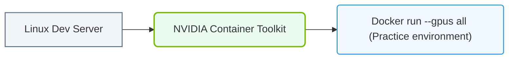

# 38.4b Hands-on lab environment setup: building a local single-GPU practice environment

  📦 Exam Prep & Certification
  📖 Reference Appendices and Quick-Reference Guides

---

## 🧠 Context Introduction

As you begin your journey into AI infrastructure, having a local practice environment is essential for experimenting with GPU-accelerated workloads. This guide walks you through setting up a **single-GPU lab** on your own machine — perfect for learning containerization, driver management, and basic AI workload orchestration without needing a full data center. By the end, you'll have a functional sandbox to test NVIDIA tools and workflows.

---

## ⚙️ What You'll Need

- A desktop or laptop with a **single NVIDIA GPU** (e.g., GeForce RTX 3060 or higher)
- **Ubuntu 22.04 LTS** or **Windows 10/11 with WSL2** (recommended for Linux-native experience)
- At least **16 GB RAM** and **50 GB free disk space**
- Stable internet connection for downloading drivers and containers

---

## 🛠️ Step 1: Install NVIDIA Drivers

Your GPU needs the proper driver to communicate with the operating system.

- **On Ubuntu:** Use the **Software & Updates** tool or run the **ubuntu-drivers** utility to detect and install the recommended driver version.
- **On Windows with WSL2:** Install the **NVIDIA Driver for Windows** (the same driver supports both Windows and WSL2 GPU acceleration).
- After installation, reboot your system.

Verify the driver is active by checking the **NVIDIA Control Panel** (Windows) or running a system info command (Linux).

---

## 🐳 Step 2: Install Docker and NVIDIA Container Toolkit

Containers let you run AI frameworks without polluting your host OS.

- **Install Docker Engine** using the official Docker repository for Ubuntu, or **Docker Desktop** for Windows.
- **Install the NVIDIA Container Toolkit** by adding the NVIDIA package repository and installing the **nvidia-container-toolkit** package.
- Configure Docker to use the NVIDIA runtime by editing the Docker daemon configuration file.

After setup, test that Docker can see your GPU by running a simple container that lists GPU devices.

---

### 📊 Visual Representation: Hands-On Lab GPU configuration
This diagram displays the hands-on lab stack: deploying the container toolkit inside local Linux environments to practice CLI commands.

## 🧪 Step 3: Pull and Run a Practice AI Container

Use a pre-built container from NVIDIA's catalog to validate your environment.

- Pull the **nvidia/cuda:12.2.0-base-ubuntu22.04** image from NGC (NVIDIA GPU Cloud).
- Run a container with the **--gpus all** flag to pass your GPU into the container.
- Inside the container, run a command that prints the CUDA version and GPU information.

Expected result: You should see your GPU model name and CUDA version displayed.

---

## 📊 Comparison: Local Single-GPU vs. Cloud GPU

| Feature | Local Single-GPU Lab | Cloud GPU Instance |
|---------|----------------------|-------------------|
| **Cost** | One-time hardware purchase | Pay-per-hour (can be expensive) |
| **Setup Time** | 1–2 hours initial | Minutes (pre-configured) |
| **GPU Power** | Limited to one consumer GPU | Access to A100, H100, etc. |
| **Persistence** | Always available | Requires instance start/stop |
| **Learning Value** | High (hands-on driver/container mgmt) | Medium (mostly cloud UI) |

---

## 🕵️ Common Troubleshooting Tips

- **Docker cannot find GPU:** Ensure the NVIDIA Container Toolkit is properly installed and the Docker daemon was restarted.
- **Driver version mismatch:** Check that your driver supports the CUDA version in your container (use NVIDIA's compatibility matrix).
- **Out of memory:** Reduce batch sizes or use smaller models (e.g., switch from Llama to TinyLlama).
- **WSL2 GPU not detected:** Confirm you are running **Windows 11** or **Windows 10 build 19044+** and have the latest WSL2 kernel.

---

## 🧰 Recommended Practice Workloads

Once your environment is ready, try these beginner-friendly tasks:

- Run a **PyTorch** or **TensorFlow** container and train a simple image classifier on CIFAR-10.
- Use **NVIDIA Triton Inference Server** to serve a pre-trained model locally.
- Experiment with **NVIDIA Nsight Systems** to profile GPU utilization during training.
- Build a custom Docker image that includes your own AI application code.

---

## ✅ Summary

You now have a fully functional single-GPU practice environment. This lab is your sandbox for learning container orchestration, GPU driver management, and AI workload deployment — all foundational skills for the NVIDIA-Certified Associate exam. Keep experimenting, and remember: every production AI infrastructure starts with a single GPU and a curious engineer.